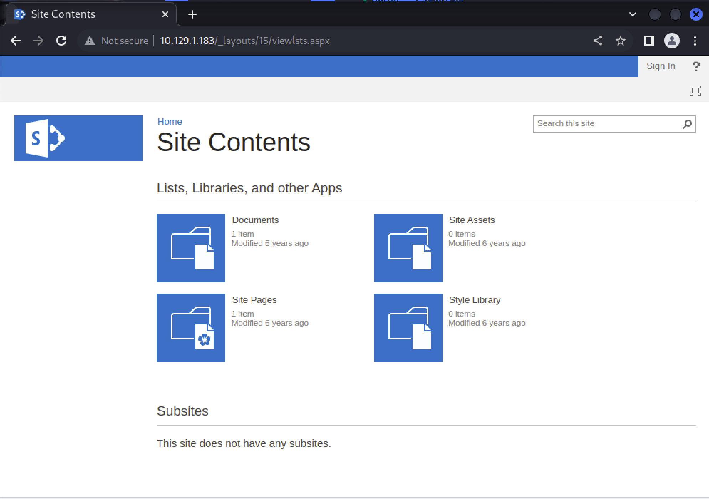
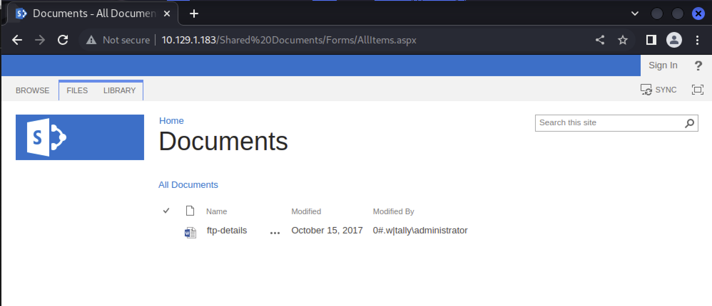

# SharePoint

`pentesting sharepoint`で検索

https://the-infosec.com/2017/04/18/penetration-testing-sharepoint/

wordlist

https://github.com/XalfiE/Sharepoint-URL-Fuzzlist/blob/master/sharepoint.txt

`http://10.129.1.183/_layouts/15/viewlsts.aspx`

hostsを設定しないと描画できない画面をあるためIPとhostどちらでも確認すると良い。