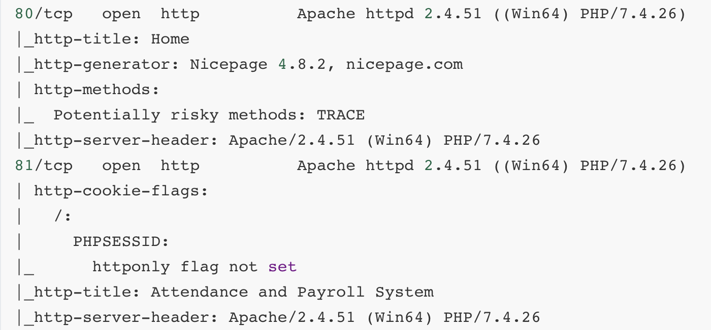

# Initial Excecutionチェックリスト

[toc]

* hostsの設定

  httpsの場合はドメイン指定じゃないとアクセスができない場合があるので設定する癖をつけた方がいい

  ```
  sudo vi /etc/hosts
  ```

* 製品の脆弱性（バージョン特定が大事）

* 各ポート確認（情報収集、見れるファイルがないかなど）

* web脆弱性確認（SQL、LFI）

* UDP（TFTP）

* ディレクトリリスティング（SecListに製品のリストがある場合あり）

  ※ gobusterだけでなくdirbで再帰チェックも！

* ディレクトリトラバーサル（画像のリンクを細かくチェックする）

  ```
  curl http://mountaindesserts.com/meteor/index.php?page=../../../../../../../../../home/offsec/.ssh/id_rsa
  ```

* nikto

* nmapのhttp情報

  

  ```bash
  searchsploit Attendance
  ```

* [パスワードアタック](./../PasswordAttacks.md)