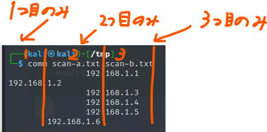
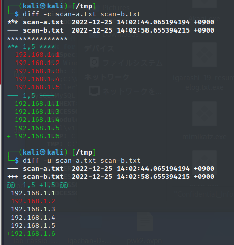

# ファイル比較

## comm

### 比較

```
comm scan-a.txt scan-b.txt
```



### 差分のみ表示

```
comm -3 scan-a.txt scan-b.txt
```


### 一致部分のみ表示

```
comm -12 scan-a.txt scan-b.txt
```


## diff

```
diff -c scan-a.txt scan-b.txt
diff -u scan-a.txt scan-b.txt
```




