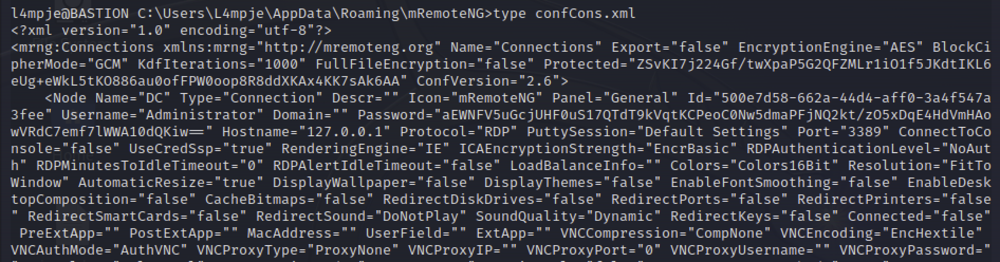
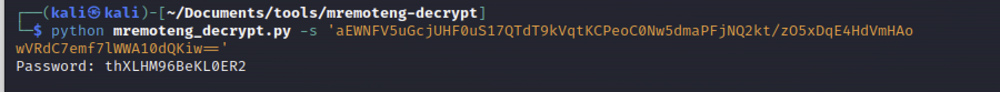

# CredentialSearch

[toc]

#### search for clear text credentials

```cmd
#ファイル名で検索
C:\> dir /b /s *pass*
C:\> dir /b /s *.ini
C:\> dir /b /s *.xml
C:\> dir /b /s *.config
C:\> dir /b /s *.history
C:\> dir /b /s *.old
C:\> dir /b /s vnc.ini

C:\unattend.xml
C:\Windows\Panther\Unattend.xml
C:\Windows\Panther\Unattend\Unattend.xml
C:\> dir /b /s Unattend.xml

C:\sysprep\sysprep.xml
C:\Windows\system32\sysprep.inf
C:\Windows\system32\sysprep\sysprep.xml
C:\> dir /b /s sysprep.xml

C:\inetpub\wwwroot\web.config

C:\> dir /b /s web.config
```

```powershell
#ファイル内検索する場合(大体out of memory)
PS C:\Users> findstr /spin "password" *.* # search all files with extensions
PS C:\Users> findstr /spin "secret" *.*
PS C:\Users> findstr /spin "password" *.txt *.ini *.config *.xml # search specific extensions

findstr /si password *.txt
findstr /si password *.xml
findstr /si password *.ini
```

```powershell
# HKLM
reg query HKLM /f pass /t REG_SZ /s
reg query HKLM /f password /t REG_SZ /s
# HKCU
reg query HKCU /f pass /t REG_SZ /s
reg query HKCU /f password /t REG_SZ /s
```

```cmd
# Windows autologin
reg query "HKLM\SOFTWARE\Microsoft\Windows NT\Currentversion\Winlogon"
reg query "HKLM\SOFTWARE\Microsoft\Windows NT\Currentversion\Winlogon" 2>nul | findstr "DefaultUserName DefaultDomainName DefaultPassword"

# VNC
reg query "HKCU\Software\ORL\WinVNC3\Password"

# SNMP Parameters
reg query "HKLM\SYSTEM\Current\ControlSet\Services\SNMP"

# Putty
reg query "HKCU\Software\SimonTatham\PuTTY\Sessions"
```


### mRemoteNG.exe

クレデンシャル情報を.xmlファイルに持つ

```cmd
dir "C:\Program Files (x86)"
```

```cmd
cd C:\Users¥L4mpje\AppData\Roaming\mRemoteNG
type confCons.xml
```



パスワードクラックする

https://github.com/kmahyyg/mremoteng-decrypt

```
git clone https://github.com/kmahyyg/mremoteng-decrypt.git
cd mremoteng-decrypt 
```


