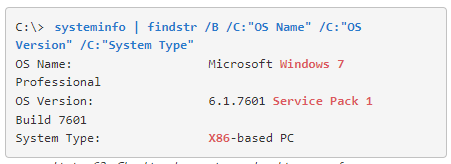

# Windows Kernel Vulnerabilities

### USBPcap Case Study

カーネルドライバの脆弱性に依存した特権の昇格

システムレベルのソフトウェア（ドライバやカーネル自体など）をエクスプロイトしようとする場合、ターゲットのオペレーティングシステム、バージョン、アーキテクチャなど、いくつかの要因に注意する必要がある

```
systeminfo | findstr /B /C:"OS Name" /C:"OS Version" /C:"System Type"
```




この時点で、Windows 7 SP1 x86のネイティブカーネル脆弱性を探し出し、それを使って特権を昇格させることができるが、**サードパーティのドライバを悪用する方がより一般的**


* ドライバを列挙する

  ```
  driverquery /v
  ```

  

  ※停止とマークされていても、カーネルメモリ空間にロードされているため、まだ対話できる可能性がある

* サードパーティ製品の脆弱性を検索する

  ```bash
  searchsploit USBPcap                                                                                  
  ------------------------------------------------------------------------ ---------------------------------
   Exploit Title                                                          |  Path
  ------------------------------------------------------------------------ ---------------------------------
  USBPcap 1.1.0.0 (WireShark 2.2.5) - Local Privilege Escalation          | windows/local/41542.c
  ------------------------------------------------------------------------ ---------------------------------
  Shellcodes: No Results
  ```

* 対象のバージョンを確認する

  ```
  Exploit Title    - USBPcap Null Pointer Dereference Privilege Escalation
  Date             - 07th March 2017
  Discovered by    - Parvez Anwar (@parvezghh)
  Vendor Homepage  - http://desowin.org/usbpcap/ 
  Tested Version   - 1.1.0.0  (USB Packet cap for Windows bundled with WireShark 2.2.5)
  Driver Version   - 1.1.0.0 - USBPcap.sys
  Tested on OS     - 32bit Windows 7 SP1 
  CVE ID           - CVE-2017-6178
  Vendor fix url   - not yet
  Fixed Version    - 0day
  Fixed driver ver - 0day
  ```

* 該当バージョンのドライバがインストールされているか確認する

  ```
  cd "C:\Program Files"
  dir
  type USBPcap.inf
  ```

  ※ドライバディレクトリは`C:\Windows\System32\DRIVERS`の下にあることが多いので注意

* エクスプロイトコードをコンパイルする

  * windowsクライアントのGCCコンパイラを利用する方法

    ```
    C:\Program Files\mingw-w64\i686-7.2.0-posix-dwarf-rt_v5-rev1> mingw-w64.bat
    
    C:\Program Files\mingw-w64\i686-7.2.0-posix-dwarf-rt_v5-rev1>echo off
    Microsoft Windows [Version 10.0.10240]
    (c) 2015 Microsoft Corporation. All rights reserved.
    
    C:\> gcc
    gcc: fatal error: no input files
    compilation terminated.
    
    C:\> gcc --help
    Usage: gcc [options] file...
    Options:
      -pass-exit-codes         Exit with highest error code from a phase.
      --help                   Display this information.
      --target-help            Display target specific command line options.
      --help={common|optimizers|params|target|warnings|[^]{joined|separate|undocumented}}[
                               Display specific types of command line options.
      (Use '-v --help' to display command line options of sub-processes).
      --version                Display compiler version information.
    ...
    ```

  * コンパイルする
  
    
  
    
  
  * 実行する
  
    
  
    