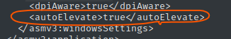

### Windows Privilege Escalation Information Gathering

* windowsでインストールされたサービスの一覧

  ```powershell
  Get-WmiObject win32_service | Select-Object Name, State, PathName | Where-Object {$_.State -like 'Running'}
  ```

* サービスの権限確認

  ```cmd
  icacls "C:\Program Files\rempl\sedsvc.exe" 
  ```

* Program Files配下のunquatedfileを一覧で表示

  ```cmd
  for /f "tokens=2 delims='='" %a in ('wmic service list full^|find /i "pathname"^|find /i /v "system32"') do @echo %a
  ```

* 


### UAC By pass

* Administrator group(`BUILTIN\Administrators`)で整合性レベル`medium`あることを確認

  ```
  whoami /groups 
  ```

* UAC設定の確認

  ```powershell
  Get-ItemProperty HKLM:\SOFTWARE\Microsoft\Windows\CurrentVersion\Policies\System | Select-Object EnableLUA
  
  EnableLUA
  ---------
  1
  
  # check behavior 
  Get-ItemProperty HKLM:\SOFTWARE\Microsoft\Windows\CurrentVersion\Policies\System | Select-Object ConsentPromptBehaviorAdmin
  
  ConsentPromptBehaviorAdmin
  --------------------------
  5
  ```

  ```cmd
  # 1：UAC有効、0または存在しない場合はUACが非有効
  REG QUERY HKEY_LOCAL_MACHINE\Software\Microsoft\Windows\CurrentVersion\Policies\System\ /v EnableLUA
  
      EnableLUA    REG_DWORD    0x1
  ```

  ```
  REG QUERY HKEY_LOCAL_MACHINE\Software\Microsoft\Windows\CurrentVersion\Policies\System\ /v ConsentPromptBehaviorAdmin
  
      ConsentPromptBehaviorAdmin    REG_DWORD    0x5
  ```

  https://book.hacktricks.xyz/windows-hardening/authentication-credentials-uac-and-efs/uac-user-account-control

  

* 自動昇格するプロセスの確認

  ```cmd
  cd c:\windows\
  strings –s *.exe | findstr /i autoelevate
  ```

  https://learn.microsoft.com/ja-jp/sysinternals/downloads/strings

  ```
  sigcheck.exe -accepteula -m C:\Windows\System32\dccw.exe
  ```

  

  

### insecure permissions

悪意のあるファイルで上書きされる可能性があり、サービスの再起動時に悪意あるコードが実行される

```cmd
# show effective access of current user

# -u suppress errors
# -s recurse
# -w show only writable
PS C:\> ./accesschk.exe -accepteula -wsu C:\*.* 

# weak directory permissions, writable dirs
PS C:\> ./accesschk.exe -accepteula -wsud "Everyone" C:\*.*
PS C:\> ./accesschk.exe -accepteula -wsud "Users" C:\*.*
PS C:\> ./accesschk.exe -accepteula -wsud "Authenticated Users" C:\*.*

# -c check services permissions (use * for all)
PS C:\> ./accesschk.exe -accepteula -wsuc * # current user
PS C:\> ./accesschk.exe -accepteula -wsuc "Everyone" * 
PS C:\> ./accesschk.exe -accepteula -wsuc "Authenticated Users" *
```

https://xorond.com/posts/2021/04/windows-local-privilege-escalation/

合わせてiscalでファイルのパーミッションを確認する

```powershell
PS C:\> icacls "C:\Program Files\*" | findstr "(F) (M) :\" | findstr ":\ everyone authenticated users todos %username%"
PS C:\> icacls "C:\Program Files (x86)\*" | findstr "(F) (M) :\" | findstr ":\ everyone authenticated users todos %username%"
PS C:\Program Files\> icacls.exe * | findstr "(F)" # full access
PS C:\Program Files\> icacls.exe * | findstr "(M)" # modify acces
```


### unquoted paths

```cmd
# check for unquoted paths in services
PS C:\> wmic service get name,pathname | select-string -notmatch '"|^$'
PS C:\> wmic service get name,displayname,pathname,startmode | select-string -notmatch 'C:\\Windows|"|^$'

# check only non-windows services
PS C:\> wmic service get name,displayname,pathname,startmode | select-string -notmatch 'C:\\Windows|"|^$'

# check only auto started services
PS C:\> wmic service get name,displayname,pathname,startmode | select-string "auto" | select-string -notmatch 'C:\\Windows|"|^$'
```

