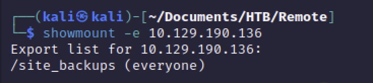
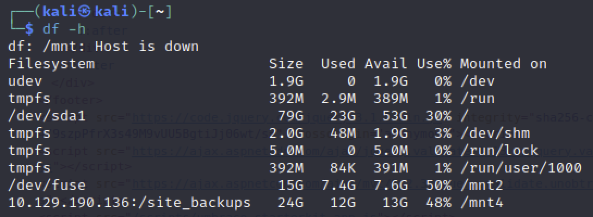

# NFS(2049)

[toc]

sambaのようなファイル共有サービス。認証がない？ポートが空いてたらとりあえずマウントすると良さそう

### 参考ページ

https://book.hacktricks.xyz/network-services-pentesting/nfs-service-pentesting

### Showmountでマウントディレクトリを確認する

```bash
showmount -e 10.11.1.72
```



### NFSをマウントする

```
sudo mkdir /mnt4/
sudo chmod 777 /mnt4/

sudo apt update
sudo apt install nfs-common
sudo mount -t nfs 10.129.190.136:/site_backups /mnt4/
```

確認コマンド

```
df -h
```

