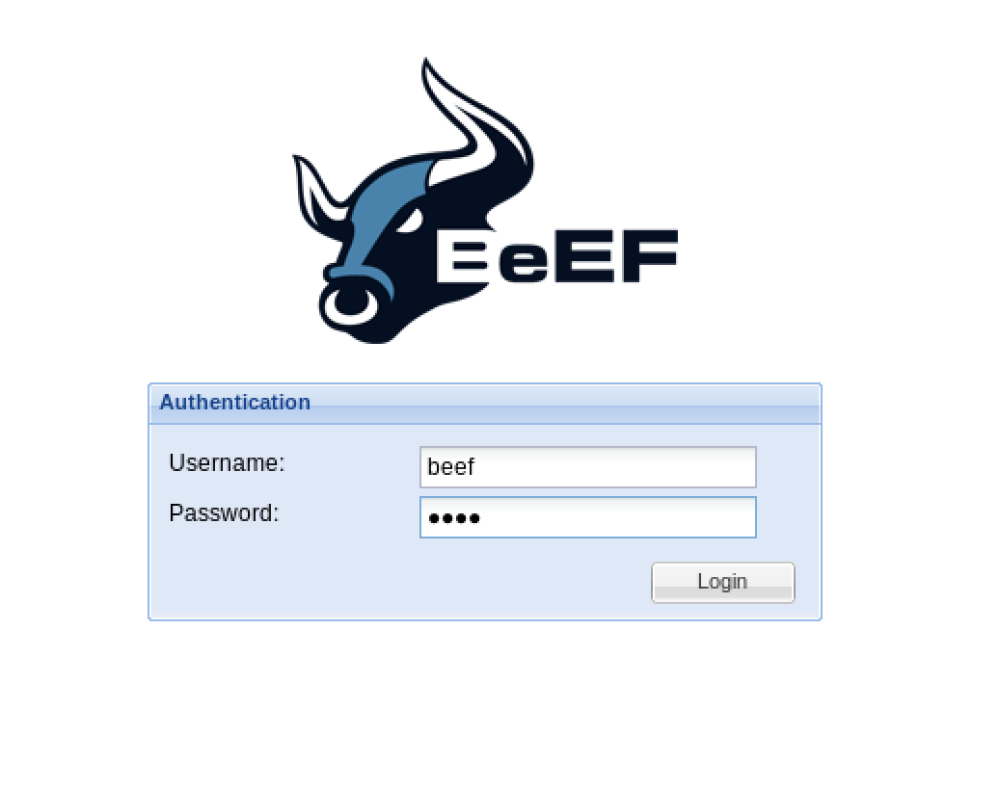

# BeEF

Browser Exploitation Framework (BeEF)

ウェブブラウザ内で実行されるクライアントサイド攻撃に焦点を当てたペネトレーションテストツール

### 起動

```bash
sudo beef-xss
```



※ログイン情報

```
┌──(kali㉿kali)-[/usr/share/beef-xss]
└─$ sudo cat config.yaml 
```

