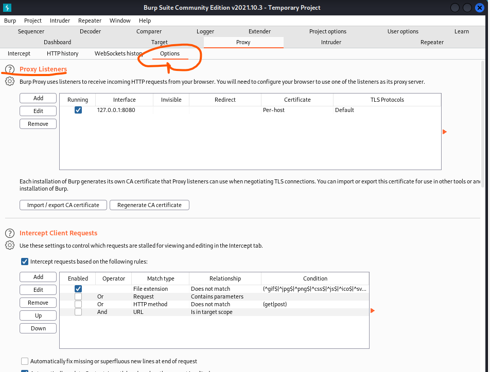
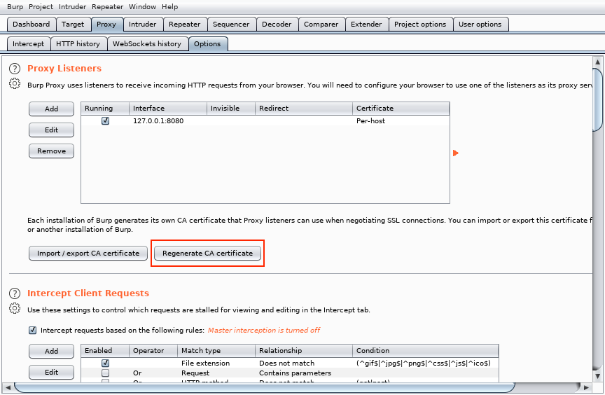
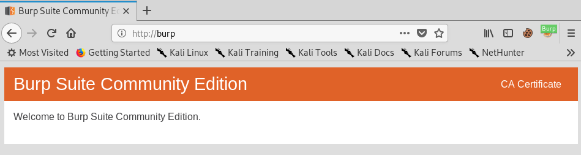
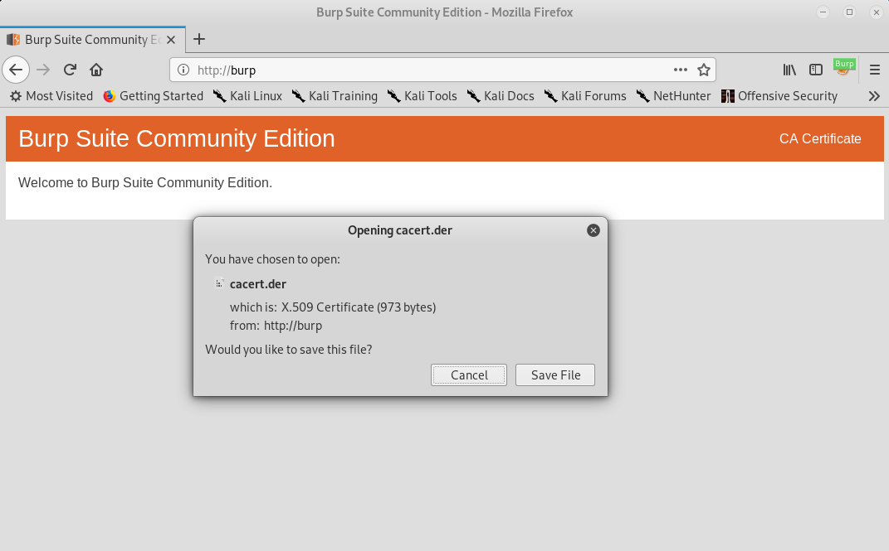
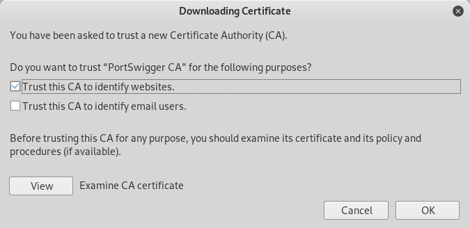
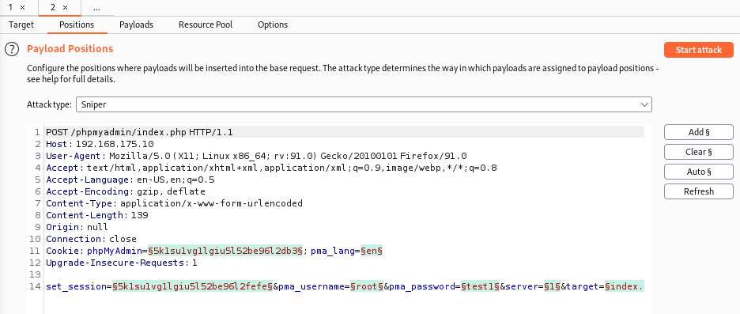
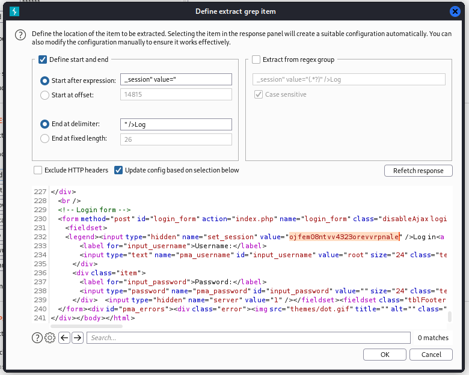
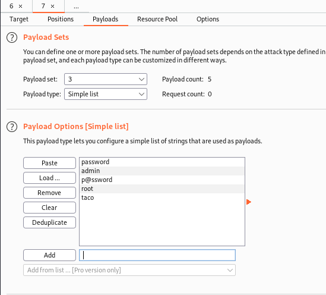
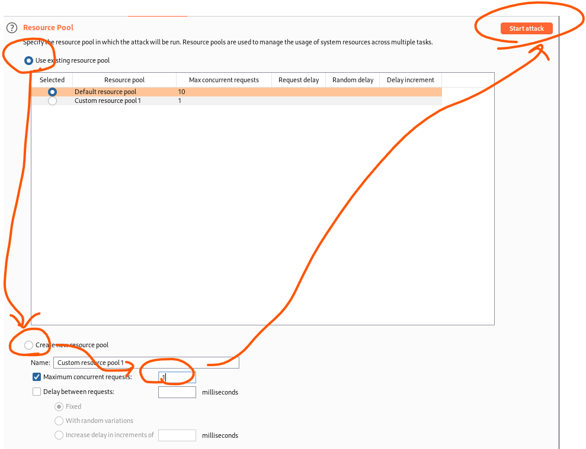
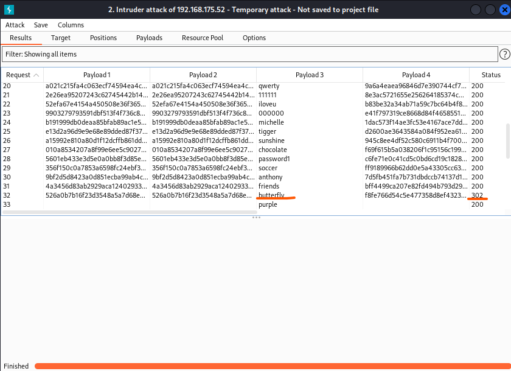

# BurpSuite

### プロキシ情報

### 証明書のインストール

BurpSuiteのProxy > Options > Proxy Listenersに移動し、Regenerate CA certificateをクリック

確認ダイアログで「はい」をクリックし、Burp Suiteを再起動

新しいCA証明書をFirefoxにインポートするために、まず、http://burp をブラウズして、証明書へのリンクを見つける

証明書を表示するには、この画面で CA 証明書をクリックし（または http://burp/cert に接続し）、cacert.der ファイルをローカルマシンに保存

ダウンロードが完了したら、ダウンロードしたファイルをFirefoxにドラッグ＆ドロップし、「Trust this CA to identify websites」を選択して「OK」をクリック

### Intruderを利用したパスワードアタック

* リクエストをプロキシしHTTPHistoryからintruderにリクエストを転送

  

* intruderタブをクリックする。Targetは特に設定不要

  

* Positionsタブを編集する

  

  * `Clear $`を押下し選択を解除した後、動的に設定した箇所のみ選択して`Add $`で追加していく。ここで選択した箇所ぶん後ほどpayloadの設定をする

    

    * set-cookieの箇所を2か所設定
    * tokenの箇所を1か所設定
    * パスワードの箇所を1か所設定

    計4か所に設定をする

    * Attack typeに`Pitchfork`を設定すること

* Optionタブを設定する

  * Grep - Extractセクションを設定する。 "Recursive grep "というペイロードがあり、あらかじめ定義された値をgrep4で検索して、その結果を次のリクエストで利用できるようにするための設定

    

    cookieの設定箇所を選択して登録する

    

    tokenの設定箇所も選択して登録する

    

* 「payload」タブを設定する

  * 1つ目と2つ目はcookieの設定。Payload typeを「Recursive grep」に設定する
    

  * 3つ目はパスワードの設定。Payload typeを「Simple list」に設定する

    

  * 4つ目のtokenを設定する

    

  * 「Resource Pool」タブを設定する

    

  * 「Start Attack」で攻撃開始する。

    

    
