# Nessus

### インストール

Tenableのウェブサイトhttps://www.tenable.com/downloads/nessus

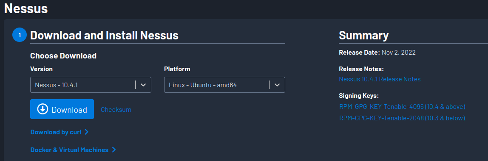

```bash
┌──(kali㉿kali)-[/usr/share/nmap/scripts]
└─$ sha256sum ~/Downloads/Nessus-10.4.1-ubuntu1404_amd64.deb     
```

```bash
┌──(kali㉿kali)-[/usr/share/nmap/scripts]
└─$ sudo apt install ~/Downloads/Nessus-10.4.1-ubuntu1404_amd64.deb
```

```
sudo systemctl start nessusd.service 
```

https://localhost:8834 


### Basic Network Scan

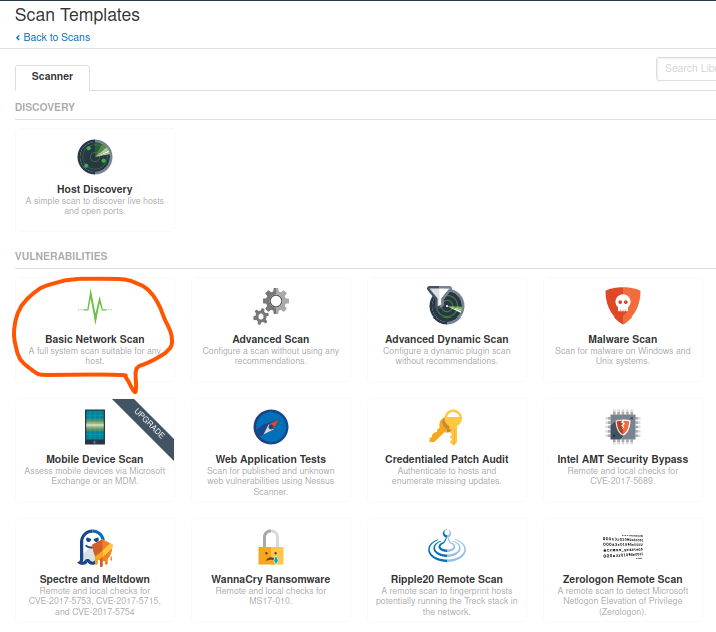

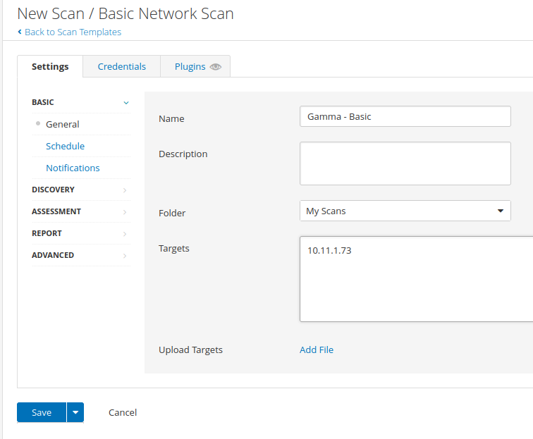

名前に「*** - Basic」とつける必要がありそう


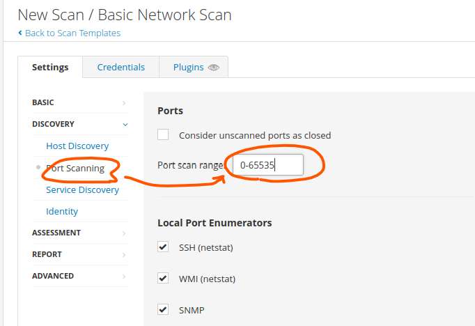


### Authenticated Scan

有効なターゲット認証情報を必要とする認証済みスキャンを実行することで、より詳細な情報を生成し、誤検出を減らすことができる

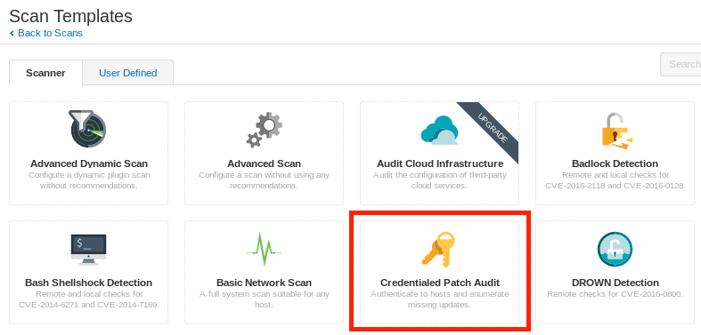

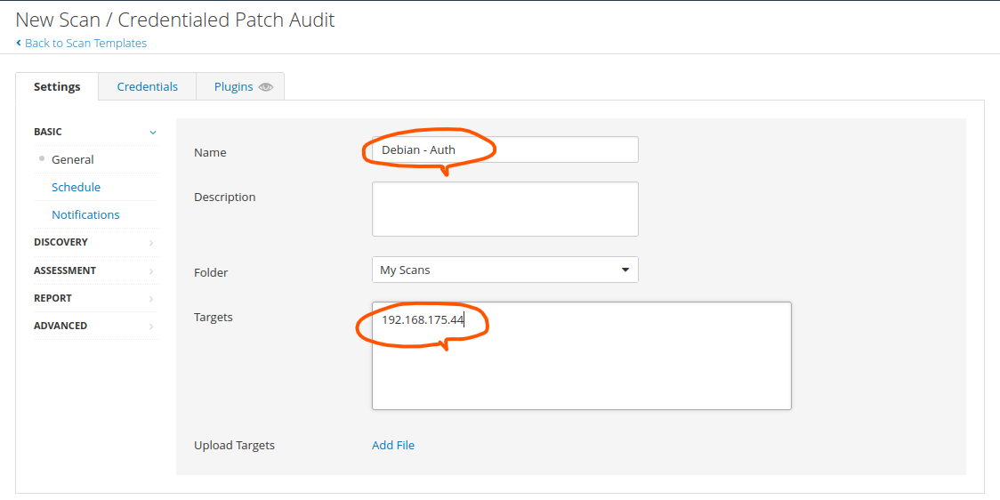

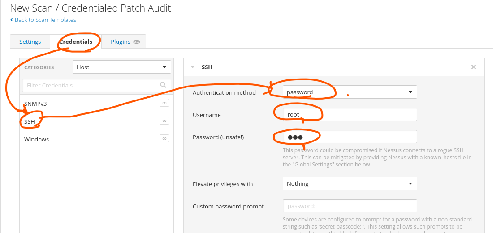


### Scanning with Individual Nessus Plugins

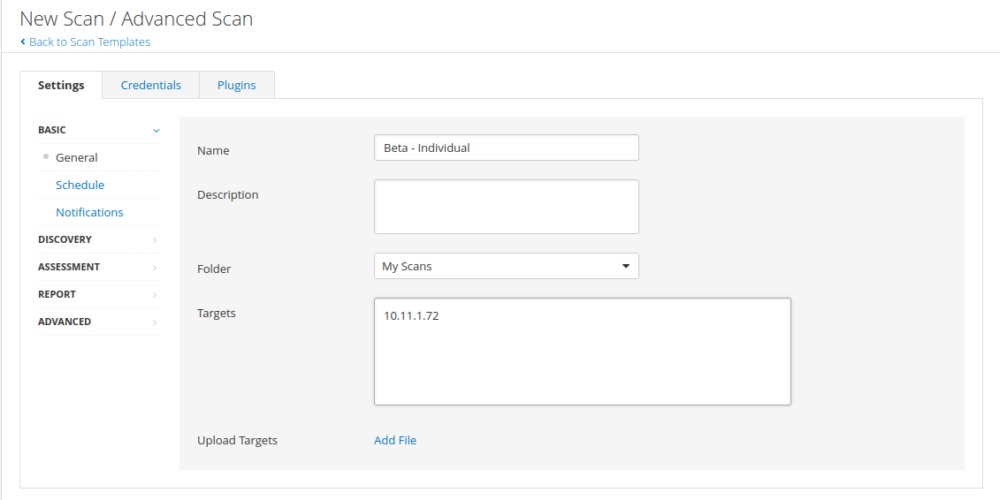

ホストがOpenしていることがわかっている場合、ホストの検出をオフにする

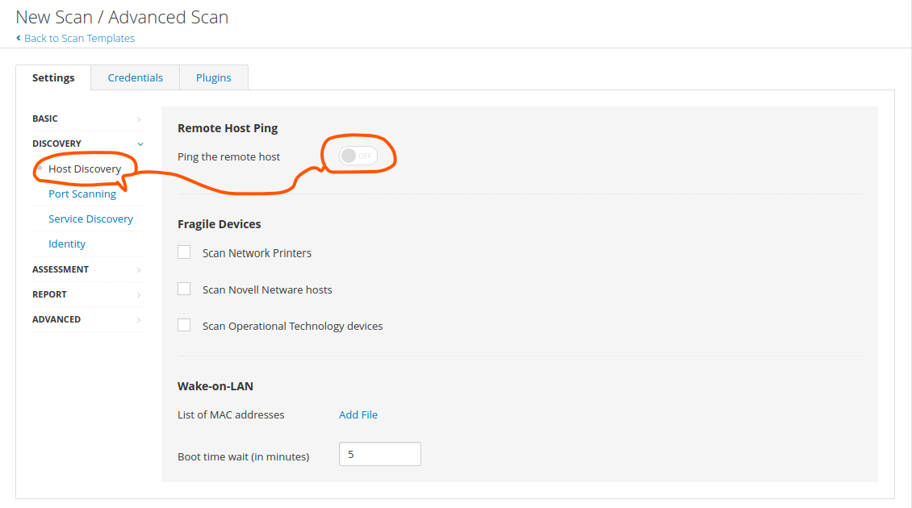

openしているポートがわかっていれば絞り込みをする

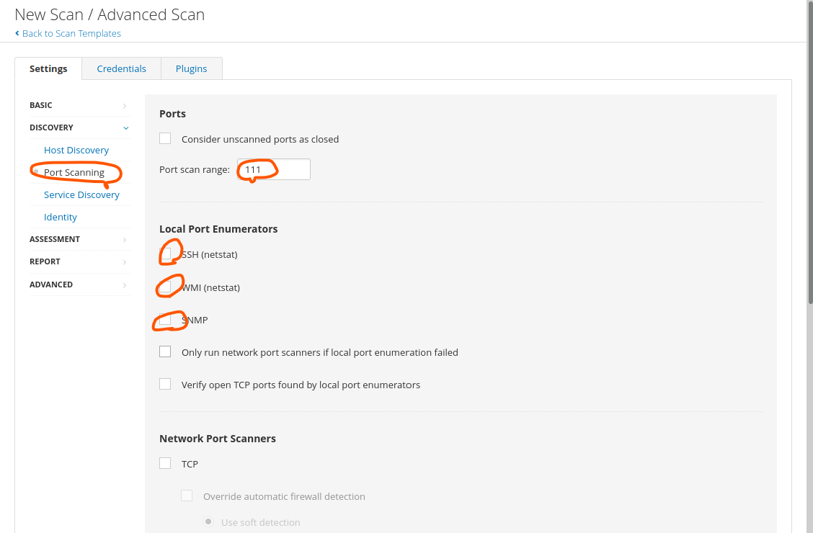

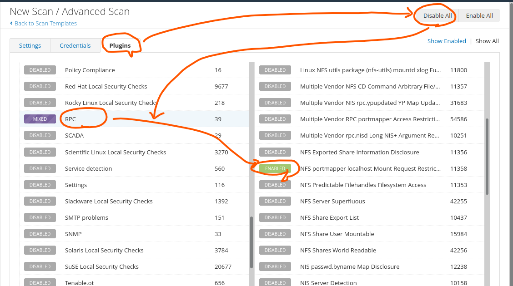