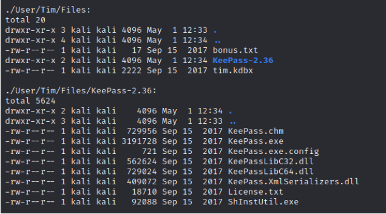
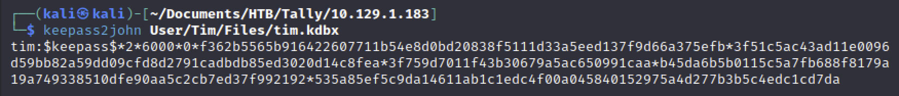
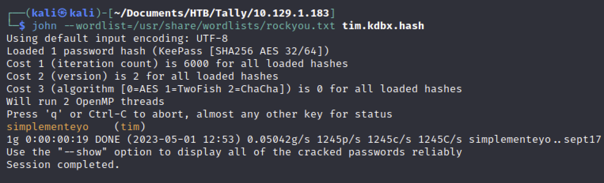
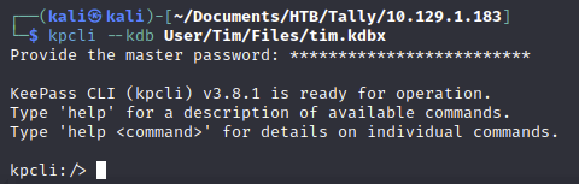
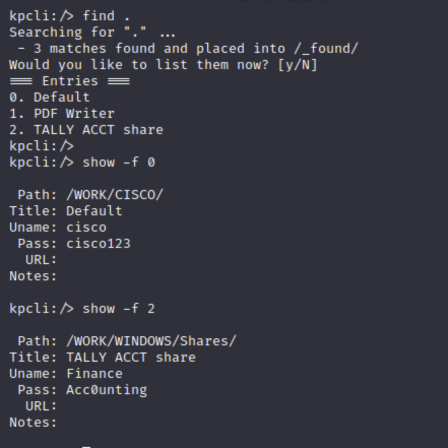

# KeePass DB

[toc]

bitwardenのようなOSSのパスワード管理ツール。主にwindowsで用いられる

kdbxがDBとなっている



### マスターパスワードのクラック

```
keepass2john User/Tim/Files/tim.kdbx
keepass2john User/Tim/Files/tim.kdbx > tim.kdbx.hash
```



```
john --wordlist=/usr/share/wordlists/rockyou.txt tim.kdbx.hash 
```



### kpcliでパスワードを取得する

```
kpcli --kdb User/Tim/Files/tim.kdbx
```



```
find .
show -f 2
```



