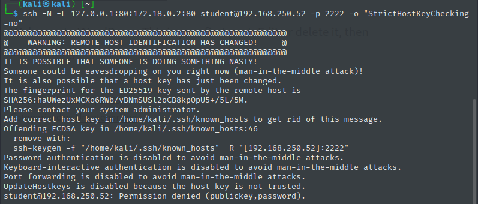

# 分類前のコマンド

適切な分類が見つかれば適宜コピーして削除すること

### リモートデスクトップ接続(rdesktop)

```bash
# kali
rdesktop -g 90% -u student -p lab 192.168.127.10
```

### SSH接続

```bash
# kali
ssh -o "UserKnownHostsFile=/dev/null" -o "StrictHostKeyChecking=no" student@192.168.127.52 -p 2222
```

※以下メッセージが出たら上記のssh接続の方法で鍵にパスワード認証を強制すること



### tun0のipアドレスを環境変数として設定

```
kali=$(ip addr | awk '/inet/ && /tun0/{sub(/\/.*$/,"",$2); print $2}')
echo $kali
```


